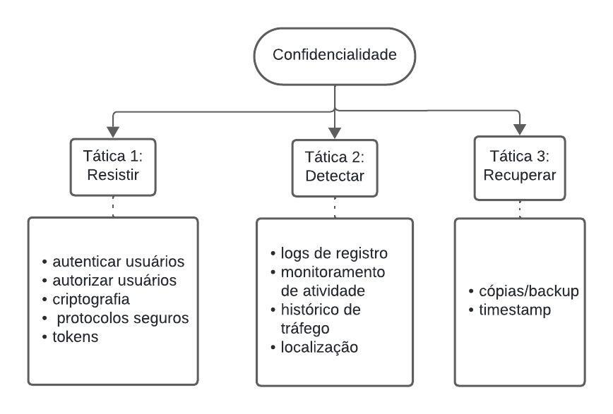
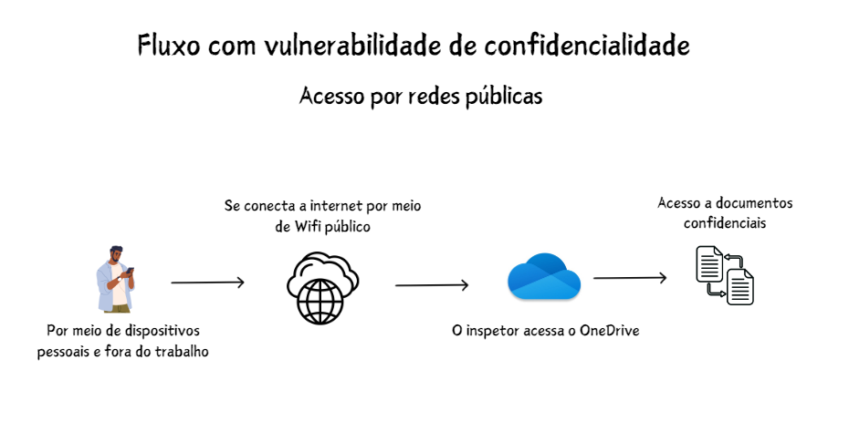
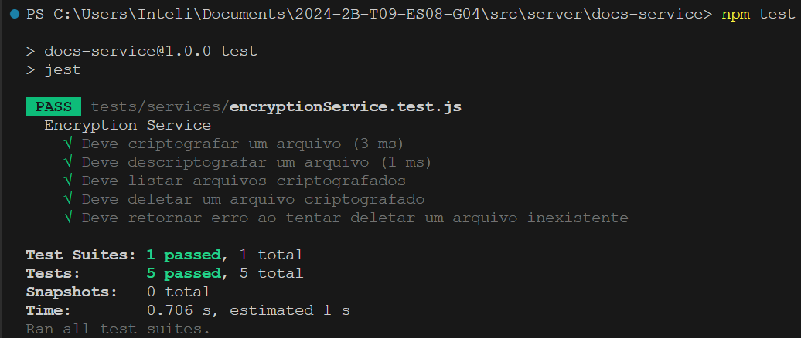
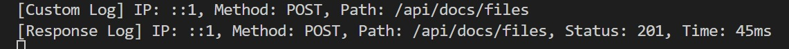

# SPRINT 1

## 1 - Analise do parceiro de projeto e Business Drivers

&emsp;&emsp; Neste tópico, serão apresentadas as informações acerca do parceiro, bem como os drivers de negócio que motivaram a realização do projeto.

### 1.1 - Setor de aplicação

&emsp;&emsp; O parceiro de negócios deste projeto é o Instituto de Pesquisas Tecnológicas (IPT), que é uma empresa pública vinculada à Secretaria de Desenvolvimento Econômico, Ciência, Tecnologia e Inovação do Estado de São Paulo. O IPT é um instituto de pesquisa e desenvolvimento que atua em diversas áreas, como a de tecnologia da informação, energia, meio ambiente, entre outras. O IPT é uma instituição de referência em pesquisa e desenvolvimento no Brasil e no mundo, e tem como missão promover a inovação e o desenvolvimento tecnológico do país.

&emsp;&emsp; O IPT é composto por diferentes **Unidades de Negócio**, cada uma dedicada a setores específicos de atuação. O projeto em questão será desenvolvido em colaboração direta com a Unidade de Negócio de **Habitações e Edificações**, mais especificamente com o departamento responsável por realizar **Inspeções Técnicas em Edificações Existentes**. Esse departamento é fundamental para a realização de avaliações técnicas sobre a integridade, segurança e qualidade de edificações, desempenhando um papel estratégico na manutenção de padrões de construção adequados.

&emsp;&emsp; Nesse sentido, partindo para uma visão sobre quais são os setores atendidos pelo desenvolvimento deste projeto, é notória que a área de inspeções técnicas do IPT está inserida no setor de **engenharia civil**, com o foco na análise de construções públicas e privadas, como edifícios comerciais, residenciais, industriais, entre outros. O objetivo principal das inspeções é garantir a segurança estrutural, a qualidade dos materiais utilizados e a conformidade com normas técnicas vigentes, de modo a evitar riscos de acidentes e falhas que possam compromoter a integridade das construções. Além disso, as inspeções realizadas pelo IPT são essenciais para assegurar a sustentabilidade das edificações e orientar possíveis adequações técnicas e preventivas necessárias para prolongar a vida útil dos imóveis.

&emsp;&emsp; Ademais, é válido ressaltar que a inserçã do IPT nesse setor não se limita à aplicação de técnicas tradicionais de engenharia civil, mas envolve, também, a busca constante por **inovação por meio da pesquisa e desenvolvimento**. Assim, o instituto utiliza metodologias avançadas e explora a integração de novas tecnologias, como dispositivos IoT, câmeras e drones, em seus processos de inspeção, com o intuito de aprimorar a qualidade dos serviços prestados e a eficiência das análises realizadas.

&emsp;&emsp; Dessa forma, o IPT se posiciona como um agente crucial na garantia da segurança e da eficiência de edificações, ao mesmo tempo em que colabora para a evolução das práticas de engenharia civil e pesquisa aplicada. O desenvolvimento de uma plataforma digital dedicada às inspeções prediais não apenas moderniza as operações do instituto, mas também reforça seu compromisso com a inovação e excelência técnica, oferecendo soluções que atendem tanto às necessidades operacionais quanto às demandas da sociedade e do mercado.

### 1.2 - Adição de Valor

&emsp;&emsp; Tendo em vista o contexto apresentado sobre o setor de aplicação do projeto, é possível identificar a forma com que a solução digital proposta agrega valor tanto ao IPT quanto ao setor de inspeções técnicas em edificações. Como visto, o IPT é um instituto de pesquisa e desenvolvimento inserido em vários setores, sendo um deles o de engenharia civil, atuando na inspeção de construções, de modo a garantir a segurança estrutural, qualidade, sustentabilidade e conformidade técnica. Assim, o desenvolvimento de uma arquitetura de plataforma digital integrada para esse processo tem como objetivo principal **modernizar e otimizar as operações de inspeções**, alinhando as práticas do IPT às melhores tecnologias disponíveis no mercado e reforçando seu compromisso com a inovação e a excelência técnica.

&emsp;&emsp; Atualmente, o processo de inspeção é **predominante manual**, o que gera diversas limitações operacionais. Isso porque as anotações e registros de inspeções são realizados em documentos físicos (como cadernos, papéis, planilhas impressas) e a consolidação dos dados requer o uso de ferramentas externas, como o OneDrive e o Microsoft Teams, para o armazenamento e compartilhamento de tais dados. Além de que, há, também o servidor interno do IPT que serve para armazenamento dos dados internamente, mas não há possibilidade de compartilhamento com outras pessoas. Dessa maneira, esse fluxo manual compromete a eficiência das operações, gera riscos de inconsistências e perda de dados, além de dificultar a rastreabilidade e o controle de versões dos relatórios gerados. É válido ressaltar que, como o processo é manual, há também o fato de que não há nem a possibilidade de inserção de diferentes tecnologias nesse processo. Nesse contexto, a arquitetura proposta tem o potencial de resolver essas limitações e agregar valor ao negócio de diferentes formas, sendo elas:

- **Eliminação de processos manuais e dependência de tecnologias terceirizadas**, dado que a arquitetura da plataforma eliminará a necessidade de anotações manuais e dispersas, permitindo que os inspetores registrem as informações diretamente no sistema durante o seu trabalho. Além de que a plataforma será capaz de armazenar e compartilhar os dados de forma segura e eficiente, sem a necessidade de ferramentas externas. Dessa forma, o tempo gasto com a consolidação manual dos dados será reduzido, minimizando erros humanos e retrabalhos.
- **Integração e Suporte a Múltiplas Tecnologias**, uma vez que a arquitetura da plataforma será pensada para suportar diferentes tecnologias inovadoras, que não necessariamente estejam presentes no cotidiano dos inspetores, mas que, futuramente, possam ser incorporadas ao processo de inspeção. Isso inclui a integração de dispositivos IoT, câmeras, drones, entre outros, que podem ser utilizados para coletar dados e informações durante as inspeções, tornando-as mais precisas e eficientes.
- **Aumento da Eficiência e Precisão**, haja vista que, ao digitalizar todo o processo, a arquitetura da plataforma permitirá que os dados sejam inseridos e acessados em tempo real, de modo a garantir uma maior precisão nas informações coletadas. Isso evita erros decorrentes da duplicidade de informações ou da falta de sincronização entre os diferentes meios atualmente utilizados para registro e armazenamento de dados.
- **Rastreabilidade e Conformidade Regulatória**, uma vez que a arquitetura garantirá a rastreabilidade completa ao registrar todas as ações geitas dentro do sistema, por meio de logs detalhados. Isso facilita auditorias e garante a conformidade com a LGPD e outros regulamentos aplicáveis. Além disso, a plataforma permitirá o controle de versões dos relatórios gerados, garantindo a integridade e a autenticidade das informações.
- **Interoperabilidade entre Tecnologias e Colaboração Simultânea**, pois a arquitetura será projetada para que a colaboração simultânea entre os diferentes membros da equipe ocorra de forma eficiente ao elaborar as versões do laudo final da inspeção. Isso possibilitará que os inspetores e outros profissionais do time trabalhem em conjunto e em tempo real, sem a necessidade de tecnologia de terceiros.
- **Centralização das Informações**, uma vez que a arquitetura da plataforma permitirá que todas as informações relacionadas às inspeções sejam armazenadas em um único local, facilitando o acesso e a gestão dos dados. Isso contribui para a organização e a segurança das informações, bem como para a colaboração entre os diferentes membros da equipe.
- **Escalabilidade e Flexibilidade Operacional**, dado que a arquitetura contará com a utilização de servidores em nuvem, o que permitirá que a plataforma esteja disponível, na maioria das vezes, para os usuários, independente do volume de dados ou do número de usuários. Além disso, a arquitetura será projetada para evoluir de forma modular, permitindo que o IPT integre novas tecnologias e expanda a solução sem comprometer a estabilidade do sistema.
- **Reduzir o tempo de operação e minimizar erros humanos** associados à entrada manual de dados.

&emsp;&emsp; Portanto, a arquitetura digital proposta para as inspeções prediais tem o potencial de transformar a maneira como o IPT realiza suas operações, resolvendo fragilidades críticas e alinhando o instituto com as melhores práticas de mercado. Ao garantir a confidencialidade dos dados e promover interoperabilidade com tecnologias emergentes, a plataforma reforça o compromisso do IPT com a inovação e a excelência técnica. Além disso, a solução facilitará a colaboração em tempo real, centralizará informações e assegurará a rastreabilidade e segurança dos dados, modernizando os processos e preparando o IPT para futuras demandas tecnológicas e operacionais.

### 1.3 - Processo de Negócio e Fluxos Críticos Suportados pelo Sistema

&emsp;&emsp; O processo atual de inspeções prediais realizado pelo IPT segue um **fluxo complexo e manual**, envolvendo diversas etapas, ferramentas e interações entre os inspetores, coordenadores e clientes. Assim, este processo depende de e-mails, documentos físicos e ferramentas de terceiros, como o OneDrive e Teams, para consolidar as informações e organizar os resultados das inspeções.

&emsp;&emsp; É válido destacar que o processo de inspeção predial realizado pelo IPT tem 3 grandes fases, sendo elas:

- Coleta de Dados Gerais sobre o Projeto de Inspeção
- Análise dos Dados Coletados
- Elaboração do Laudo Final

&emsp;&emsp; Cada uma dessas fases é composta por diversas etapas, que envolvem a interação entre diferentes atores, como o cliente, os inspetores, os coordenadores e os responsáveis pela elaboração do laudo final. O fluxo de trabalho atual é baseado em comunicações por e-mail, reuniões presenciais e documentos físicos, o que torna o processo lento, sujeito a erros e inconsistências, e dificulta a colaboração e a rastreabilidade das informações. Nesse sentido, este projeto entra na **primeira fase de coleta de dados gerais sobre o projeto de inspeção**, com o objetivo de identificar os principais desafios e oportunidades de melhoria no processo de inspeções prediais do IPT.

&emsp;&emsp; Dessa forma, a seguir o grupo irá descrever o fluxo de negócio em detalhes, de modo a destacar as etapas críticas, ferramentas utilizas, pontos fortes e vulnerabilidades identidicads durante tal processo.

<div align="center">
  <sub>Figura 1: Diagrama do Processo de Negócios</sub>
  
  <sup>Fonte: Elaborado pelos autores</sup>
</div>

&emsp;&emsp; Para um entendimento mais aprofundado do processo de negócios de inspeções prediais, representado no diagrama acima, é necessário descrever as etapas e os fluxos críticos envolvidos. A seguir, serão detalhadas as principais etapas do processo, bem como as ferramentas e interações que ocorrem em cada uma delas:

**Etapa 1 - Recebimento da Solicitação de Inspeção:**

- **Descrição:** O processo começa com o cliente entrando em contato por e-mail para solicitar a inspeção. Toda a comunicação inicial, incluindo o envio de detalhes sobre os problemas enfrentados, é feita por meio de e-mails. Essa etapa corresponde à triagem do pedido, onde o IPT começa a levantar informações sobre o escopo e a complexidade do trabalho.
- **Ferramenta Utilizada:** E-mail.
- **Ponto Forte:** Comunicação rápida e direta com o cliente.
- **Vulnerabilidade:** Dependência de e-mails para centralizar o escopo; risco de perda de informações se e-mails forem extraviados ou não organizados adequadamente.

**Etapa 2 - Reunião com o Cliente e Planejamento Inicial:**

- **Descrição:** Após o recebimento do pedido, é realizada uma reunião presencial ou virtual entre a equipe do IPT e o cliente para entender melhor o problema e definir a abordagem da inspeção. Essa etapa pode incluir uma visita técnica preliminar ao local para avaliar as necessidades e delimitar os recursos e o tempo necessários para realizar a inspeção. Com base nessa análise, a equipe define ensaios, materiais e pessoal necessários para a execução do trabalho.
- **Ferramenta Utilizada:** Reunião presencial/virtual, visita técnica.
- **Ponto Forte:** Levantamento preciso das necessidades para embasar a proposta.
- **Vulnerabilidade:** Falta de documentação estruturada do planejamento, o que pode gerar inconsistências na comunicação entre a equipe.

**Etapa 3 - Elaboração da Proposta e Orçamento:**

- **Descrição:** Com base nas informações levantadas, a equipe prepara uma proposta e orçamento utilizando o PGP (software interno) e planilhas Excel para calcular os custos. Após a proposta ser finalizada, ela é enviada para o cliente por e-mail para aprovação. Se a proposta for rejeitada, o contato com o cliente é encerrado.
- **Ferramenta Utilizada:** PGP (software interno do IPT), Excel e E-mail.
- **Ponto Forte:** Uso de ferramentas internas para cálculos detalhados.
- **Vulnerabilidade:** Falta de integração entre sistemas e risco de inconsistências devido à necessidade de consolidar informações manualmente.

**Etapa 4 - Preparação e Alocação da Equipe:**

- **Descrição:** Após a aprovação da proposta, o coordenador da equipe aloca os inspetores e define as tarefas. A comunicação com a equipe é feita verbalmente e por meio da criação de pastas no OneDrive e grupos no Microsoft Teams. O coordenador é responsável por orientar os técnicos sobre o que deve ser feito em campo.
- **Ferramenta Utilizada:** Microsoft Teams, OneDrive, Orientação verbal.
- **Ponto Forte:** Flexibilidade na comunicação e na alocação de recursos.
- **Vulnerabilidade:** Falta de documentação formal do plano de trabalho e risco de falhas de comunicação.

**Etapa 5 - Inspeção em Campo:**

- **Descrição:** Durante a inspeção, os técnicos utilizam cadernos e documentos impressos para anotar observações e tirar fotos com seus celulares pessoais. Cada inspetor pode trabalhar em ambientes diferentes ou na mesma área, dependendo da complexidade do local.
- **Ferramenta Utilizada:** Cadernos, papéis e celulares pessoais.
- **Ponto Forte:** Flexibilidade na coleta de dados em campo.
- **Vulnerabilidade:** Risco de perda de dados; fragmentação das informações em diferentes dispositivos e falta de precisão na coleta de dados.

**Etapa 6 - Transferência de Dados:**

- **Descrição:** Após a inspeção, as fotos e anotações são enviadas para a equipe por meio do Microsoft Teams ou OneDrive. Posteriormente, essas informações são armazenadas na rede interna do IPT para garantir segurança.
- **Ferramenta Utilizada:** Microsoft Teams, OneDrive, Servidor Interno do IPT.
- **Ponto Forte:** Possibilidade de compartilhamento rápido entre a equipe.
- **Vulnerabilidade:** Dependência de ferramentas externas e risco de perda de dados na migração para a rede interna.

**Etapa 7 - Consolidação e Organização dos Dados:**

- **Descrição:** As anotações feitas em campo são transferidas para documentos Word ou planilhas Excel. As fotos tiradas são organizadas de acordo com os ambientes inspecionados, seguindo a lógica: local geral, local específico e cômodo específico. A comparação entre fotos e anotações ajuda na elaboração do relatório.
- **Ferramenta Utilizada:** Word e Excel.
- **Ponto Forte:** Estruturação clara das informações coletadas.
- **Vulnerabilidade:** Processo demorado e sujeito a erros pela necessidade de consolidação manual.

**Etapa 8 - Elaboração de Relatórios em Versões:**

- **Descrição:** Com base nas informações organizadas, é iniciado o processo de elaboração do relatório de inspeção, feito em Word e passando por várias revisões internas. Cada versão do relatório é compartilhada para aprovação da equipe.
- **Ferramenta Utilizada:** Word.
- **Ponto Forte:** Permite colaboração e revisão contínua.
- **Vulnerabilidade:** Falta de controle automatizado de versões, dificultando a rastreabilidade das alterações.

**Etapa 9 - Elaboração do Laudo Final:**

- **Descrição:** Após a última revisão, o relatório é convertido para PDF e assinado por três responsáveis. O laudo final é enviado ao cliente por e-mail como o documento oficial da inspeção.
- **Ferramenta Utilizada:** PDF.
- **Ponto Forte:** Garante a integridade do documento final.
- **Vulnerabilidade:** Dependência de processos manuais para controle e envio do laudo.

&emsp;&emsp; Para sumarizar todas as etapas acima com seus pontos fortes, vulnerabilidades e ferramentas utilizadas, abaixo segue uma tabela com todas as informações:

| **Etapa**                            | **Ferramenta Usada**          | **Ponto Forte**                    | **Vulnerabilidade**                           |
| ------------------------------------ | ----------------------------- | ---------------------------------- | --------------------------------------------- |
| Recebimento da Solicitação           | E-mail                        | Comunicação direta com o cliente   | Risco de perda de informações por e-mail      |
| Reunião e Planejamento               | Reunião presencial/virtual    | Levantamento inicial preciso       | Falta de documentação formal                  |
| Elaboração da Proposta e Orçamento   | PGP, Excel, E-mail            | Integração parcial dos dados       | Risco de inconsistências                      |
| Preparação e Alocação da Equipe      | Microsoft Teams, OneDrive     | Flexibilidade na comunicação       | Falta de formalização das tarefas             |
| Inspeção em Campo                    | Cadernos, celulares pessoais  | Coleta de dados localmente         | Fragmentação dos dados em vários dispositivos |
| Transferência de Dados               | Teams, OneDrive, Rede Interna | Compartilhamento rápido            | Dependência de ferramentas externas           |
| Consolidação e Organização dos Dados | Word, Excel                   | Estruturação clara das informações | Processo manual e sujeito a erros             |
| Elaboração de Relatórios em Versões  | Word                          | Permite revisão contínua           | Falta de controle de versões automatizado     |
| Elaboração do Laudo Final            | PDF                           | Documento final inviolável         | Processo manual e suscetível a atrasos        |

&emsp;&emsp; A partir da análise das etapas do processo de inspeções prediais, é possível identificar os principais pontos fortes e vulnerabilidades do fluxo atual. A dependência de ferramentas externas, a falta de integração entre sistemas e a necessidade de consolidação manual de informações são alguns dos desafios enfrentados pela equipe do IPT. Além disso, a ausência de um sistema centralizado para armazenar e compartilhar dados, a falta de controle automatizado de versões e a rastreabilidade limitada dos documentos são fatores que impactam a eficiência e a qualidade das inspeções realizadas.

### 1.4 - Volumes

#### Estágio Atual

&emsp;&emsp;No **estágio atual**, a volumetria das inspeções prediais realizadas pelo IPT é um aspecto crucial a ser considerado na arquitetura do sistema. Com uma equipe composta por **35 pessoas**, a quantidade de informações geradas durante cada inspeção é significativa. Cada membro da equipe, que inclui doutores, mestres, graduados e técnicos, contribui para um fluxo constante de dados que precisa ser gerido adequadamente.

#### Estimativa de Dados Coletados

Com base na estrutura atual de trabalho e no número de inspeções realizadas, pode-se estimar o volume de informações geradas:

- **Frequência de Inspeções**: 2 inspeções por dia.
- **Número de Informações por Inspeção**:
  - **Fotos**: Cada inspeção pode gerar em média **50 fotos**.
  - **Documentos**: Aproximadamente **5 documentos** (relatórios, anotações, etc.).
  - **Informações Textuais**: Cerca de **10 páginas de anotações** e dados relevantes por inspeção.

Com esses dados, pode-se calcular a volumetria total gerada:

- **Total de Inspeções por Ano**: 2 inspeções por dia x 250 dias por ano = 500 inspeções.
- **Total de Fotos**: 500 inspeções x 50 fotos = 25.000 fotos.
- **Total de Documentos**: 500 inspeções x 5 documentos = 2.500 documentos.
- **Total de Páginas de Anotações**: 500 inspeções x 10 páginas = 5.000 páginas.

### Resumo dos Dados Coletados Anualmente

| Tipo de Dado         | Volume Anual |
| -------------------- | ------------ |
| Fotos                | 25.000       |
| Documentos           | 2.500        |
| Páginas de Anotações | 5.000        |

#### Vulnerabilidades Atuais de Volumetria

&emsp;&emsp;A gestão desse volume elevado de informações apresenta desafios significativos, principalmente no que diz respeito ao armazenamento e à organização. A necessidade de transferir grandes quantidades de dados para o Microsoft Teams e o OneDrive pode causar:

- **Drive Cheio**: O armazenamento em nuvem pode rapidamente se esgotar, levando à impossibilidade de upload de novos dados e à perda de informações coletadas.
- **Perda de Dados**: A migração de informações entre plataformas e a dependência de múltiplas ferramentas aumentam o risco de perda de dados, especialmente se não houver um sistema de backup eficiente.
- **Processamento e Organização**: O volume de informações pode dificultar a consolidação e a organização adequada dos dados, resultando em dificuldades na elaboração de relatórios e na comunicação interna.

#### Sistema Novo

&emsp;&emsp;No aspecto do **projeto a ser desenvolvido** para o Instituto de Pesquisas Tecnológicas, um dos pontos abordados pelos engenheiros de software ao projetar a estrutura arquitetural do sistema, é garantir a qualidade do projeto, analisando diferentes visões arquiteturais presentes na norma [ISO 10746](https://committee.iso.org/sites/jtc1sc7/home/projects/flagship-standards/isoiec-10746.html) e criando pilares que sustentam as escolhas feitas.

&emsp;&emsp;O sistema também deve estar preparado para lidar com falhas e incidentes, uma vez que qualquer interrupção ou indisponibilidade pode resultar em consequências graves. A perda de dados críticos, como fotos e relatórios, ou a indisponibilidade de acesso aos arquivos no Teams ou no OneDrive, pode comprometer diretamente o andamento das inspeções. Além disso, falhas que atrasem ou impeçam a entrega dos laudos finais podem levar à quebra de contrato com os clientes, resultando em penalidades financeiras e perda de confiança. Portanto, é fundamental que o sistema tenha mecanismos robustos de backup e recuperação de dados, além de um plano de contingência bem definido, para garantir a continuidade do serviço e evitar quebras de contrato.

&emsp;&emsp;Nesse contexto, ao avaliar pontos de vulnerabilidade presente no processo atual, de maneira criteriosa, torna-se possível detalhar informações que serão abordadas pelos mecanismos de engenharia (visão arquitetural 4) e tecnologia (visão arquitetural 5). Dessa forma, para refletir sobre a volumetria associada ao sistema, os seguintes pontos foram levantados:

### a. Clientes

&emsp;&emsp;Ao levantar questionamentos como "Quantos clientes o sistema espera atender?" e "Qual é o perfil desses clientes?", informações valiosas sobre o número de acessos e a frequência de uso se tornam palpáveis. Como consequência, passa-se a ser questionado caso o sistema não for capaz de atender à demanda de clientes, quais serão as consequências?

&emsp;&emsp;No cenário da solução projetada para o IPT, dados sensíveis sobre a inspeção e seus usuários estão ligados à plataforma e não podem ser perdidos, ou seja, o sistema deve ser capaz de desempenhar dentro da demanda real de clientes, garantindo que danos relacionados a volumetria desses usuários sejam mitigados.

&emsp;&emsp;Além disso, é importante ressaltar que o sistema proposto irá lidar com diferentes usuários, como inspetores técnicos e gestores de edifícios, que precisarão acessar a plataforma de forma escalável e distribuída. Se atentar que a quantidade de clientes simultâneos ou picos de uso pode afetar a disponibilidade e a performance do sistema, é primordial para criar um plano de ação para a resolução de problemas que possam vir a acontecer.

#### Total de usuários

&emsp;&emsp;A equipe de Habitação e Edificações, para qual a arquitetura da solução está sendo construída, tem aproximadamente 35 pessoas que utilizarão a plataforma. No entanto, como o uso simultâneo de 3 pessoas por equipe durante uma determinada inspeção é uma estimativa construída com base em informações fornecidas pelo cliente, a seguir define-se a carga média de acessos simultâneos.

#### Uso simultâneo, frequência e previsão de pico

&emsp;&emsp;Como as inspeções podem ocorrer ao mesmo tempo, é importante calcular uma estimativa de uso simultâneo. Considera-se diferentes cenários de uso para chegar a uma volumetria mais precisa:

| **Parâmetro**                       | **Estimativa**                            |
| ----------------------------------- | ----------------------------------------- |
| **Usuários simultâneos (básico)**   | 3 usuários (1 inspeção simultânea)        |
| **Usuários simultâneos (moderado)** | 6 usuários (2 inspeções simultâneas)      |
| **Usuários simultâneos (máximo)**   | 15 usuários (5 inspeções simultâneas)     |
| **Frequência de uso (diária)**      | 9 usuários/dia (3 inspeções/dia)          |
| **Frequência de uso (semanal)**     | 45 usuários/semana                        |
| **Frequência de uso (mensal)**      | 180 usuários/mês                          |
| **Previsão de pico**                | 15 usuários simultâneos (cenário de pico) |

#### Vulnerabilidades e Mitigação de riscos

| **Risco Identificado**                               | **Descrição do Risco**                                                                                                                 | **Mitigação Proposta**                                                                                                   |
| ---------------------------------------------------- | -------------------------------------------------------------------------------------------------------------------------------------- | ------------------------------------------------------------------------------------------------------------------------ |
| **Sobrecarga em períodos de alta demanda**           | O sistema pode ser sobrecarregado em cenários de picos de uso simultâneo, afetando a disponibilidade e performance.                    | Implementar **escalabilidade horizontal** para aumentar a capacidade do sistema conforme a demanda.                      |
| **Autenticação e autorização lentas**                | O processo de autenticação de usuários pode gerar lentidão, especialmente em momentos de acesso simultâneo de vários inspetores.       | Utilizar **cache de sessões** e **balanceamento de carga** nos servidores de autenticação para reduzir o tempo de login. |
| **Falhas na gestão de sessões simultâneas**          | Em cenários de múltiplos usuários, o gerenciamento de sessões pode falhar, resultando em problemas de logout ou duplicação de sessões. | Implementar **sistemas de monitoramento de sessões** com limites de inatividade e controle de sessões por usuário.       |
| **Perda de dados sensíveis durante inspeções**       | Durante a coleta de dados nas inspeções, há risco de perda de dados sensíveis, impactando a integridade dos relatórios gerados.        | Garantir **redundância de armazenamento** e **backups contínuos** durante as sessões de inspeção.                        |
| **Latência elevada em momentos de pico**             | A latência pode aumentar significativamente quando há uso simultâneo acima do esperado, impactando a experiência do usuário.           | Implementar **balanceamento de carga** eficaz e **caching** de dados estáticos para reduzir a latência percebida.        |
| **Escalabilidade insuficiente em picos inesperados** | O sistema pode não ter capacidade de escalar adequadamente durante picos de demanda imprevistos, prejudicando o tempo de resposta.     | Utilizar **ferramentas de auto-scaling** na infraestrutura para adaptar a capacidade conforme a demanda instantânea.     |
| **Monitoramento ineficaz de desempenho**             | Falta de monitoramento pode resultar na incapacidade de identificar e resolver problemas de sobrecarga antes que afetem os usuários.   | Implementar **ferramentas de monitoramento contínuo** (e.g., Grafana, Prometheus) para identificar gargalos de uso.      |

### b. Transações

&emsp;&emsp;No desenvolvimento da arquitetura da solução para o Instituto de Pesquisas Tecnológicas, é essencial analisar o volume e os tipos de transações que o sistema deverá processar. Ao levantar questões como "Qual é o volume de transações esperado por dia/semana/mês?" e "Quais são os tipos de transações a serem realizadas?", é possível identificar as necessidades reais do sistema e garantir que ele opere de forma eficiente.

#### Tipos de Transações

&emsp;&emsp;A plataforma será projetada para lidar com diversos tipos de transações durante as inspeções prediais, incluindo:

- **Coleta de Dados**: Registro de informações relevantes durante as inspeções, como notas e observações.
- **Upload de Arquivos**: Envio de fotos, vídeos e documentos, como versões de relatórios e laudos.
- **Consultas**: Solicitações para visualizar dados armazenados e históricos de inspeções.
- **Atualizações**: Modificações em dados existentes, como status e resultados de inspeções.
- **Relatórios**: Geração e download de relatórios baseados nas informações coletadas.

#### Estimativa de Volume de Transações

&emsp;&emsp;Para compreender a volumetria associada às transações, foram feitas as seguintes estimativas:

- **Frequência de Inspeções**: A equipe projetada realizará, em média, 2 inspeções por dia.
- **Transações de Coleta**: Cada inspeção resultará na coleta de aproximadamente 35 informações (10 fotos, 5 documentos e 20 notas).
- **Uploads de Arquivos**: Espera-se um total de 30 uploads diários (10 fotos + 5 documentos por inspeção).
- **Consultas e Atualizações**: A plataforma deverá suportar cerca de 30 interações diárias entre os usuários para consultas e atualizações de dados.

A seguir, é apresentado um resumo da estimativa de transações:

| **Parâmetro**                   | **Estimativa**     |
| ------------------------------- | ------------------ |
| **Inspeções diárias**           | 2 inspeções/dia    |
| **Transações de coleta**        | 70 transações/dia  |
| **Uploads de arquivos**         | 30 uploads/dia     |
| **Consultas e atualizações**    | 30 interações/dia  |
| **Total de transações diárias** | 130 transações/dia |

#### Consequências de um Processamento Ineficiente

&emsp;&emsp;Caso o sistema não consiga processar as transações de forma eficiente, diversas consequências podem surgir, como:

- **Atrasos nas Inspeções**: A ineficiência no processamento pode resultar em atrasos nas operações, impactando a programação das inspeções.
- **Perda de Dados**: Durante a coleta de informações e uploads, a possibilidade de perda de dados sensíveis pode comprometer a integridade dos relatórios gerados.
- **Experiência do Usuário**: Uma performance abaixo do esperado pode frustrar os usuários e reduzir a aceitação do sistema.

#### Considerações sobre Performance e Armazenamento

&emsp;&emsp;A arquitetura deve considerar aspectos fundamentais como a latência nas transações e a necessidade de armazenamento adequado para os dados coletados. A escalabilidade da solução será vital para suportar o volume de transações, principalmente em períodos de pico, onde a demanda pode ser maior que o esperado.

### c. Registros

&emsp;&emsp;Ao desenvolver a arquitetura da solução para o Instituto de Pesquisas Tecnológicas, é fundamental avaliar o volume e a natureza dos registros que o sistema deverá armazenar e processar. As perguntas centrais que devem ser levantadas incluem: "Quantos registros o sistema precisa armazenar e processar?" e "Qual é o tipo de registros a serem geridos?".

#### Tipos de Registros

&emsp;&emsp;A plataforma deverá gerenciar diversos tipos de registros, incluindo:

- **Dados de Clientes**: Informações sobre os usuários da plataforma, como perfis de inspetores e gestores.
- **Histórico de Transações**: Registros detalhados de todas as interações e transações realizadas durante as inspeções, incluindo coletas de dados e uploads de arquivos.
- **Relatórios de Inspeções**: Documentação gerada a partir das inspeções, que deve ser armazenada para referência futura.
- **Logs de Sistema**: Registros das atividades do sistema, incluindo erros, acessos e modificações, essenciais para auditoria e monitoramento.

#### Estimativa de Volume de Registros

&emsp;&emsp;Para uma compreensão adequada do volume de registros que o sistema deve processar, consideram-se as seguintes estimativas:

- **Usuários do Sistema**: Aproximadamente 35 usuários registrados.
- **Inspeções por Dia**: Em média, 2 inspeções diárias, resultando em aproximadamente 70 registros diários.
- **Histórico de Transações**: Cada inspeção gerará cerca de 35 registros de coleta, totalizando aproximadamente 70 registros diários para transações.
- **Total de Registros Armazenados**: Com um ciclo de inspeções contínuo, projeta-se que o sistema armazenará em média 2500 registros por mês.

A seguir, apresenta-se um resumo da estimativa de registros:

| **Parâmetro**                  | **Estimativa**     |
| ------------------------------ | ------------------ |
| **Usuários registrados**       | 35 usuários        |
| **Inspeções diárias**          | 2 inspeções/dia    |
| **Registros de coleta**        | 70 registros/dia   |
| **Total de registros mensais** | 2500 registros/mês |

#### Consequências de um Armazenamento Ineficiente

&emsp;&emsp;A incapacidade do sistema em armazenar e processar os registros de forma adequada pode levar a diversas consequências, tais como:

- **Perda de Dados**: A falta de um armazenamento confiável pode resultar na perda de informações críticas, comprometendo a integridade das inspeções.
- **Erros de Processamento**: Dados mal armazenados ou corrompidos podem gerar falhas nos relatórios, afetando a tomada de decisões dos usuários.
- **Impacto na Confiabilidade do Sistema**: A falta de registros confiáveis pode afetar a confiança dos usuários na plataforma.

#### Sistemas de Malha Fechada e Logs

&emsp;&emsp;Para garantir a integridade e a segurança dos dados, é essencial implementar um sistema de malha fechada que permita um monitoramento contínuo e um controle rigoroso sobre os registros. Este sistema deve incluir:

- **Logs Detalhados**: A manutenção de logs abrangentes é crucial para registrar todas as atividades no sistema, permitindo rastrear ações, detectar anomalias e realizar auditorias quando necessário.
- **Auditoria de Registros**: A implementação de processos de auditoria regular nos logs ajudará a identificar e corrigir potenciais problemas antes que se tornem críticos.

#### Confidencialidade como Requisito Não Funcional

&emsp;&emsp;Além da integridade e disponibilidade dos dados, a confidencialidade é um requisito não funcional essencial para a arquitetura da solução. Todos os registros sensíveis, como dados de clientes e informações coletadas durante as inspeções, devem ser protegidos contra acessos não autorizados. As seguintes medidas podem ser implementadas para garantir a confidencialidade:

- **Criptografia**: Utilizar técnicas de criptografia para proteger dados sensíveis em repouso e em trânsito.
- **Controle de Acesso**: Implementar políticas de controle de acesso rigorosas para assegurar que apenas usuários autorizados possam visualizar ou modificar registros.
- **Auditorias de Segurança**: Realizar auditorias de segurança periódicas para avaliar a eficácia das medidas de proteção implementadas e garantir a conformidade com as normas de segurança.

&emsp;&emsp;Considerando a Volumetria da solução, a equipe de desenvolvedores tem acesso a dados e informações primordiais para a construção da arquitetura do sistema. Esses dados permitem dimensionar adequadamente a infraestrutura necessária, incluindo armazenamento robusto para lidar com o grande volume de fotos, documentos e relatórios gerados durante as inspeções. Além disso, a análise do fluxo de trabalho atual e o mapeamento de possíveis gargalos auxiliam na criação de soluções que minimizam falhas e incidentes. A arquitetura proposta deve garantir escalabilidade e resiliência, assegurando que o sistema suporte não apenas o volume presente, mas também possíveis expansões futuras, mantendo a segurança e integridade das informações armazenadas.

### 1.5 - Estratégias de Crescimento

&emsp;&emsp;Diante do cenário descrito no processo de inspeção predial realizado pelo IPT, é evidente que a operação atual enfrenta desafios substanciais relacionados à volumetria de dados e à complexidade dos fluxos de trabalho. Com aproximadamente _500 inspeções anuais_, resultando em _25.000 fotos, 2.500 documentos_ e _5.000 páginas de anotações_, a gestão desses dados é feita de maneira manual, o que afeta diretamente a eficiência operacional. A falta de automação e controle de versões sobrecarrega a infraestrutura e aumenta o risco de perda de dados e inconsistências. Um exemplo crítico desse cenário foi a perda de informações no servidor interno, que já foi relatada como uma vulnerabilidade.

&emsp;&emsp;Considerando um crescimento anual de _10%_ no número de inspeções, o volume projetado poderá chegar a _750 inspeções por ano_ nos próximos cinco anos. Esse aumento implicará um crescimento proporcional no volume de dados gerados, com a necessidade de armazenar até _187.500 fotos_ e _18.750 documentos_ no mesmo período. A centralização desses dados e a automação das etapas de coleta, análise e geração de relatórios são cruciais para assegurar que o sistema possa escalar de forma sustentável, mantendo a eficiência e a segurança das informações.

&emsp;&emsp;Além do aumento no volume de dados, a demanda por um sistema mais robusto também se reflete nas interações diárias. Atualmente, a equipe realiza cerca de _130 interações diárias_ (incluindo coletas, uploads e consultas), o que totaliza _47.450 interações por ano_. Nos períodos de alta demanda, o sistema deverá suportar até _15 usuários simultâneos_, garantindo que essas interações ocorram sem perdas de desempenho. A arquitetura proposta precisa ser escalável verticalmente para absorver esse crescimento sem comprometer a operação.

&emsp;&emsp;Outro ponto crítico é a necessidade de automação no controle de versões dos relatórios, uma vez que cada inspeção passa por, em média, _5 revisões_. Com _500 inspeções anuais_, o sistema deverá gerenciar cerca de _2.500 versões de documentos por ano_. Automatizar esse processo reduzirá significativamente o risco de inconsistências e retrabalhos, que são comuns em sistemas manuais, e otimizará o fluxo de trabalho da equipe.

&emsp;&emsp;Em relação ao armazenamento, o crescimento anual dos dados exige soluções escaláveis. Atualmente, o IPT gera cerca de _3 TB de dados por ano_, e a projeção para os próximos cinco anos é de que o volume total de armazenamento necessário atinja _15 TB_. A implementação de backups automáticos diários será essencial para garantir a integridade dos dados e evitar a repetição de problemas de perda de informações.

&emsp;&emsp;Além da escalabilidade e da automação, a eficiência no tempo de processamento é outro fator que pode ser significativamente melhorado. Atualmente, cada inspeção leva até _3 dias_ para consolidar as informações manualmente. Com a automação dos processos de coleta e análise de dados, esse tempo poderá ser reduzido para _1 dia_, resultando em uma economia anual de até _1.000 horas de trabalho_.

&emsp;&emsp;Para sustentar esse crescimento e garantir a eficiência a longo prazo, propõe-se a seguinte estrutura arquitetural, baseada em requisitos funcionais e não funcionais:

### **Camada de Apresentação (Front-end)**

A interface será responsiva, permitindo o acesso em múltiplos dispositivos, com suporte a visualizações imersivas em realidade virtual. A comunicação direta com APIs otimizará a experiência do usuário, tanto em campo quanto remotamente.

### **Camada de Aplicação (Back-end)**

Responsável pelas regras de negócio, o back-end incluirá uma gestão robusta de permissões, com autenticação multifator (MFA) e Single Sign-On (SSO). O fluxo de inspeção será automatizado, garantindo que a operação ocorra de maneira segura e eficiente, mesmo com o aumento no volume de dados.

### **Camada de Integração**

APIs REST permitirão a integração com sistemas externos, como BIM, IoT e CAD. A comunicação será protegida por TLS/SSL, e a sincronização em tempo real com a nuvem garantirá a escalabilidade e acessibilidade contínuas.

### **Camada de Armazenamento**

Os dados das inspeções, como fotos, vídeos e documentos, serão armazenados em nuvem, com metadados estruturados que facilitarão as consultas e a geração de relatórios. Logs de auditoria garantirão a conformidade e a rastreabilidade das operações.

### **Camada de Infraestrutura e Segurança**

A segurança será reforçada por criptografia AES para dados em repouso e TLS/SSL para dados em trânsito. Servidores em nuvem com alta disponibilidade garantirão a resiliência do sistema, enquanto ferramentas de monitoramento identificarão e prevenirão ameaças.

&emsp;&emsp;Com essas medidas, a estratégia de crescimento será capaz de sustentar o aumento de demanda de forma sustentável, garantindo a continuidade e segurança das operações. O foco em automação, escalabilidade e controle rigoroso de versões permitirá ao IPT não apenas modernizar seus fluxos, mas também expandir sua operação de forma eficiente e segura.

## 2 - Riscos e Oportunidades

&emsp;&emsp;Os riscos estão associados às limitações do processo atual do parceiro e às vulnerabilidades que podem comprometer dois requisitos funcionais essenciais do projeto: **confidencialidade** e **interoperabilidade**. Diante disso, identificamos oportunidades estratégicas que a Inspetec pode oferecer para mitigar esses riscos e agregar valor à Inspetec.

### 2.1 - Riscos Ligados ao Sistema

&emsp;&emsp;Atualmente, o fluxo de inspeção envolve o Instituto de Pesquisas Tecnológicas (IPT) realizando visitas às obras, onde os inspetores registram fotos e anotações de forma manual. Posteriormente, essas informações são transcritas em documentos digitais, como arquivos do Word, que são salvos e compartilhados via OneDrive e Teams. Esse processo apresenta uma série de riscos tanto no que diz respeito à segurança das informações quanto à eficiência operacional.

**Confidencialidade**

&emsp;&emsp;O modelo atual expõe riscos à confidencialidade dos dados, visto que as informações são manipuladas manualmente e distribuídas em várias plataformas. Sem um controle centralizado, existe maior vulnerabilidade de acessos indevidos e perdas de dados. As principais ameaças são:

1. **Falta de controles de acesso e rastreabilidade**: Não há um sistema automatizado para monitorar quem acessa ou modifica as informações, o que compromete a segurança e o não-repúdio.
2. **Risco de vazamento de informações**: A ausência de mecanismos de criptografia e proteção adequada eleva a chance de acessos não autorizados durante o compartilhamento nos canais existentes (OneDrive e Teams).
3. **Perda de dados importantes**: Como o fluxo depende da transcrição manual, informações podem ser esquecidas ou perdidas, o que afeta a qualidade das análises e dos relatórios.

**Interoperabilidade**

&emsp;&emsp;A interoperabilidade também é limitada, uma vez que não há padronização nos formatos de dados e documentos usados nas inspeções. Isso prejudica a integração com outras ferramentas e a eficiência do processo como um todo. Os principais desafios são:

1. **Falta de padronização dos dados**: Inspetores podem usar formatos diferentes para registrar informações, o que torna o processo confuso e impede a reutilização eficaz dos dados.
2. **Dificuldade na integração com outros sistemas**: A ausência de padrões claros e templates prejudica a interoperabilidade e impede que os dados possam ser utilizados em outras plataformas, como sistemas de gestão de manutenção.
3. **Atualização e sincronização de dados lenta**: Como os dados precisam ser manualmente inseridos e enviados para plataformas distintas, há um atraso significativo na consolidação das informações para análise.
4. **Descentralização das informações**: O armazenamento disperso entre diferentes plataformas impede o acesso em tempo real e dificulta o monitoramento das atividades.

### 2.2 - Oportunidades de Melhorias dos SLAs

&emsp;&emsp;Com a implementação da Inspetec, será possível superar muitos dos riscos identificados, ao mesmo tempo que são criadas oportunidades de melhorias nos SLAs (Acordos de Nível de Serviço). A seguir, detalhamos essas oportunidades:

| **Aspecto**            | **Melhorias Propostas**                                                                                                                                                                     |
| ---------------------- | ------------------------------------------------------------------------------------------------------------------------------------------------------------------------------------------- |
| **Confidencialidade**  | A Inspetec incluirá controle de acesso por autenticação robusta, permitindo definir diferentes níveis de permissão para cada usuário. Isso evita acessos indevidos e garante o não-repúdio. |
|                        | O uso de criptografia e protocolos seguros garantirá que os dados sejam protegidos tanto em trânsito quanto em repouso.                                                                     |
|                        | Um sistema de logs e auditoria registrará todas as ações realizadas, melhorando a rastreabilidade e proporcionando maior segurança e transparência.                                         |
| **Interoperabilidade** | A adoção de templates padronizados facilitará a coleta de dados e a posterior integração com outras ferramentas e sistemas de gestão de manutenção.                                         |
|                        | A centralização das informações permitirá acesso em tempo real a todas as inspeções e relatórios, melhorando a eficiência operacional.                                                      |
|                        | A automação de tarefas eliminará a necessidade de transcrições manuais, reduzindo erros e aumentando a produtividade.                                                                       |

### Benefícios Esperados

&emsp;&emsp;Com a implementação da Inspetec, espera-se uma melhoria significativa nos processos e nos SLAs relacionados às inspeções técnicas. Esses benefícios incluem:

- **Segurança e integridade dos dados**: A confidencialidade será garantida por meio de autenticação e criptografia, enquanto a rastreabilidade será fortalecida com registros detalhados das ações realizadas.
- **Padronização e eficiência**: A interoperabilidade será melhorada com o uso de templates consistentes e integração com outras plataformas. A eliminação de redundâncias e o acesso em tempo real às informações aumentarão a eficiência.
- **Redução de riscos**: A centralização das informações e a automação do fluxo de trabalho minimizam erros humanos e perdas de dados, além de facilitar a gestão e a auditoria dos processos.

## 3 - Arquitetura do Sistema Novo - Especificação de Requisitos

### 3.1 - Requisitos Não-Funcionais

&emsp;&emsp;Atualmente, o processo de inspeções prediais realizado pelo IPT é bastante manual, o que significa que não há um recurso tecnológico autoral que possa servir como apoio para tal processo. Dessa forma, essa característica gera diversas vulnerabilidades que impactam diretamente a eficiência e a segurança das operações de inspeção. Assim, uma das principais fragilidades observadas é a dependência de serviços externos, como o OneDrive e o Teams, para o armazenamento e compartilhamento de documentos e fotos. Essa dependência expõe o processo a riscos, como a indisponibilidade temporária desses serviços e a falta de controle sobre dados sensíveis, uma vez que o IPT não possui gestão direta sobre essas plataformas.

&emsp;&emsp;Além disso, a falta de rastreabilidade adequada das informações é um desafio crítico, dado que, atualmente, os dados coletados durante as inspeções são registrados manualmente em papéis e planilhas, o que dificulta a identificação de possíveis autores de alterações. Com isso, tal ausência de controle pode levar a erros e inconsistências, comprometendo a confiabilidade dos relatórios finais. Outro problema identificado é a falta de integração eficiente entre diferentes dispositivos e ferramentas. Durante as inspeções, os inspetores utilizam câmeras e dispositivos diferentes para coletar dados e, posteriormente, precisam consolidar essas informações manualmente, o que é demorado e suscetível a falhas. Sem uma plataforma que conecte esses dispositivos e dados de forma centralizada, há um desperdício de tempo e risco de perda de informações críticas.

&emsp;&emsp;Por fim, o processo atual apresenta fragilidades no armazenamento e segurança dos dados. Nesse viés, a falta de uma plataforma dedicada ao gerenciamento das informações coletadas gera riscos relacionados ao acesso não autorizado e ao armazenamento inadequado dos dados pessoais dos inspetores e dos detalhes técnicos das inspeções. Ademais, não há garantias de que as práticas adotadas estejam plenamente alinhadas com a Lei Geral de Proteção de Dados (LGPD), o que pode acarretar problemas legais e comprometer a confiança dos envolvidos no processo.

&emsp;&emsp;Diante desse panorama, o grupo escolheu trabalhar com dois pilares principais para a construção da nova arquitetura de uma plataforma digital para inspeções: confidencialidade e interoperabilidade. A confidencialidade foi escolhida como um dos focos da solução, dado que o IPT precisa de um sistema próprio e seguro para garantir a proteção das informações ao longo de todas as etapas da inspeção. Nesse contexto, foram elaboradas decisões arquiteturais para assegurar a segurança dos dados armazenados e transmitidos. A plataforma contará com criptografia AES-256 para dados em repouso e TLS/SSL para comunicação segura (Decisão Arquitetural 1), além de um rigoroso controle de acesso baseado em papéis (RBAC) e autenticação multifator (MFA) para garantir que apenas pessoas autorizadas possam acessar informações sensíveis (Decisão Arquitetural 2). Dessa forma, o sistema permitirá que todas as ações realizadas pelos usuários sejam registradas em logs detalhados, garantindo a rastreabilidade e a auditoria contínua das operações (Decisão Arquitetural 3). A conformidade com a LGPD também foi um critério importante no desenvolvimento da plataforma, assegurando a privacidade dos dados pessoais e empresariais, com recursos de anonimização e pseudonimização (Decisão Arquitetural 4).

&emsp;&emsp;Por outro lado, o grupo também priorizou a interoperabilidade, visando garantir que a solução fosse capaz de integrar diferentes dispositivos e tecnologias, de forma fluida e eficiente. Essa escolha foi baseada na experiência prática das inspeções, nas quais os inspetores utilizam diversos aparelhos, como câmeras, tablets e celulares, para coletar dados em campo. A plataforma proposta terá APIs padronizadas (REST e GraphQL) que permitirão a integração com dispositivos IoT, sistemas CAD e BIM, além de oferecer suporte a múltiplos formatos de arquivo (Decisão Arquitetural 5). Isso permitirá que as informações coletadas sejam armazenadas e acessadas em tempo real, independentemente do dispositivo utilizado, garantindo uma comunicação consistente e sincronizada entre todos os envolvidos.

&emsp;&emsp;Outro ponto relevante da arquitetura é a capacidade de escalar conforme a demanda cresce, com o uso de servidores em nuvem que garantem alta disponibilidade e flexibilidade operacional (Decisão Arquitetural 6). Dessa forma, a plataforma estará sempre acessível para os usuários, mesmo em situações de grande volume de dados, e poderá ser migrada entre diferentes provedores de nuvem, evitando a dependência de um único fornecedor. Além disso, a solução foi desenhada para ser modular e evolutiva, permitindo a integração futura com tecnologias emergentes, como drones e sensores IoT, sem a necessidade de grandes reestruturações (Decisão Arquitetural 7).

&emsp;&emsp;Por fim, um dos aspectos mais inovadores da plataforma é a possibilidade de edição simultânea e controle de versões das inspeções (Decisão Arquitetural 8). Em vez de consolidar manualmente as informações coletadas por diferentes inspetores, a nova solução permitirá que todos os membros da equipe trabalhem em tempo real no preenchimento do formulário de inspeção, com sincronização automática e criação de novas versões a cada alteração significativa. Isso garantirá que todas as mudanças sejam documentadas de forma transparente, sem conflitos entre as edições realizadas por diferentes usuários. Além disso, o sistema notificará os colaboradores sobre atualizações e novas versões, promovendo uma comunicação eficiente entre todos os envolvidos.

#### 3.1.1 - Requisito Não-Funcional 1: Confidencialidade

&emsp;&emsp;A partir do que foi mencionado anteriormente, a confidencialidade é um requisito crítico para a nova plataforma de inspeções do IPT. Dessa forma, a solução deve garantir a proteção dos dados armazenados e transmitidos, evitando acessos não autorizados e vazamentos de informações sensíveis. Para atender a esse requisito, o grupo decidiu assegurar as seguintes decisões arquiteturais:

**Decisão Arquitetural 01 - Criptografia de Dados e Segurança em Transmissões:**

&emsp;&emsp;Para proteger dados sensíveis (como dados de usuários, plantas baixas e imagens de inspeção), a plataforma utilizará criptografia AES-256 para dados armazenados e TLS/SSL para garantir a segurança na comunicação. Dessa forma, todos os dados transmitidos entre dispositivos e servidores estarão protegidos contra acessos não autorizados. Essa arquitetura reforça a integridade e a confidencialidade das informações ao longo do ciclo de vida da inspeção.

**Decisão Arquitetural 2 - Controle de Acesso e Autenticação Baseada em Permissões:**

&emsp;&emsp;O acesso ao sistema será controlado por autenticação multifator (MFA) e Single Sign-On (SSO) utilizando o domínio institucional do IPT. Além disso, a plataforma aplicará um modelo de controle de acesso baseado em papéis (RBAC), garantindo que cada membro da equipe tenha acesso apenas às informações necessárias para suas tarefas específicas. Com essa abordagem, o IPT poderá restringir o acesso a dados confidenciais e evitar exposições não autorizadas.

**Decisão Arquitetural 3 - Conformidade e Privacidade de Dados (LGPD):**

&emsp;&emsp;Para assegurar que o sistema esteja em conformidade com a LGPD, a plataforma implementará mecanismos de controle de acesso e anonimização de dados. Assim, mesmo que dados pessoais sejam utilizados nos relatórios, será possível manter a privacidade e segurança das informações. A plataforma também disponibilizará logs de auditoria, permitindo que as operações sejam verificadas periodicamente para garantir a conformidade com as normas vigentes.

**Decisão Arquitetural 4 - Rastreabilidade Completa por Meio de Logs:**

&emsp;&emsp;A plataforma registrará todas as ações dos usuários e eventos críticos em logs detalhados, garantindo rastreabilidade completa e auditoria contínua. Esse monitoramento permitirá que o IPT identifique inconsistências ou acessos suspeitos rapidamente, minimizando riscos de segurança e mantendo a integridade dos dados.

#### 3.1.2 - Requisito Não-Funcional 2: Interoperabilidade

&emsp;&emsp;A interoperabilidade é um requisito essencial para a arquitetura da nova plataforma de inspeções do IPT, uma vez que os inspetores poderão utilizar diversos dispositivos e tecnologias durante o processo de coleta de dados. Dessa forma, a solução deve ser capaz de integrar-se facilmente com diferentes sistemas e dispositivos, garantindo uma comunicação fluida e eficiente entre todos os envolvidos. Para atender a esse requisito, o grupo definiu as seguintes decisões arquiteturais:

**Decisão Arquitetural 5 - Interoperabilidade e Flexibilidade das APIs:**

&emsp;&emsp;A plataforma disponibilizará APIs padronizadas (REST e GraphQL) para facilitar a integração com diferentes dispositivos e sistemas externos, como dispositivos IoT, sistemas CAD e BIM. Essas APIs permitirão que as funcionalidades da plataforma sejam acessadas por diferentes tecnologias, garantindo comunicação eficiente e sincronização em tempo real entre sistemas heterogêneos.

**Decisão Arquitetural 6 - Adaptação e Suporte a Tecnologias Emergentes:**

&emsp;&emsp;Com uma arquitetura modular e flexível, a plataforma permitirá a integração futura com drones, câmeras 360º e sensores IoT, sem necessidade de grandes reestruturações. Essa capacidade de adaptação garantirá que a solução permaneça atualizada e eficiente, acompanhando a evolução tecnológica.

**Decisão Arquitetural 7 - Armazenamento e Escalabilidade em Nuvem:**

&emsp;&emsp;
A plataforma utilizará servidores em nuvem para garantir alta disponibilidade e flexibilidade operacional, assegurando que os usuários possam acessar o sistema a qualquer momento, mesmo em situações de grande demanda. Essa abordagem permitirá também a interoperabilidade entre provedores de nuvem, evitando a dependência de um único fornecedor e garantindo a continuidade dos serviços.

**Decisão Arquitetural 8 - Compatibilidade com Múltiplos Dispositivos e Sincronização Offline:**

&emsp;&emsp;A plataforma será totalmente responsiva, garantindo funcionamento consistente em smartphones, tablets e desktops. Além disso, terá suporte para sincronização offline, permitindo que os dados sejam atualizados automaticamente assim que a conexão for restabelecida, o que é essencial para cenários de campo.

**Decisão Arquitetural 9 - Elaboração Simultânea e Controle de Versões das Inspeções:**

&emsp;&emsp;O processo de preenchimento e edição das inspeções será colaborativo e simultâneo, com diferentes usuários completando partes de um formulário particionado. A cada alteração, uma nova versão será criada automaticamente, garantindo controle e rastreabilidade das mudanças realizadas. Além disso, o sistema enviará notificações em tempo real sobre novas edições, facilitando a comunicação entre os colaboradores.

#### 3.1.3 - Justificativa dos Requisitos Não-Funcionais

&emsp;&emsp;Com a introdução da Inspetec, o IPT minimiza as fragilidades do processo manual atual, promovendo maior segurança, eficiência e controle operacional. A proposta reduz a dependência de ferramentas externas, como OneDrive e Teams, garantindo que o IPT mantenha total gestão e rastreabilidade dos dados. Assim, minimiza-se o risco de indisponibilidade e acessos não autorizados, enquanto as informações passam a ser centralizadas e protegidas.

&emsp;&emsp;Consequentemente, a usabilidade melhora significativamente ao oferecer integração automática entre dispositivos e sistemas, facilitando o fluxo de trabalho dos inspetores em campo. A interoperabilidade permite que dados sejam coletados e sincronizados de maneira contínua, sem necessidade de retrabalho ou consolidar manualmente informações dispersas. Isso não só economiza tempo, mas também diminui erros, trazendo agilidade ao processo.

&emsp;&emsp;Além disso, a adoção de controles rigorosos de acesso por papéis (RBAC) e autenticação multifator (MFA) garante maior segurança, alinhando-se às exigências da LGPD. A rastreabilidade proporcionada por logs de auditoria detalhados dá mais transparência às operações e facilita a identificação de inconsistências, aumentando a confiabilidade dos relatórios finais.

&emsp;&emsp;Já com servidores em nuvem e arquitetura modular, a solução assegura alta disponibilidade e escalabilidade, permitindo que o sistema se adapte à medida que as demandas do IPT crescem. O sistema também é projetado para se integrar a tecnologias emergentes, como drones e sensores IoT, garantindo longevidade e relevância no futuro.

&emsp;&emsp;Portanto, a tabela a seguir apresenta os indicadores-chave de desempenho (KPIs) que serão utilizados para medir a melhoria da usabilidade e os ganhos obtidos com a implementação da Inspetec:

| **Indicador**                                    | **Descrição**                                                                | **Frequência de Medição** |
| ------------------------------------------------ | ---------------------------------------------------------------------------- | ------------------------- |
| **Tempo médio para entrega de relatórios**       | Avalia a agilidade no preenchimento e finalização dos relatórios.            | Mensal                    |
| **Número de erros e inconsistências detectadas** | Mede a confiabilidade dos dados e a eficácia dos logs e controle de versões. | Mensal                    |
| **Índice de satisfação dos usuários**            | Coleta a percepção dos inspetores quanto à facilidade de uso e eficiência.   | Trimestral                |
| **Taxa de uptime do sistema**                    | Verifica a disponibilidade da plataforma em tempo integral.                  | Mensal                    |
| **Tempo de resposta na sincronização**           | Avalia a rapidez na atualização de dados entre dispositivos e servidores.    | Mensal                    |
| **Número de tentativas de acesso bloqueadas**    | Mede a eficácia do controle de acesso e da segurança da informação.          | Mensal                    |

&emsp;&emsp;Com base nas vulnerabilidades identificadas no sistema atual e nas oportunidades de melhoria apontadas, a Inspetec se apresenta como uma solução completa e eficaz. A nova arquitetura garante interoperabilidade, segurança e escalabilidade, atendendo não apenas às necessidades atuais, mas também se posicionando para suportar o crescimento futuro e as inovações tecnológicas. A adoção dessa solução permitirá ao IPT automatizar e modernizar seus processos de inspeção, aumentar a eficiência operacional e assegurar a confidencialidade e integridade das informações.

## 4 - Visão Modelo Comportamental

### 4.1 - Estrutura Estática do Modelo

&emsp;&emsp;A seguir, serão mencionadas as estruturas atuais do fluxo realizado pela equipe do IPT durante as inspeções prediais e as sugestões estruturais de arquitetura da solução.

### 4.1.1 Estágio Atual

&emsp;&emsp;No fluxo atual de coleta e armazenamento de informações, o processo de inspeção de profissionais do IPT começa com o recebimento de uma solicitação, passa por uma reunião inicial com o cliente e planejamento, e continua com a preparação e alocação da equipe para a inspeção. Após a coleta de dados no campo, os dados são transferidos e consolidados manualmente, e as fotos e anotações feitas no local da inspeção são digitalizadas e organizadas. Posteriormente, são criados relatórios preliminares, e, caso necessário, um laudo final é gerado e enviado ao cliente.

> Observação: todas as etapas do estágio atual realizado pelo IPT estão detalhadas na [seção 1.3](#13---processo-de-negócio-e-fluxos-críticos-suportados-pelo-sistema) deste documento. Para um melhor entendimento do fluxo de interação, recomenda-se a visualização da Figura 1 (Diagrama do Processo de Negócios), presente nessa seção.

&emsp;&emsp;Após a análise sobre o processo de inspeção predial, foram identificados pontos vulneráveis consequentes do estágio atual. A dependência de métodos manuais, como a captura de fotos e dados, sua digitalização, e a transferência de informações via Microsoft Teams/OneDrive, o que pode levar a erros, atrasos ou perda de dados. Além disso, o uso de documentos do Word e Excel para consolidar relatórios pode dificultar a padronização e a automação do processo, aumentando o risco de inconsistências e retrabalho.

&emsp;&emsp;Dessa forma, o grupo de desenvolvedores focou em desenhar uma nova arquitetura para a solução, fundamentada nos requisitos não funcionais estabelecidos. Foram priorizados aspectos como a confidencialidade, assegurando a proteção dos dados e informações coletadas durante as inspeções, e a interoperabilidade, que possibilita o uso da solução em diferentes dispositivos e pontos de transação de informações, adaptando-se a formatos variados.

### 4.1.2 Sistema Novo

&emsp;&emsp;Com a finalidade de abordar pontos vulneráveis no fluxo atual, o grupo de desenvolvedores elaborou uma arquitetura em camadas que prioriza os requisitos de confidencialidade e interoperabilidade. Essa arquitetura organiza as funcionalidades em cinco camadas principais: apresentação, aplicação, integração, armazenamento e infraestrutura, promovendo uma comunicação segura entre interfaces e a proteção de dados em trânsito e repouso. A camada de integração foi especialmente projetada para facilitar a interoperabilidade, permitindo uma conexão eficiente com sistemas externos e tecnologias emergentes. Com essa estrutura modular, a solução garante segurança, flexibilidade e escalabilidade, criando um ambiente robusto e adaptável para o futuro.

#### Arquitetura Proposta

&emsp;&emsp;O diagrama de arquitetura em camadas a seguir foi estruturado em cinco camadas principais, o modelo ilustra a separação lógica entre as diferentes camadas, destacando os componentes e protocolos de segurança em cada nível.

<div align="center">
  <sub>Figura 2: Arquitetura</sub>
  
  <sup>Fonte: Elaborado pelos autores</sup>
</div>

### Camada de Apresentação (Front-end)

&emsp;&emsp;A camada de apresentação é crucial para a experiência do usuário, englobando componentes como a "Interface Web e Mobile," que garante acessibilidade em diferentes plataformas e dispositivos. O "Suporte para Realidade Virtual" permite a criação de experiências imersivas, ampliando a interatividade do usuário com o sistema. A "Interface Responsiva e Compatível com Dispositivos Móveis" assegura que o layout se adapte a diferentes tamanhos de tela, melhorando a usabilidade. Além disso, a "Comunicação com APIs" possibilita a troca de informações entre o front-end e o back-end, utilizando protocolos seguros para garantir a integridade e a segurança dos dados transmitidos.

### Camada de Aplicação (Back-end)

&emsp;&emsp;Na camada de aplicação, são implementados os mecanismos fundamentais que garantem a segurança e o controle do sistema. Os "Mecanismos de Autenticação (MFA, SSO)" asseguram que apenas usuários autorizados tenham acesso ao sistema, utilizando autenticação multifator e logins únicos para facilitar o processo. A "Gestão de Permissões (RBAC)" define papéis e restrições de acesso, permitindo que os usuários interajam apenas com os dados e funções necessárias ao seu trabalho. Além disso, as "Regras de Negócio e Controle de Fluxo de Inspeção" regulam como os dados são processados e manipulados dentro do sistema, garantindo que todas as operações estejam em conformidade com as políticas e procedimentos definidos.

### Camada de Integração

&emsp;&emsp;A camada de integração é responsável por conectar o sistema a serviços externos e tecnologias emergentes, como BIM, IoT e sistemas CAD. As "APIs REST/GraphQL" facilitam essa integração, permitindo que diferentes sistemas compartilhem dados de maneira eficiente e organizada. A "Comunicação Segura (TLS/SSL)" é essencial nesta camada, pois protege os dados durante a transmissão, mitigando riscos de interceptação. Além disso, a "Sincronização com Provedores de Nuvem" garante que as informações estejam atualizadas em tempo real, permitindo que o sistema se integre facilmente com outras plataformas e serviços, além de agregar mais segurança e confidencialidade, uma vez que os dados são armazenados em ambientes protegidos com mecanismos de criptografia e controle de acesso rigoroso, reduzindo o risco de perdas e acessos não autorizados.

### Camada de Armazenamento

&emsp;&emsp;A camada de armazenamento é responsável por gerenciar e proteger os dados e mídias do sistema. O "Armazenamento de Dados e Mídias em Nuvem" permite que arquivos como fotos, vídeos, DWG e PDFs sejam acessíveis de qualquer lugar, garantindo flexibilidade e escalabilidade. A "Base de Dados para Metadados de Inspeção" organiza informações de maneira estruturada, facilitando a recuperação e análise. Para assegurar a transparência e o controle, são mantidos "Logs para Auditoria e Rastreabilidade," que registram todas as interações e alterações realizadas no sistema, permitindo um rastreamento eficaz das atividades.

### Camada de Infraestrutura e Segurança

&emsp;&emsp;A camada de infraestrutura e segurança fornece os recursos fundamentais para o funcionamento do sistema, além de garantir sua proteção. A "Criptografia AES para Dados em Repouso" assegura que as informações sensíveis estejam protegidas contra acessos não autorizados, mesmo quando armazenadas. O uso de "TLS/SSL para Dados em Trânsito" garante que a comunicação entre os diferentes componentes do sistema seja segura e confiável. Com "Servidores em Nuvem com Alta Disponibilidade," a solução se torna resiliente a falhas, garantindo que os serviços estejam sempre acessíveis. Por fim, as "Ferramentas de Monitoramento de Segurança e Auditoria" são essenciais para detectar e responder a ameaças em tempo real, garantindo a conformidade e a segurança contínua do ambiente.

#### Táticas Arquiteturais

&emsp;&emsp;As táticas arquiteturais são abordagens específicas que visam abordar e mitigar preocupações fundamentais em um sistema de software, como desempenho, segurança, escalabilidade e manutenibilidade. Elas são ferramentas essenciais para arquitetos de software, pois permitem a implementação de soluções que atendem aos requisitos funcionais e não funcionais de uma aplicação. Essas táticas não são designações de alto nível, mas sim métodos concretos que podem ser aplicados em diferentes camadas da arquitetura para resolver problemas específicos. Por exemplo, o uso de caching para melhorar o desempenho, a implementação de criptografia para garantir a segurança dos dados ou a adoção de práticas de design modular para facilitar a manutenibilidade e a escalabilidade. Ao empregar essas táticas, é possível criar um sistema mais robusto, flexível e adaptável às mudanças nas necessidades do negócio, assegurando que a arquitetura suporte eficazmente os objetivos estratégicos da organização.

##### a. Confidencialidade

&emsp;&emsp;No contexto da arquitetura sugerida, a confidencialidade é uma preocupação primordial, especialmente em sistemas que lidam com dados sensíveis ou regulamentados. Para garantir a confidencialidade, 3 táticas arquiteturais foram levantadas:

<div align="center">
  <sub>Figura 3: Táticas arquiteturais de confidencialidade</sub><br />  
  <br />  
  <sup>Fonte: Adaptação feita pelos autores, a partir da metodologia do Departamento de Defesa (DOD) dos EUA</sup>
</div>

> Obs: [Departamento de Defesa (DOD) dos Estados Unidos](https://dodcio.defense.gov/Library/DoD-Architecture-Framework/dodaf20_background/) criou as táticas arquiteturais como parte do DoD Architecture Framework (DoDAF), um conjunto de normas e diretrizes voltadas para o desenvolvimento de arquiteturas de sistemas complexos, especialmente aqueles usados nas áreas de defesa e operações governamentais. O objetivo principal do DoDAF é estabelecer uma estrutura comum que facilite o desenvolvimento, a documentação e a análise de sistemas de forma interoperável e eficiente.

&emsp;&emsp;É essencial compreender as táticas envolvidas na manutenção da confidencialidade de informações. A primeira tática, **Resistir**, concentra-se em implementar sólidos sistemas de autenticação e autorização de usuários. Isso envolve adotar mecanismos robustos, como login com credenciais, autenticação de dois fatores e definição de permissões, garantindo que apenas pessoas autorizadas tenham acesso aos dados confidenciais.

&emsp;&emsp;Além disso, a criptografia desempenha um papel crucial nessa tática, protegendo os dados tanto em repouso quanto em trânsito, impedindo que informações sensíveis sejam acessadas por indivíduos não autorizados. Protocolos de comunicação seguros, como HTTPS e SSL/TLS, também devem ser utilizados para garantir a integridade e confidencialidade das informações trafegadas.

&emsp;&emsp;A segunda tática, **Detectar**, concentra-se em manter registros detalhados de todas as atividades relacionadas aos dados confidenciais. Esses registros, ou logs, permitem a auditoria e a identificação de possíveis atividades suspeitas. Além disso, soluções de monitoramento podem ser implementadas para detectar padrões anormais de acesso ou tentativas de exfiltração de informações.

&emsp;&emsp;O histórico de tráfego de rede e a capacidade de rastrear a localização de acesso aos dados confidenciais também são importantes nessa tática, permitindo a identificação de atividades incomuns ou originárias de locais não autorizados.

&emsp;&emsp;Por fim, a terceira tática, **Recuperar**, concentra-se em garantir a existência de backups regulares dos dados confidenciais. Dessa forma, em caso de incidentes, como perda, corrupção ou acesso não autorizado, será possível recuperar as informações e restabelecer a integridade dos sistemas. Além disso, a manutenção de registros de carimbo de data e hora (timestamps) das atividades relacionadas aos dados confidenciais facilita a investigação e a reconstrução de eventos no caso de incidentes.

&emsp;&emsp;Essas três táticas - Resistir, Detectar e Recuperar - formam uma abordagem abrangente e eficaz para lidar com a confidencialidade de informações, visando prevenir, identificar e mitigar eventuais problemas relacionados à segurança e proteção dos dados sensíveis da organização.

##### b. Interoperabilidade

&emsp;&emsp;A interoperabilidade é um requisito não funcional arquitetural crítico que possibilita a comunicação e a colaboração entre diferentes sistemas e tecnologias. Nesse contexto, foram levantadas 3 táticas arquiteturais para abordar esse RNF:

<div align="center">
  <sub>Figura 4: Táticas arquiteturais de interoperabilidade</sub><br />  
  <br />  
  <sup>Fonte: Adaptação feita pelos autores, a partir da metodologia do Departamento de Defesa (DOD) dos EUA</sup>
</div>

&emsp;&emsp;A interoperabilidade é um requisito fundamental para criar soluções que possam se integrar de maneira eficiente a diferentes sistemas e dispositivos. A primeira tática, **Adaptar**, concentra-se em desenvolver uma solução que seja adaptável a uma ampla gama de dispositivos. Isso significa projetar a aplicação de forma que ela possa ser facilmente integrada e ajustada para funcionar de maneira harmoniosa com uma variedade de hardwares e plataformas. Essa capacidade de adaptação é crucial para garantir que a solução possa ser implantada em diferentes ambientes e atender às necessidades de diversos usuários.

&emsp;&emsp;A segunda tática, **Inovar**, traz abordagens avançadas de arquitetura e projeto que visam aprimorar a interoperabilidade. Uma arquitetura modular, com componentes bem definidos e interfaces padronizadas, facilita a integração da solução com novos sistemas e dispositivos. Essa flexibilidade para integrações futuras é essencial, pois permite que a aplicação acompanhe a evolução tecnológica, incorporando novos recursos e funcionalidades à medida que eles surgem. Além disso, a extensibilidade da solução, ou seja, a capacidade de adicionar novos dispositivos e funcionalidades, é um aspecto fundamental para manter a interoperabilidade ao longo do tempo. Nesse sentido, a atualização contínua da plataforma, com melhorias e atualizações, é crucial para manter a interoperabilidade alinhada com as tendências do mercado.

&emsp;&emsp;Por fim, a terceira tática, **Escalar**, aborda aspectos relacionados à disponibilidade e escalabilidade da solução. Para garantir a interoperabilidade em larga escala, é importante projetar a aplicação com alta disponibilidade, de modo que ela possa atender a um número crescente de dispositivos e usuários sem comprometer seu desempenho. A utilização de recursos de infraestrutura em nuvem, como escalabilidade horizontal e vertical, redundância e failover, desempenha um papel fundamental nesse sentido. Dessa forma, a solução poderá se adaptar às demandas futuras, mantendo a interoperabilidade e a capacidade de atender às necessidades dos usuários, mesmo em cenários de crescimento e aumento da complexidade.

&emsp;&emsp;Essas três táticas - Adaptar, Inovar e Escalar - formam uma abordagem holística para lidar com a interoperabilidade, permitindo que as engenheiras de software criem soluções flexíveis, extensíveis e escaláveis, capazes de se integrar de maneira eficiente a uma ampla variedade de sistemas e dispositivos, atendendo às necessidades atuais e futuras dos usuários.

#### Diagrama de Implantação

&emsp;&emsp;Um diagrama de implantação (ou diagrama de deployment) é utilizado para representar a arquitetura física de uma aplicação ou sistema, mostrando como os componentes de software serão executados em diferentes ambientes de hardware. Ele ilustra a relação entre os elementos de hardware e os elementos de software, como:

- **Nodos de hardware**: servidores, dispositivos, bancos de dados, etc.
- **Artefatos de software**: componentes do sistema (módulos, serviços, bibliotecas, entre outros) que serão executados nesses nodos.
- **Comunicação e dependências**: conexões entre os nodos, como protocolos de rede e interações entre os componentes.

&emsp;&emsp;O diagrama é especialmente útil para arquitetos de software e engenheiros de infraestrutura, pois facilita a visualização e o planejamento do ambiente de produção, identificando aspectos como distribuição de carga, redundância, segurança e desempenho da aplicação. Ele auxilia na documentação e permite que equipes compreendam onde e como o sistema será implantado.

<div align="center">
  <sub>Figura 5: Diagrama de Implantação</sub>
  
  <sup>Fonte: Elaborado pelos autores</sup>
</div>

&emsp;&emsp;A imagem apresenta um diagrama de implantação que descreve a arquitetura do sistema proposto. Ele mostra as principais camadas e componentes que compõem a solução, bem como as interações e fluxos de comunicação entre eles.

&emsp;&emsp;Na camada de Armazenamento, temos um Servidor de Banco de Dados, que armazena os dados do sistema. Na camada de Apresentação, encontramos o ambiente de execução para aplicativos móveis (Desktop/Smartphone) e a Interface do Usuário.

&emsp;&emsp;A camada de Aplicação é composta por um Servidor de Aplicativos, que executa a lógica de negócios do sistema, e um ambiente de execução para aplicativos web (Node.js). A camada de Integração contempla a integração com APIs externas, utilizando o protocolo HTTPS.

&emsp;&emsp;As comunicações entre as camadas acontecem via protocolos TCP/IP e APIs REST, garantindo a interoperabilidade e a segurança do sistema. Esse diagrama fornece uma visão geral da arquitetura e ajuda a compreender como os diferentes componentes se relacionam e se comunicam para atender aos requisitos do sistema.

&emsp;&emsp;Além disso, a segurança é um aspecto importante considerado na arquitetura do sistema:

- **Comunicação Segura:** Todas as interações entre os componentes do sistema acontecem por meio de protocolo HTTPS, garantindo a criptografia dos dados transmitidos e a autenticação dos endpoints envolvidos. Isso protege a integridade e a confidencialidade das informações.
- **Camada de Integração:** A camada de Integração é responsável por gerenciar a comunicação com APIs externas, que podem representar fontes de dados ou serviços de terceiros. Essa camada intermediária atua como um gateway, permitindo o controle e a validação das requisições, reforçando a segurança da arquitetura.
- **Ambiente de Execução:** Tanto a camada de Apresentação quanto a camada de Aplicação utilizam ambientes de execução específicos (Desktop/Smartphone, Node.js), que podem oferecer recursos de segurança adicionais, como isolamento de processos, gerenciamento de permissões e mecanismos de autenticação.

&emsp;&emsp;Essa abordagem de segurança em camadas, combinada com o uso de protocolos criptográficos, demonstra que a equipe de desenvolvimento teve a preocupação de proteger o sistema contra ameaças e garantir a confidencialidade, integridade e disponibilidade das informações manipuladas.

### 4.2 - Modelagem Comportamental e Simulação dos RNFs

&emsp;&emsp;Com base no funcionamento do sistema atual, foram definidos cenários de simulação focados nos requisitos não funcionais (RNFs) de interoperabilidade e confidencialidade. O objetivo dessas simulações é identificar vulnerabilidades e gargalos presentes no sistema existente, como acessos simultâneos e riscos à privacidade, para então desenvolver uma nova solução que atenda a esses requisitos. A simulação não apenas evidencia os problemas atuais, mas também destaca as melhorias propostas.

#### 4.2.1 - Interoperabilidade

&emsp;&emsp;A interoperabilidade é um requisito essencial para garantir a integração eficiente entre diferentes sistemas e plataformas, permitindo a troca de informações de forma segura e contínua. Na solução atual, esse requisito não é plenamente atendido, apresentando vulnerabilidades que comprometem o funcionamento ideal do sistema. Essas falhas serão analisadas no fluxo subsequente, com foco nas principais vulnerabilidades identificadas. No entanto, é crucial apresentar previamente o fluxo ideal, no qual as vulnerabilidades relacionadas à interoperabilidade não ocorrem.

<div align="center">
  <sub>Figura 6: Análise do processo de negócio do ponto de vista de interoperabilidade</sub>
  
  <sup>Fonte: Elaborado pelos autores</sup>
</div>

**Análise das Vulnerabilidades de Confidencialidade**

<div align="center">
  <sub>Figura 7: Análise do processo de negócio com vunerabilidade</sub>
  
  <sup>Fonte: Elaborado pelos autores</sup>
</div>

&emsp;&emsp;O diagrama evidencia uma falha significativa de interoperabilidade no processo de trabalho, onde a integração entre os dispositivos utilizados pelo inspetor não é concluída de maneira eficiente. O fluxo demonstra que, ao capturar imagens em seu smartphone, o inspetor enfrenta dificuldades ao tentar transferir e acessar esses arquivos por meio de diferentes plataformas e dispositivos, como o Teams e o OneDrive. Essa falta de compatibilidade entre os sistemas resulta na impossibilidade de acessar os arquivos no computador, comprometendo a continuidade do trabalho e gerando retrabalho ou atrasos na execução das tarefas.

&emsp;&emsp;Essa vulnerabilidade ocorre devido à falta de padronização e compatibilidade entre os dispositivos e softwares utilizados. No exemplo, o sistema atual não garante que os arquivos sejam transferidos e acessados de forma transparente entre os diferentes dispositivos e plataformas, criando um ambiente fragmentado e suscetível a falhas operacionais. O dispositivo do inspetor, por não ser compatível com o formato ou os requisitos do sistema central, impossibilita o acesso seguro e eficiente às informações necessárias.

&emsp;&emsp;Além disso, o sistema não possui a capacidade de identificar automaticamente o tipo de dispositivo utilizado pelo inspetor, o que poderia permitir ajustes e adequações específicas para garantir a compatibilidade. A ausência desse recurso de identificação limita a capacidade de fornecer soluções personalizadas para diferentes tipos de dispositivos, o que seria crucial para evitar problemas futuros de interoperabilidade e assegurar que cada dispositivo, seja um smartphone, tablet ou computador, opere de forma integrada com o sistema principal.

&emsp;&emsp;Essa análise reforça a importância de assegurar uma interoperabilidade eficiente entre os diversos sistemas e dispositivos utilizados. A ausência de um fluxo contínuo e padronizado de comunicação entre plataformas compromete a produtividade e a eficácia das operações, sendo necessário implementar padrões de interoperabilidade que permitam o acesso e a troca de dados de forma segura e compatível entre todas as ferramentas envolvidas no processo. Adicionalmente, incorporar um sistema capaz de identificar o tipo de aparelho e suas especificações será essencial para prevenir futuras falhas e garantir que todos os dispositivos se comuniquem adequadamente.

**Interoperabilidade no Sistema Novo**

&emsp;&emsp;Com base nos desafios de interoperabilidade identificados no sistema atual, o novo sistema foi projetado para garantir uma integração fluida entre dispositivos e plataformas, facilitando a transferência e o processamento de dados de maneira eficiente e segura. O objetivo é evitar falhas na comunicação entre os dispositivos do inspetor e os repositórios de dados, seja em operações online ou offline.

<div align="center">
  <sub>Figura 8: Fluxo do processo de negócio novo do ponto de vista de interoperabilidade</sub>
    
  <sup>Fonte: Elaborado pelos autores</sup>
</div>

**Mecanismos Propostos:**

**Identificação Automática de Dispositivo:** Para garantir a compatibilidade entre diferentes dispositivos (smartphones, tablets, notebooks, etc.), o novo sistema possui a capacidade de identificar automaticamente o tipo de dispositivo usado pelo inspetor. Essa funcionalidade ajusta as configurações de upload e armazenamento de dados conforme as características de cada aparelho, evitando erros de incompatibilidade que possam comprometer a interoperabilidade.

**Sincronização de Dados em Tempo Real (Online e Offline):** O sistema possibilita o upload e consulta de dados tanto em modo online quanto offline. No caso de indisponibilidade da conexão, os dados são armazenados localmente e sincronizados automaticamente com a nuvem assim que o dispositivo restabelece a conexão, garantindo que não haja perda de informações nem interrupções no processo de trabalho do inspetor.

**Repositórios Locais e na Nuvem:** O novo sistema implementa um mecanismo híbrido de armazenamento. Se os dados não forem carregados para a nuvem (por exemplo, por falta de conexão), eles são armazenados temporariamente no repositório local do dispositivo. Uma vez que o sistema restabeleça a conexão, os dados são validados e transferidos para a nuvem, garantindo que as informações estejam disponíveis para todas as partes interessadas sem depender exclusivamente da conectividade.

**Validação e Rastreabilidade de Dados:** A interoperabilidade é complementada por um processo de validação e rastreamento dos dados carregados para a nuvem. Esse processo garante que os arquivos sejam íntegros e que não haja duplicações ou perda de informações durante a transmissão, permitindo que todas as plataformas conectadas acessem dados corretos e atualizados.

**Integração Multi-Plataforma:** O sistema foi projetado para integrar-se com diferentes plataformas de colaboração e armazenamento de dados, como Microsoft Teams, OneDrive e outros serviços de nuvem. Isso permite que os inspetores façam upload de arquivos diretamente para essas plataformas, sem a necessidade de conversões manuais ou configurações adicionais, tornando o fluxo de trabalho mais eficiente.

**Acesso Offline aos Projetos:** Durante as operações em campo, o inspetor pode precisar acessar informações sobre projetos em ambientes sem conexão. O sistema, ao detectar que está offline, buscará os dados localmente armazenados, exibindo as informações necessárias até que a conexão seja restabelecida, momento em que os dados são sincronizados novamente com a nuvem.

**Flexibilidade na Colaboração e Compartilhamento:** Com o sistema de interoperabilidade aperfeiçoado, os dados capturados pelo inspetor, sejam imagens ou relatórios, podem ser facilmente compartilhados entre diferentes equipes e plataformas, promovendo uma colaboração mais fluida entre todos os envolvidos no processo. Isso garante que a comunicação e a troca de informações entre dispositivos e sistemas sejam contínuas e eficazes.

**Benefícios Esperados:** Com essas melhorias, a interoperabilidade no novo sistema proporcionará uma experiência de uso contínua e eficiente, independentemente das condições de conexão ou do dispositivo utilizado. As informações estarão acessíveis e seguras tanto localmente quanto na nuvem, reduzindo a necessidade de retrabalho e o risco de perda de dados. Esse ambiente integrado facilitará a colaboração entre equipes e melhorará a eficiência operacional em todos os níveis da organização.

### 4.2.2 - Confidencialidade

&emsp;&emsp;A confidencialidade é um requisito não funcional essencial em qualquer sistema de informação, pois assegura que dados sensíveis só sejam acessados por pessoas autorizadas. Quando esse requisito não é atendido de forma adequada, informações confidenciais podem ser expostas, comprometendo a segurança de todo o sistema. No cenário atual, o processo de negócio apresenta várias vulnerabilidades que afetam diretamente a confidencialidade das informações. Nesta seção, analisaremos o fluxo de trabalho atual, destacando as vulnerabilidades relacionadas à confidencialidade e como essas fragilidades podem comprometer a integridade dos dados.
&emsp;&emsp;Além disso, para ilustrar melhor esses pontos, são apresentados fluxos visuais que evidenciam os aspectos críticos onde a falta de confidencialidade pode ser explorada. Cada diagrama traz uma análise de diferentes pontos do processo, revelando as vulnerabilidades e oportunidades de melhoria para garantir um sistema mais seguro.

#### Análise das Vulnerabilidades de Confidencialidade

<div align="center">
  <sub>Figura 9: Análise do processo de negócio do ponto de vista de confiabilidade</sub>
  
  <sup>Fonte: Elaborado pelos autores</sup>
</div>

&emsp;&emsp;A primeira figura ilustra o fluxo de acesso a documentos no sistema atual. Conforme o diagrama, observa-se que o controle de acesso é feito de forma manual, sem mecanismos de autenticação adequados. Isso possibilita que qualquer pessoa com o conhecimento da localização do arquivo possa acessá-lo, criando uma falha crítica de confidencialidade. A ausência de controle de permissões e autenticação robusta é uma das principais razões pelas quais documentos confidenciais estão vulneráveis.

<div align="center">
  <sub>Figura 10: Análise do processo de negócio do ponto de vista de confiabilidade</sub>
  
  <sup>Fonte: Elaborado pelos autores</sup>
</div>

&emsp;&emsp;Este diagrama ilustra uma situação vulnerável em que documentos sensíveis são compartilhados de forma insegura, permitindo o acesso por equipes não autorizadas. A falta de criptografia nas transmissões de dados e a utilização de redes públicas para o compartilhamento aumentam o risco de interceptação por agentes maliciosos. Essa vulnerabilidade expõe as informações a violações de confidencialidade, permitindo que dados confidenciais sejam visualizados ou manipulados por terceiros não autorizados, o que compromete a integridade e a segurança da organização.

<div align="center">
  <sub>Figura 11: Análise do processo de negócio do ponto de vista de confiabilidade</sub>
  
  <sup>Fonte: Elaborado pelos autores</sup>
</div>

&emsp;&emsp;A imagem acima demonstra uma vulnerabilidade crítica relacionada ao acesso e compartilhamento de documentos sensíveis fora do ambiente de trabalho, utilizando dispositivos pessoais. Quando colaboradores acessam informações confidenciais em seus dispositivos pessoais ou em redes públicas, sem as devidas proteções, aumentam consideravelmente os riscos de exposição. A falta de criptografia durante a transmissão dos dados, somada ao uso de redes não seguras, como Wi-Fi público, facilita a interceptação de informações por agentes mal-intencionados.

&emsp;&emsp;Além disso, o uso de dispositivos pessoais, que podem não ter os mesmos padrões de segurança que os sistemas corporativos, abre a possibilidade de acesso não autorizado. Isso significa que dados confidenciais podem ser visualizados, copiados ou até mesmo manipulados por terceiros não autorizados, colocando a integridade e a segurança da organização em risco.

<div align="center">
  <sub>Figura 12: Análise do processo de negócio do ponto de vista de confiabilidade</sub>
  
  <sup>Fonte: Elaborado pelos autores</sup>
</div>

&emsp;&emsp;Nesta figura, o diagrama mostra como documentos são compartilhados de forma insegura, particularmente através de redes públicas ou meios não criptografados. Esse comportamento abre caminho para a interceptação de dados por agentes mal-intencionados. A falta de encriptação nas transmissões de dados aumenta significativamente o risco de vazamento de informações confidenciais, expondo a organização a sérios riscos.

<div align="center">
  <sub>Figura 13: Análise do processo de negócio do ponto de vista de confiabilidade</sub>
  
  <sup>Fonte: Elaborado pelos autores</sup>
</div>

&emsp;&emsp;O diagrama apresentado ilustra uma vulnerabilidade crítica no ambiente de trabalho, onde ocorre o compartilhamento inseguro de credenciais de acesso a informações sensíveis. Este comportamento representa um risco significativo à confidencialidade dos dados, uma vez que credenciais compartilhadas podem ser utilizadas indevidamente, facilitando o acesso não autorizado a documentos confidenciais. Além disso, o uso de redes públicas ou de dispositivos sem criptografia adequada para esse tipo de transmissão expõe as informações a interceptações por agentes mal-intencionados. A falta de controle sobre o acesso às credenciais e a ausência de encriptação aumentam o risco de vazamento de dados, comprometendo a segurança e integridade da organização.

&emsp;&emsp;A análise apresentada demonstra claramente como a confidencialidade das informações está em risco no cenário atual do processo de negócios. A ausência de mecanismos adequados de autenticação, controle de acesso e criptografia durante a transmissão e compartilhamento de dados críticos resulta em sérias vulnerabilidades. Essas fragilidades permitem que informações sensíveis sejam facilmente interceptadas ou acessadas por terceiros não autorizados, tanto dentro quanto fora do ambiente de trabalho. O uso de dispositivos pessoais e redes públicas sem as devidas proteções acentua ainda mais o problema, criando um ambiente propício para violações de segurança e vazamento de dados.

&emsp;&emsp;Diante disso, é essencial implementar medidas de segurança robustas, como criptografia de ponta a ponta, autenticação multifator e políticas rigorosas de acesso, para mitigar os riscos identificados. Garantir a confidencialidade das informações não apenas preserva a integridade e segurança do sistema, como também protege a organização de possíveis consequências legais e danos à reputação.

### 4.2.3 - Confidencialidade no sistema novo

&emsp;&emsp;Diante das vulnerabilidades identificadas no sistema atual, é crucial que o novo sistema incorpore mecanismos robustos de segurança para garantir a confidencialidade das informações. O objetivo é minimizar os riscos de acesso não autorizado, interceptação de dados e vazamento de informações sensíveis, estabelecendo controles que protejam os dados em todas as fases do processo, desde o armazenamento até o compartilhamento.

#### Mecanismos Propostos:

&emsp;&emsp;1. Criptografia de Dados em Trânsito e em Repouso: Para assegurar que as informações sensíveis não sejam interceptadas durante a transmissão, a implementação de criptografia de ponta a ponta é fundamental. Utilizando protocolos seguros como HTTPS e TLS, garantimos que todos os dados trafegados pelo sistema, especialmente em redes públicas ou não confiáveis, estejam protegidos. Além disso, dados em repouso, como documentos armazenados no servidor ou em repositórios na nuvem, serão criptografados usando algoritmos fortes (por exemplo, AES-256).

&emsp;&emsp;2. Autenticação Multifator (MFA): A autenticação multifator adiciona uma camada adicional de segurança ao exigir mais de um método de verificação (como senhas e tokens gerados em tempo real) para o acesso ao sistema. Isso impede que usuários não autorizados acessem dados confidenciais mesmo que obtenham as credenciais de login.

&emsp;&emsp;3. Gerenciamento de Acesso Baseado em Funções (RBAC): Para garantir que apenas usuários autorizados acessem informações sensíveis, o novo sistema implementará um modelo de controle de acesso baseado em funções (RBAC). Isso permitirá a segmentação de permissões, assegurando que cada colaborador tenha acesso somente às informações necessárias para realizar suas atividades, evitando o acesso irrestrito a dados confidenciais.

&emsp;&emsp;4. Políticas de Senha Fortes: Senhas fortes são uma linha de defesa importante. O novo sistema imporá políticas de senhas mais rigorosas, exigindo caracteres complexos, mudanças periódicas de senhas e a proibição de reutilização de senhas antigas. Isso contribuirá para dificultar ataques de força bruta e o comprometimento de contas.

&emsp;&emsp;5. Auditoria e Registro de Atividades (Logging): A implementação de um sistema de auditoria completo permitirá o registro detalhado de todas as atividades dos usuários. Logs de acessos, modificações em documentos e tentativas de login serão monitorados e auditados em tempo real, possibilitando a detecção precoce de atividades suspeitas e a investigação de possíveis incidentes de segurança.

&emsp;&emsp;6.Compartilhamento Seguro de Documentos: No novo sistema, o compartilhamento de documentos será feito por meio de links seguros com expiração automática, criptografia de arquivos e permissões definidas, limitando o tempo de acesso e garantindo que apenas usuários autorizados possam visualizar ou editar os documentos.

&emsp;&emsp;7. Proteção de Dispositivos e Acessos Remotos: Para colaboradores que precisam acessar informações fora do ambiente de trabalho, será exigido o uso de VPNs seguras e dispositivos corporativos configurados com padrões de segurança adequados. O uso de redes públicas ou Wi-Fi não criptografado será desencorajado, e políticas de segurança adicionais serão implementadas para garantir que dispositivos pessoais sejam adequadamente protegidos antes de permitir o acesso aos sistemas da organização.

&emsp;&emsp;Benefícios Esperados: Com a implementação dessas melhorias, o novo sistema proporcionará um ambiente muito mais seguro, reduzindo significativamente os riscos de vazamento de informações e acesso não autorizado. A confidencialidade será garantida por uma combinação de medidas técnicas e políticas, alinhadas às melhores práticas de segurança da informação. Dessa forma, a organização estará melhor protegida contra ataques cibernéticos e incidentes de segurança, garantindo a confiança e a integridade de seus processos e dados.

<div align="center">
  <sub>Figura 14: Fluxograma do novo processo para garantir confidencialidade</sub>
  
  <sup>Fonte: Elaborado pelos autores</sup>
</div>

&emsp;&emsp;Este fluxograma detalha o processo pelo qual um usuário pode acessar documentos protegidos no sistema, com várias verificações para assegurar que o acesso seja seguro e autorizado.

1. Autenticação do Usuário: O fluxo começa com a verificação se o usuário está autenticado no sistema. Caso não esteja, ele será direcionado para realizar o login.

2. Verificação de Associação a Equipe Autorizada: Após a autenticação, o sistema verifica se o usuário pertence a uma equipe que possui permissões de acesso aos documentos protegidos. Se a verificação falhar, o usuário será impedido de acessar as informações sensíveis.

3. Acesso Garantido aos Documentos: Apenas os usuários autenticados e que fazem parte de uma equipe autorizada poderão acessar os documentos protegidos, garantindo que apenas pessoas autorizadas consigam visualizar essas informações.

&emsp;&emsp;Esse fluxo ajuda a mitigar riscos ao impedir o acesso não autorizado por meio de verificações de autenticação e autorização.

<div align="center">
  <sub>Figura 15: Fluxograma do novo processo para garantir confidencialidade</sub>
  
  <sup>Fonte: Elaborado pelos autores</sup>
</div>

&emsp;&emsp;Este segundo fluxograma ilustra o processo pelo qual o sistema decide se um usuário pode acessar documentos protegidos com base no dispositivo que ele está usando.

1. Autenticação e Verificação de Dispositivo: O fluxo começa com a autenticação do usuário, seguida de uma verificação do dispositivo utilizado para o acesso. Se o dispositivo não for autorizado (por exemplo, não for um dispositivo de trabalho ou corporativo), o acesso aos documentos é negado.

2. Acesso Permitido com Dispositivo Autorizado: Somente usuários autenticados que estão utilizando dispositivos autorizados pelo sistema (como dispositivos corporativos com padrões de segurança pré-estabelecidos) terão acesso aos documentos protegidos.

&emsp;&emsp;Essa regra reforça a segurança ao limitar o acesso apenas a dispositivos confiáveis, reduzindo o risco de vazamento de informações em dispositivos pessoais ou não protegidos adequadamente.

&emsp;&emsp;Esses fluxos, quando implementados, são cruciais para reforçar a confidencialidade dos dados. Eles garantem que o acesso aos documentos protegidos seja restrito a usuários devidamente autenticados e autorizados, utilizando dispositivos confiáveis, o que reduz significativamente os riscos de acesso não autorizado e vazamento de informações.

# SPRINT 2

## 1 - Avaliação dos Mecanismos Utilizados no Sistema Atual (ATAM)

### 1.1 - Revisão do Mapa de Requisitos Não-Funcionais e Respectivas Vulnerabilidades

Os requisitos não funcionais críticos para a nova plataforma de inspeções do IPT, incluindo confidencialidade e interoperabilidade, foram identificados como essenciais para assegurar que a plataforma ofereça proteção contra acessos não autorizados, mantenha a integridade dos dados e permita comunicação fluida com dispositivos e sistemas externos. Com base nisso, foi realizada uma revisão detalhada das vulnerabilidades associadas a cada requisito, acompanhadas de métodos de controle para mitigar esses riscos e promover a segurança e eficiência da plataforma.

**1. Requisito Não Funcional de Confidencialidade**

- **Entrada Esperada:** Total de acessos ao sistema, incluindo tentativas de acesso não autorizadas e consultas a dados sensíveis, como plantas e dados de inspeções.

- **Saída Esperada:** Registros detalhados de transações autorizadas e tentativas de acesso inadequado, incluindo a identificação dos usuários e as ações realizadas. No sistema atual, faltam mecanismos eficazes de rastreamento e controle para esses acessos, o que deixa o sistema vulnerável a acessos não autorizados e dificulta a auditoria sobre o uso de dados sensíveis.

- **Controle do RNF:** A confidencialidade será aprimorada com a implementação de criptografia de dados (AES-256 para dados armazenados e TLS/SSL para transmissões), controle de acesso baseado em papéis (RBAC) e autenticação multifator (MFA), além de SSO vinculado ao domínio institucional do IPT. Esses controles ainda não existem no sistema atual, que não possui autenticação robusta nem logs de auditoria para monitorar atividades. A adição desses controles permitirá o monitoramento contínuo e a identificação de acessos não autorizados, aumentando significativamente a segurança dos dados.

**2. Requisito Não Funcional de Interoperabilidade**

- **Entrada Esperada:** Dados de integração com dispositivos e sistemas externos (ex. dispositivos IoT e smartphones) para facilitar a coleta de dados de inspeção.

- **Saída Esperada:** Comunicação eficiente entre a plataforma e sistemas externos, evidenciada por uma lista de dispositivos conectados e acessando com sucesso os documentos de inspeção. No sistema atual, a integração é limitada e frequentemente instável, impossibilitando o uso contínuo de tecnologias emergentes e dificultando o fluxo de dados com dispositivos externos.

- **Controle do RNF:** A interoperabilidade será garantida através de APIs padronizadas, possibilitando a integração com uma gama de dispositivos e sistemas externos. No entanto, atualmente o sistema não possui uma arquitetura modular e nem APIs bem definidas para integração, o que limita a flexibilidade e impossibilita a incorporação de novos dispositivos, como drones e sensores IoT. Com a nova arquitetura, a plataforma será responsiva, suportará sincronização offline (também ausente no sistema atual) e oferecerá suporte a uma variedade de tecnologias, mitigando as vulnerabilidades e aprimorando a capacidade de coleta de dados.

Dessa forma, foi possível identificar as vulnerabilidades do sistema atual em relação aos requisitos de confidencialidade e interoperabilidade, que ainda carece de controles robustos de segurança e integração. As medidas propostas estabelecem uma base sólida para uma plataforma mais segura, confiável e interoperável, preparada para atender às necessidades do IPT e para suportar tecnologias e demandas futuras.

### 1.2 - Táticas Arquiteturais e Componentes Adotados que Ajudam a Execução e o Controle dos RNFs do Sistema Atual

&emsp;&emsp;Conforme detalhado na [seção 3.1](#31---requisitos-não-funcionais) desse documento, os requisitos não funcionais abordados pelo grupo de desenvolvedores abordam aspetos de [Confidencialidade](#311---requisito-não-funcional-1-confidencialidade) e [Interoperabilidade](#312---requisito-não-funcional-2-interoperabilidade). Nesse sentido, as táticas arquiteturais desenvolvidas na [seção 4](#4---visão-modelo-comportamental), são consideradas medidas de avaliação tanto para o sistema atual, quanto para o sistema novo.

&emsp;&emsp;Nesse contexto, é importante realizar uma análise crítica da arquitetura e fluxo atual do sistema, relacionando-os com as táticas arquiteturais definidas para os requisitos de confidencialidade e interoperabilidade. Essa análise permitirá identificar os pontos vulneráveis da arquitetura atual e subsidiar melhorias futuras.

Alguns pontos podem ser avaliados, por exemplo:

1. **Confidencialidade**:

   - Autenticação de usuários: O sistema atual contempla mecanismos robustos de autenticação de usuários, como o uso de credenciais seguras e protocolos criptográficos? Isso está alinhado com a tática "Resistir" definida para confidencialidade?
   - Autorização de usuários: O sistema atual possui controles adequados para autorizar e limitar o acesso de usuários a informações sensíveis? Essa abordagem está em conformidade com a tática "Resistir"?
   - Histórico de acesso: O sistema atual registra e monitora adequadamente o histórico de acesso a informações confidenciais, conforme a tática "Detectar"? Esses registros podem ser recuperados de forma confiável, como definido na tática "Recuperar"?

2. **Interoperabilidade**:
   - Solução adaptável: A arquitetura atual do sistema permite que a solução seja adaptada a diferentes dispositivos e plataformas, como preconizado pela tática "Adaptar"?
   - Extensibilidade: O sistema atual possui mecanismos que permitem a incorporação de novos dispositivos e funcionalidades, atendendo à tática "Inovar"?
   - Escalabilidade: A arquitetura do sistema atual é capaz de atender a altas demandas de uso, de forma escalável e confiável, como definido na tática "Escalar"?

&emsp;&emsp;Seguindo essa proposta de avaliação e com base no detalhamento das etapas do processo de inspeção predial presente na [seção 1.3](#13---processo-de-negócio-e-fluxos-críticos-suportados-pelo-sistema) dessa documentação, é possível analisar o fluxo atual realizado e identificar os pontos vulneráveis em relação aos requisitos não funcionais de confidencialidade e interoperabilidade.

| Etapa                                           | Confidencialidade                                                                                                               | Interoperabilidade                                                                                                    | Táticas Relacionadas à Confidencialidade    | Táticas Relacionadas à Interoperabilidade                       |
| ----------------------------------------------- | ------------------------------------------------------------------------------------------------------------------------------- | --------------------------------------------------------------------------------------------------------------------- | ------------------------------------------- | --------------------------------------------------------------- |
| 1. Recebimento da Solicitação de Inspeção       | - Risco de perda de informações confidenciais devido à dependência de e-mails                                                   | - Baixa integração entre sistemas, dificultando a centralização de informações                                        | Resistir: Autenticação e Criptografia       | Adaptar: Identificação do tipo de dispositivo e adaptabilidade  |
| 2. Reunião com o Cliente e Planejamento Inicial | - Falta de documentação estruturada do planejamento, podendo gerar inconsistências na comunicação                               | - Dificuldade de integração entre equipes e plataformas devido à falta de documentação formal                         | Resistir: Protocolos seguros e autenticação | Inovar: Arquitetura modular e flexibilidade para integrações    |
| 3. Elaboração da Proposta e Orçamento           | - Risco de inconsistências na consolidação de informações devido à falta de integração entre sistemas                           | - Processo manual de consolidação de informações, dificultando a interoperabilidade entre ferramentas                 | Detectar: Monitoramento de atividade        | Inovar: Flexibilidade e extensibilidade                         |
| 4. Preparação e Alocação da Equipe              | - Falta de documentação formal do plano de trabalho, aumentando o risco de falhas de comunicação                                | - Dificuldade de coordenação e acompanhamento do trabalho da equipe devido à falta de sistemas integrados             | Detectar: Logs de registro                  | Inovar: Atualização contínua da plataforma                      |
| 5. Inspeção em Campo                            | - Risco de perda de dados confidenciais devido à fragmentação das informações em diferentes dispositivos pessoais               | - Baixa interoperabilidade entre os dispositivos e ferramentas utilizadas em campo                                    | Resistir: Criptografia e tokens             | Adaptar: Solução adaptável a diferentes dispositivos            |
| 6. Transferência de Dados                       | - Dependência de ferramentas externas para compartilhamento de dados, aumentando o risco de perda de informações confidenciais  | - Necessidade de migração manual de dados entre diferentes plataformas, dificultando a interoperabilidade             | Resistir: Autenticação e criptografia       | Escalar: Utilização de infraestrutura em nuvem                  |
| 7. Consolidação e Organização dos Dados         | - Processo demorado e sujeito a erros manuais, podendo comprometer a confidencialidade das informações                          | - Baixa integração entre as ferramentas utilizadas para consolidação de dados, prejudicando a interoperabilidade      | Recuperar: Backup e timestamp               | Inovar: Registro de logs de acesso                              |
| 8. Elaboração de Relatórios em Versões          | - Falta de controle automatizado de versões, dificultando a rastreabilidade e comprometendo a confidencialidade                 | - Processo de colaboração e revisão de relatórios depende de ferramentas limitadas, prejudicando a interoperabilidade | Detectar: Logs de versão e histórico        | Inovar: Extensibilidade para incorporação de novos dispositivos |
| 9. Elaboração do Laudo Final                    | - Dependência de processos manuais para controle e envio do laudo, aumentando o risco de exposição de informações confidenciais | - Baixa interoperabilidade entre as ferramentas utilizadas para a finalização do documento                            | Resistir: Protocolos seguros e autenticação | Escalar: Redundância e failover                                 |

#### 1.2.1 Monitoramento dos Requisitos não Funcionais

&emsp;&emsp;Atualmente, a equipe de inspeções prediais enfrenta limitações significativas ao monitorar o nível de atendimento dos Requisitos Não Funcionais (RNFs) de confidencialidade e interoperabilidade, devido à dependência de processos manuais e ferramentas como Microsoft Teams e OneDrive. Embora essas plataformas ofereçam funcionalidades básicas para compartilhamento e armazenamento de dados, elas apresentam falhas e vulnerabilidades que comprometem a eficácia das táticas arquiteturais recomendadas.

##### a. Confidencialidade

&emsp;&emsp;As tabelas a seguir, informam para cada [tática arquitetural](#21---revisão-do-mapa-de-requisitos-não-funcionais-do-sistema-novo) de **confidencialidade**, as vulnerabilidades identificadas no sistema atual de inspeções prediais:

##### Resistir

| **Componentes e Mecanismos Utilizados** | **Vulnerabilidades Identificadas no Sistema Atual**                                                                                         |
| --------------------------------------- | ------------------------------------------------------------------------------------------------------------------------------------------- |
| Autenticação de Usuários                | Uso limitado de autenticação multifator (MFA); senhas frágeis podem comprometer o acesso.                                                   |
| Autorização de Usuários                 | Dependência do gerenciamento de permissões padrão do Microsoft Teams e OneDrive, que pode ser insuficiente para casos complexos.            |
| Criptografia                            | Criptografia em repouso e em trânsito depende de configurações automáticas, sem verificações adicionais para garantir a aplicação contínua. |
| Protocolos Seguros                      | Uso de protocolos padrão das plataformas; falta de monitoramento ativo para detectar falhas de segurança nos protocolos.                    |
| Tokens de Sessão                        | Controle limitado e sem monitoramento das sessões abertas, o que pode permitir acessos não autorizados se as sessões forem comprometidas.   |

##### Detectar

| **Componentes e Mecanismos Utilizados** | **Vulnerabilidades Identificadas no Sistema Atual**                                                                                |
| --------------------------------------- | ---------------------------------------------------------------------------------------------------------------------------------- |
| Logs de Registro                        | Registros gerados pelo Teams e OneDrive são analisados manualmente, o que pode atrasar a identificação de incidentes de segurança. |
| Monitoramento de Atividade              | Monitoramento manual sem alertas automáticos; falta de sistemas de detecção proativos para acessos suspeitos.                      |
| Histórico de Tráfego                    | Dados de transferências são armazenados, mas a análise detalhada exige revisões manuais, o que aumenta o risco de negligência.     |
| Localização de Acesso                   | Não há integração com sistemas que verifiquem a localização dos acessos para identificar tentativas suspeitas.                     |

##### Recuperar

| **Componentes e Mecanismos Utilizados**                                         | **Vulnerabilidades Identificadas no Sistema Atual**                                                                                                                        |
| ------------------------------------------------------------------------------- | -------------------------------------------------------------------------------------------------------------------------------------------------------------------------- |
| Cópias/Backup                                                                   | Dependência de backups automáticos do OneDrive.                                                                                                                            |
| Timestamp                                                                       | Falta de registros detalhados com marcação de tempo para acompanhar a integridade e alterações nos arquivos.                                                               |
| Ausência de mecanismos de identificação de acessos indevidos ou não autorizados | O sistema atual não identifica quando um acesso não autorizado ou suspeito é realizado e não sinaliza essa situação ao usuário, comprometendo o RNF de confidenciabilidade |

##### b. Interoperabilidade

&emsp;&emsp;As tabelas a seguir, informam para cada [tática arquitetural](#21---revisão-do-mapa-de-requisitos-não-funcionais-do-sistema-novo) de **interoperabilidade**, as vulnerabilidades identificadas no sistema atual de inspeções prediais:

##### Adaptar

| **Objetivo**                                    | **Vulnerabilidades no Sistema Atual**                                                                                                                                                                                                                                           |
| ----------------------------------------------- | ------------------------------------------------------------------------------------------------------------------------------------------------------------------------------------------------------------------------------------------------------------------------------- |
| **Identificação do tipo de dispositivo**        | O sistema atual não identifica automaticamente o tipo de dispositivo utilizado, o que impede adaptações na interface e no desempenho conforme o dispositivo. Isso limita a eficiência do acesso e dificulta a experiência de usuários que trabalham em diferentes dispositivos. |
| **Solução adaptável a diferentes dispositivos** | O sistema atual depende do Teams e OneDrive, que não são otimizados para todos os dispositivos usados em campo. Em dispositivos móveis, o acesso pode ser lento ou a usabilidade limitada, dificultando a consulta e o envio de documentos.                                     |

##### Inovar

| **Objetivo**                                           | **Vulnerabilidades no Sistema Atual**                                                                                                                                                                                                                                      |
| ------------------------------------------------------ | -------------------------------------------------------------------------------------------------------------------------------------------------------------------------------------------------------------------------------------------------------------------------- |
| **Arquitetura modular**                                | A ausência de uma arquitetura modular limita a capacidade de integrar novos componentes de forma fácil, exigindo alterações no sistema como um todo para incorporar novas funcionalidades ou tecnologias.                                                                  |
| **Flexibilidade para integrações futuras**             | A falta de APIs ou conectores prontos impede a integração rápida com outros sistemas, dificultando adaptações e limitando as possibilidades de expansão com outras ferramentas de inspeção e gerenciamento de dados.                                                       |
| **Extensibilidade para incorporar novos dispositivos** | O sistema atual depende de soluções específicas que nem sempre são adaptáveis a novos dispositivos ou sistemas, dificultando o suporte a dispositivos futuros.                                                                                                             |
| **Atualização contínua da plataforma**                 | A dependência de atualizações manuais dos documentos no OneDrive impede a atualização contínua e automática da plataforma, o que pode levar a versões desatualizadas e inconsistências nos dados acessados pelos usuários.                                                 |
| **Registro de logs**                                   | Sem logs, é difícil identificar a origem de problemas como erros de conexão, incompatibilidades de dispositivos ou falhas de integração, além disso, a ausência de logs impede a coleta de dados sobre o uso de diferentes ferramentas, dispositivos e fluxos de trabalho. |

##### Escalar

| **Objetivo**                                             | **Vulnerabilidades no Sistema Atual**                                                                                                                                                                                             |
| -------------------------------------------------------- | --------------------------------------------------------------------------------------------------------------------------------------------------------------------------------------------------------------------------------- |
| **Alta disponibilidade e escalabilidade**                | A infraestrutura atual, que se baseia em armazenamento local e manual, não permite escalabilidade eficiente para grandes volumes de dados. O aumento do volume de dados sobrecarrega o Teams e o OneDrive, afetando o desempenho. |
| **Utilização de infraestrutura em nuvem**                | Embora o sistema utilize o OneDrive, ele não aproveita plenamente os recursos de nuvem para escalabilidade e redundância, o que afeta a disponibilidade e aumenta o risco de falhas.                                              |
| **Escalabilidade horizontal e vertical**                 | O sistema não tem capacidade de expansão horizontal (adição de novos servidores) ou vertical (aumento de capacidade dos recursos existentes), limitando o suporte a um número crescente de usuários e dispositivos.               |
| **Redundância e failover para manter a disponibilidade** | O sistema depende de um único ponto de armazenamento (OneDrive), o que não oferece redundância ou mecanismos de failover confiáveis para assegurar a disponibilidade contínua em caso de falhas.                                  |

#### 1.2.2 Abordagem Preventiva e Reativa para Atender aos Requisitos Não Funcionais

&emsp;&emsp;A abordagem para atender aos Requisitos Não Funcionais (RNFs) de um sistema pode ser dividida em duas estratégias principais: preventiva e reativa. A abordagem preventiva visa a implementação de componentes e práticas que minimizam a possibilidade de falhas ou incidentes antes que eles aconteçam, estabelecendo uma base sólida para o cumprimento dos requisitos. Já a abordagem reativa concentra-se em identificar e responder rapidamente a problemas que surgirem, com ferramentas e processos que garantam a recuperação rápida e o retorno à operação normal do sistema. Essas duas abordagens são complementares e essenciais para assegurar que o sistema atenda aos requisitos de Confidencialidade e Interoperabilidade de forma eficaz e robusta.

### a. Confidencialidade

#### **Preventiva**

| **Componente**                            | **Descrição e Vulnerabilidades**                                                                                                                                      |
| ----------------------------------------- | --------------------------------------------------------------------------------------------------------------------------------------------------------------------- |
| Controle de Acesso no OneDrive            | O acesso é restrito por permissões configuradas manualmente, o que expõe o sistema a erros humanos e a risco de vazamento de dados.                                   |
| Organização Manual de Documentos          | Documentos são organizados em pastas por equipe, mas sem padronização automática, o que aumenta o risco de exposição acidental de informações confidenciais.          |
| Treinamento em Boas Práticas de Segurança | A equipe é orientada a seguir boas práticas, mas sem uma política de segurança centralizada e formal, o cumprimento dessas práticas depende da disciplina individual. |

#### **Reativa**

| **Componente**                         | **Descrição e Vulnerabilidades**                                                                                                                             |
| -------------------------------------- | ------------------------------------------------------------------------------------------------------------------------------------------------------------ |
| Histórico de Versionamento no OneDrive | Permite recuperar versões anteriores, mas não notifica em caso de alteração suspeita, exigindo monitoramento manual para identificar alterações.             |
| Restrições de Compartilhamento Manual  | O compartilhamento externo precisa ser revisado manualmente, o que depende do usuário e cria lacunas para acessos indevidos, especialmente em casos de erro. |
| Revisão Manual de Atividades no Teams  | Logs podem ser acessados para auditoria, mas o processo não é contínuo, dificultando a rápida detecção de acessos indevidos a informações confidenciais.     |

### b. Interoperabilidade

#### **Preventiva**

| **Componente**                           | **Descrição e Vulnerabilidades**                                                                                                                                                                   |
| ---------------------------------------- | -------------------------------------------------------------------------------------------------------------------------------------------------------------------------------------------------- |
| Uso de Teams e OneDrive                  | Ferramentas compatíveis são usadas, mas a integração é manual, o que gera inconsistências no compartilhamento e sincronização de dados entre diferentes equipes.                                   |
| Estrutura Manual de Organização          | Cada equipe organiza os arquivos de acordo com suas necessidades, o que dificulta a padronização de informações e aumenta o risco de incompatibilidades ao integrar dados de diferentes inspeções. |
| Acesso Remoto em Dispositivos Diferentes | Embora o OneDrive permita acesso remoto, limitações de interface e sincronização entre dispositivos móveis impactam a interoperabilidade no campo.                                                 |

#### **Reativa**

| **Componente**                            | **Descrição e Vulnerabilidades**                                                                                                                                                        |
| ----------------------------------------- | --------------------------------------------------------------------------------------------------------------------------------------------------------------------------------------- |
| Verificação Manual de Arquivos            | A equipe verifica se os arquivos estão disponíveis e atualizados antes de inspeções, mas a falta de automação causa atrasos e riscos de dados desatualizados ou ausentes.               |
| Armazenamento em Nuvem para Acesso Remoto | O armazenamento em nuvem permite o acesso aos documentos de qualquer local, mas problemas de conexão podem limitar a disponibilidade de informações durante as inspeções.               |
| Suporte Manual para Dispositivos Móveis   | O acesso é possível por aplicativos móveis, mas a falta de integração plena entre diferentes plataformas prejudica a interoperabilidade e dificulta a execução eficiente das inspeções. |

#### 1.2.3 Procedimentos e Componentes de Recuperação para Quebras de Serviço

&emsp;&emsp;Para tratar os impactos de quebras de serviços no sistema atual, é essencial identificar os componentes e práticas que ajudam a subsidiar o atendimento às falhas, além de entender os procedimentos de recuperação em vigor. No contexto de inspeções prediais, o sistema atual depende principalmente de ferramentas manuais e de baixa automação (Teams e OneDrive), o que implica em limitações significativas na capacidade de resposta a incidentes e recuperação de falhas.

#### Componentes de Recuperação e Subsídio para Tratamento de Quebras de Serviço

| **Componente**                          | **Descrição**                                                                                                                                               | **Procedimento de Recuperação**                                                                                                                                                                                            |
| --------------------------------------- | ----------------------------------------------------------------------------------------------------------------------------------------------------------- | -------------------------------------------------------------------------------------------------------------------------------------------------------------------------------------------------------------------------- |
| Histórico de Versionamento no OneDrive  | Permite a recuperação de versões anteriores de documentos caso alterações indevidas ou erros sejam cometidos.                                               | A equipe pode acessar o histórico de versões para restaurar um arquivo a uma versão anterior, corrigindo problemas de alterações acidentais. Porém, o processo é manual e requer conhecimento das versões anteriores.      |
| Logs de Atividades no Teams             | Logs de atividades no Teams ajudam a identificar quando e por quem documentos foram alterados ou acessados.                                                 | Em caso de falha ou acesso não autorizado, a equipe de suporte pode revisar o log de atividades. No entanto, essa verificação é reativa e manual, o que limita a velocidade da recuperação.                                |
| Backup Manual de Arquivos               | Equipes são instruídas a manter backups manuais ou duplicatas de documentos essenciais para prevenir perda total de dados.                                  | Se um documento é perdido ou danificado, a equipe pode buscar cópias de segurança feitas manualmente. A dependência de backups manuais, contudo, aumenta o risco de inconsistências e perda de informações importantes.    |
| Compartilhamento Controlado no OneDrive | Documentos são compartilhados com restrições manuais para tentar limitar o acesso não autorizado e prevenir vazamento de informações.                       | Em caso de falha de segurança, a equipe pode revisar os acessos concedidos e ajustar permissões. Esse processo é manual, demandando tempo e tornando-se vulnerável a erros humanos.                                        |
| Suporte Técnico Informal                | Colaboradores usam o suporte técnico do próprio setor ou colegas para resolver problemas que surgem, devido à ausência de um suporte centralizado dedicado. | A recuperação depende do conhecimento individual e da colaboração entre membros da equipe, o que é lento e inconsistente. Falta um procedimento formal de resposta para incidentes de perda de dados ou acessos indevidos. |

#### Justificativas e Limitações dos Procedimentos Atuais

1. **Dependência de Processos Manuais**: O uso de ferramentas manuais (como versionamento manual e backup manual) limita a capacidade do sistema de lidar com falhas rapidamente. Esse modelo é suscetível a erros humanos e apresenta dificuldade em garantir consistência no atendimento aos níveis de serviço.

2. **Ausência de Automação**: Não há processos automáticos para identificar falhas ou iniciar uma recuperação imediata, o que prejudica o tempo de resposta. Por exemplo, a recuperação de arquivos depende de backups manuais, enquanto o controle de permissões exige revisões manuais, aumentando a exposição a falhas e vazamentos.

3. **Falta de Suporte Centralizado**: A recuperação em casos de quebra de serviços depende fortemente do conhecimento dos próprios colaboradores, pois não há uma equipe de suporte técnico dedicada para atender a incidentes, o que gera respostas despadronizadas e ineficazes em situações críticas.

4. **Limitações de Segurança e Confidencialidade**: O sistema atual não possui mecanismos robustos para monitorar e restringir acessos automaticamente, aumentando o risco de quebras de confidencialidade. Qualquer incidente de acesso indevido é tratado de maneira manual e reativa, com poucas medidas preventivas eficazes.

&emsp;&emsp;A avaliação dos Requisitos Não Funcionais (RNFs) do sistema atual, focada nos aspectos de Confidencialidade e Interoperabilidade, evidencia limitações importantes na infraestrutura e nos processos adotados pela equipe de inspeções prediais. As táticas arquiteturais preventivas e reativas, embora fundamentais para garantir a resiliência e a segurança do sistema, revelaram-se insuficientes no contexto atual, onde a execução das atividades é feita de forma predominantemente manual, com apoio de ferramentas como Teams e OneDrive. Isso expõe o sistema a vulnerabilidades significativas, como a dependência excessiva de controle humano e a falta de integração automatizada, o que compromete a confidencialidade dos dados e dificulta a interoperabilidade entre dispositivos e plataformas. O sistema atual, portanto, apresenta fragilidades que demandam uma reestruturação baseada em táticas arquiteturais robustas, com o objetivo de aumentar a segurança, a adaptabilidade e a capacidade de resposta a falhas, promovendo um fluxo de trabalho mais seguro e eficiente para a equipe de inspeções.

## 2 - Especificação da Solução Técnica do Sistema Novo

&emsp;&emsp;Neste tópico será apresentada a especificação da solução técnica do sistema novo, considerando os requisitos não funcionais identificados e as vulnerabilidades do sistema atual. A proposta de arquitetura e os componentes adotados serão detalhados, destacando como esses elementos contribuem para a execução e o controle dos requisitos não funcionais.

### 2.1 - Revisão do Mapa de Requisitos Não-Funcionais do Sistema Novo

&emsp;&emsp;Após o entendimento aprofundado do sistema atual, o qual é basicamente manual e processual, e após realizar a identificação dos requisitos não-funcionais da solução proposta, é possível mapear, de forma mais específica, este requisito não-funcional, bem como entender a sua importância para o sistema.

&emsp;&emsp;Nesse sentido, abaixo terá revisões dos requisitos não-funcionais do sistema novo, com foco em aprimorar as táticas arquiteturais apresentadas na [seção 4.1.2 ](#13---sistema-novo).

#### 2.1.1 - Revisão do Mapa do Requisito Não-Funcional de Interoperabilidade

&emsp;&emsp;A interoperabilidade é um requisito crítico, uma vez que é uma maneira de garantir que a plataforma proposta seja capaz de integrar e comunicar de forma eficiente com diversos dispositivos e sistemas externos que podem ser utilizados ao realizar a inspeção predial. Dessa forma, considerando a complexidade deste ambiente de inspeção, onde dados podem ser coletados e sincronizados a partir de múltiplos dispositivos (como smartphones, tablets e computadores), as táticas arquiteturais adotadas para o requisito de interoperabilidade são fundamentais para assegurar um funcionamento integrado e escalável da solução.

&emsp;&emsp;Nesse viés, abaixo há uma figura que corresponde à revisão do mapa de requisitos não-funcionais do sistema novo, com foco em aprimorar as táticas arquiteturais apresentadas na [seção 4.1.2](#13---sistema-novo).

<div align="center">
  <sub>Figura 16: Revisão do Mapa do Requisito Não-Funcional de Interoperabilidade</sub>
  
  <sup>Fonte: Elaborado pelos autores (2024)</sup>
</div>

&emsp;&emsp;Com essa revisão, é possível visualizar que na tática arquitetural do requisito não-funcional há a entrada, saída e controle do requisito não-funcional de interoperabilidade. Assim, a entrada se refere a todos os dados, transações, ações ou estímulos que o sistema recebe para iniciar seu processamento. A saída refere-se, basicamente, ao resultado das operações realizadas pelo sistema e que são enviados para o usuário da plataforma. Por fim, o controle é o mecanismo pelo qual o sistema gerencia, monitora e protege os fluxos de entrada e saída, garantindo que eles estejam de acordo com este requisito não-funcional.

&emsp;&emsp;Com isso, abaixo será descrita a tática arquitetural revisada do requisito não-funcional de interoperabilidade, com foco em entender, de maneira mais profunda, esses três aspectos (entrada, saída e controle):

**A) Entrada:**

- **Acesso de Diferentes Dispositivos e de Sistemas Externos:** O sistema deve ser capaz de receber dados de diferentes dispositivos, como smartphones, tablets e computadores, bem como de sistemas externos, como plataformas de colaboração e armazenamento de dados. Essa capacidade de integração é essencial para garantir que as informações coletadas durante a inspeção predial possam ser sincronizadas e acessadas de forma eficiente, independentemente do dispositivo ou sistema utilizado.

**B) Saída:**

- **Acesso compatível e funcional para 80% dos dispositivos e sistemas externos:** O sistema deve ser capaz de fornecer informações de forma clara e acessível para 80% dos dispositivos e sistemas externos utilizados pelos inspetores. Isso significa que as informações coletadas durante a inspeção predial devem ser apresentadas de maneira compatível e funcional em diferentes dispositivos e plataformas, garantindo que os usuários possam acessar e analisar os dados de forma eficiente.

**C) Controle:**

- **Tática 1 - Adaptar:** A tática de _adaptar_ é aplicada para garantir que a plataforma seja compatível com diferentes dispositivos e sistemas externos, oferecendo uma solução adaptável. Esse controle é responsável por identificar e classificar automaticamente o tipo de dispositivo que está acessando o sistema, seja ele um dispositivo Android, iOS, Windows, MacOS ou um dispositivo IoT específico para inspeções. Esse tipo de controle de adaptação permite que o sistema se ajuste de maneira automática às características de cada dispositivo, garantindo uma experiência de uso consistente e eficiente. Assim, o sistema pode reagir a entradas heterogêneas e ajustar sua interface e recursos para garantir compatibilidade e performance adequadas.

- **Tática 2 - Inovar:** A tática de _inovar_ foca na flexibilidade e extensibilidade da plataforma para facilitar futuras integrações com novos dispositivos e tecnologias que possam surgir. Esse controle se traduz em uma arquitetura modular que permite adicionar novos componentes e serviços sem causar grandes alterações na estrutura do sistema. A plataforma é desenhada para ser flexível o suficiente para integrações contínuas, utilizando APIs padronizadas e módulos independentes que podem ser facilmente adaptados para receber novos dispositivos ou protocolos. Essa modularidade assegura que a interoperabilidade seja mantida ao longo do tempo, acompanhando a evolução tecnológica do mercado de inspeções.

- **Tática 3 - Escalar:** A terceira tática de controle, _escalar_, foca na capacidade do sistema de manter a interoperabilidade mesmo sob demandas crescentes, garantindo alta disponibilidade e escalabilidade. Para isso, a plataforma utiliza infraestrutura em nuvem, o que permite escalabilidade horizontal e vertical, aumentando ou reduzindo recursos conforme a necessidade. Além disso, são implementados mecanismos de redundância e failover para assegurar a continuidade do serviço em caso de falhas, garantindo que a interoperabilidade não seja comprometida por quedas de sistema ou picos de acesso. Dessa forma, o sistema pode suportar uma base crescente de usuários e dispositivos, mantendo sua capacidade de integração e sincronização de dados em larga escala.

&emsp;&emsp;Com a revisão do mapa de requisitos não-funcionais do sistema novo, é possível identificar as principais características e desafios relacionados à interoperabilidade, bem como as táticas arquiteturais adotadas para garantir a execução e o controle desse requisito não-funcional. A integração eficiente entre dispositivos e sistemas externos é essencial para o sucesso da plataforma, permitindo que os inspetores acessem e compartilhem informações de forma segura e eficiente, independentemente do dispositivo ou plataforma utilizada.

#### 2.1.2 - Revisão do Mapa do Requisito Não-Funcional de Confidenciabilidade

&emsp;&emsp;A confidencialidade é um requisito essencial para assegurar que os dados sensíveis gerados e armazenados na solução estejam protegidos contra acessos indevidos e compartilhamentos não autorizados. Dada a natureza dos dados confidenciais manipulados pelo sistema, é crucial que eles estejam acessíveis apenas para usuários devidamente autorizados e protegidos contra eventuais tentativas de violação. No contexto do IPT, onde os sistemas lidam com informações sensíveis, como dados de inspeções e dados pessoais de usuários, as táticas arquiteturais aplicadas ao requisito de confidencialidade são fundamentais para garantir a segurança da informação e a confiança dos usuários na solução.

&emsp;&emsp;A seguir, a figura ilustra a estrutura revisada do requisito de confidencialidade para o sistema, evidenciando as táticas arquiteturais adotadas para proteger esses dados.

<div align="center">
  <sub>Figura 17: Estrutura do Requisito Não-Funcional de Confidencialidade</sub>
  
  <sup>Fonte: Elaborado pelos autores (2024)</sup>
</div>

&emsp;&emsp;A análise desta estrutura permite observar que o requisito de confidencialidade é suportado por mecanismos de entrada, saída e controle, destinados a assegurar que a proteção dos dados sensíveis ocorra de forma eficaz e conforme os padrões de segurança estabelecidos. A entrada representa todos os dados e ações que o sistema processa para aplicar medidas de proteção. A saída consiste nos resultados das operações de proteção realizadas pelo sistema, garantindo a segurança dos dados ao longo do uso. O controle, por sua vez, envolve os mecanismos de monitoramento e gestão que o sistema utiliza para regular essas operações, visando a manutenção da confidencialidade.

Com base nesses princípios, a seguir detalhamos cada um dos aspectos que compõem a tática arquitetural de confidencialidade:

**A) Entrada:**

- **Solicitação de Proteção para Dados Sensíveis:** O sistema deve estar preparado para identificar e receber dados classificados como confidenciais, assegurando que eles permaneçam protegidos contra acessos e compartilhamentos não autorizados. Isso inclui dados pessoais de usuários, informações de inspeções e outros dados críticos que demandam proteção especial.

**B) Saída:**

- **Acesso Seguro e Controlado para 95% das Tentativas Autorizadas, com Monitoramento das Tentativas de Acesso Não Autorizadas:** O sistema deve garantir um nível alto de segurança para os acessos autorizados, permitindo que os dados confidenciais sejam acessados de forma controlada em 95% dos casos. Paralelamente, ele deve monitorar e registrar todas as tentativas de acesso não autorizadas, de modo a identificar e mitigar possíveis riscos de violação.

**C) Controle:**

**Tática 1 - Proteger:** A tática de proteger engloba a aplicação de controles de acesso e autenticação para assegurar que apenas usuários e dispositivos devidamente autorizados possam acessar os dados confidenciais. Esse controle abrange criptografia de dados em repouso e em trânsito, restrição de compartilhamentos e verificação constante de permissões de acesso, mantendo os dados seguros em diversos pontos de acesso. Nesse contexto, a seguir, foram levantados os mecanismos que fundamentam a tática de proteger:

- Identificação e autenticação de usuários para garantir que apenas pessoas autorizadas acessem os dados sensíveis.
- Controle de acesso para limitar o compartilhamento de dados confidenciais, assegurando que apenas usuários com permissão possam visualizá-los ou manipulá-los.
- Criptografia de dados em repouso e em trânsito, para proteger os dados tanto no armazenamento quanto durante a transmissão.
- Verificação de dispositivos cadastrados e controle de permissões, garantindo que somente dispositivos autorizados possam ter acesso.

**Tática 2 - Monitorar:** A tática de monitorar enfatiza a necessidade de vigilância contínua sobre as atividades de acesso e manipulação dos dados confidenciais. Esse controle envolve o registro de logs de todas as atividades, incluindo tentativas suspeitas ou não autorizadas, além da identificação de anomalias e dispositivos suspeitos. Esse monitoramento assegura que o sistema esteja atento a qualquer sinal de risco, permitindo respostas rápidas a possíveis incidentes. Ademais, vale ressaltar que esse monitoramento permeia visualizar as tentativas de acesso não autorizadas, de modo a detectar e responder projntamente a pontenciais incidentes de segurança.

- Monitoramento de tentativas de acesso não autorizadas, para detectar e responder prontamente a potenciais incidentes de segurança.
- Registro de logs para manter um histórico completo de compartilhamento e atividades de acesso, possibilitando auditorias e revisões de segurança.
- Rastreabilidade em relação a identificação de tipos de dispositivos, horários de acesso e localização. O sistema usará desses dados ao monitorar o sistema e avaliar possíveis ações não autorizadas.

**Tática 3 - Recuperar:** A tática de recuperar atua como uma linha de defesa para restaurar a confidencialidade dos dados em caso de incidentes de segurança. Ela inclui medidas de recuperação de dados, como backups e planos de resposta a incidentes, além de notificações de atividades suspeitas e ações corretivas. Esse controle garante que, em caso de compromissos na segurança, os dados possam ser restaurados rapidamente, minimizando o impacto para o usuário e preservando a confiança na plataforma. Como parte desse processo, foi levantadas o seguinte tópico que aprimora a tática arquitetural de recuperar:

- Notificações de atividades suspeitas e ações corretivas automáticas, assegurando resposta imediata para mitigar riscos.

&emsp;&emsp;Sendo assim, a aplicação cuidadosa dessas táticas assegura que os dados mantidos pela plataforma estejam devidamente protegidos contra acessos indevidos, proporcionando um ambiente seguro para os usuários. Dessa forma, o sistema é capaz de garantir que informações confidenciais permaneçam seguras, permitindo que o uso da plataforma ocorra com total segurança e confiabilidade.

### 2.2 - Táticas Arquiteturais e Componentes Adotados que ajudam a Execução e o Controle dos RNFs do Sistema Novo

&emsp;&emsp;Assim como realizado na [seção 1.2](#12---táticas-arquiteturais-e-componentes-adotados-que-ajudam-a-execução-e-o-controle-dos-rnfs-do-sistema-atual) deste documento, as táticas arquiteturais definidas sobre os requisitos não funcionais de confidenciabilidade e interoperabilidade se aplicam como métrica fundamental para avaliar a implementação de mecanismos que garantirão o controle e a aplicação dessas RNFs.

&emsp;&emsp;Ou seja, é a partir das táticas definidas que o grupo de desenvolvedores levantará tecnologias e módulos de código que são responsáveis por realizar a aplicação desses RNFs no sistema projetado. Assim, alguns questionamentos podem ser levantados:

- Quais componentes arquiteturais serão necessários para garantir a integridade dos dados e o controle de acesso ao sistema?
- De que forma a interoperabilidade será suportada para assegurar a integração fluida entre diferentes plataformas e dispositivos?
- Como será o monitoramento das atividades críticas para identificar e prevenir riscos?
- Quais abordagens preventivas e reativas podem ser incorporadas para mitigar eventuais falhas e garantir a continuidade do serviço?

&emsp;&emsp;A seguir, a tabela presente auxilia a compreender como cada funcionalidade do sistema novo é também abordada pelos requisitos funcionais escolhidos:

| Etapa                                   | Confidencialidade                                                                                                       | Interoperabilidade                                                                                                       | Táticas Relacionadas à Confidencialidade   | Táticas Relacionadas à Interoperabilidade |
| --------------------------------------- | ----------------------------------------------------------------------------------------------------------------------- | ------------------------------------------------------------------------------------------------------------------------ | ------------------------------------------ | ----------------------------------------- |
| **1. Identificação e Autenticação**     | Controle de acesso e autenticação de usuários para limitar acesso a informações sensíveis.                              | Integração com sistemas de autenticação externos (ex: SSO) para permitir acesso unificado.                               | Tática 1: Proteger<br>Tática 2: Monitorar  | Tática 1: Adaptar                         |
| **2. Registro de Acessos**              | Logs detalhados para auditoria e monitoramento de atividades e compartilhamento de dados.                               | Sincronização de logs com sistemas de gerenciamento de segurança e auditoria externos.                                   | Tática 2: Monitorar                        | Tática 2: Inovar                          |
| **3. Inspeção e Coleta de Dados**       | Criptografia dos dados em repouso e em trânsito, garantindo que apenas usuários autorizados acessem os dados coletados. | API para coleta de dados em dispositivos móveis e sincronização automática com o sistema central.                        | Tática 1: Proteger<br>Tática 2: Monitorar  | Tática 2: Inovar<br>Tática 3: Escalar     |
| **4. Armazenamento de Dados**           | Armazenamento seguro com criptografia e redundância, garantindo a continuidade dos dados em caso de falhas.             | Integração com armazenamento em nuvem para compartilhamento e sincronização de dados com outros sistemas e dispositivos. | Tática 3: Recuperar                        | Tática 3: Escalar                         |
| **5. Análise de Dados**                 | Proteção dos dados durante o processamento para manter a confidencialidade.                                             | Arquitetura modular para facilitar a integração com sistemas de análise de terceiros.                                    | Tática 1: Proteger                         | Tática 2: Inovar                          |
| **6. Relatórios e Alertas**             | Notificação de acessos e atividades suspeitas para rápida resposta e mitigação de riscos.                               | Sistema de notificações compatível com diversos dispositivos e plataformas, como web e mobile.                           | Tática 2: Monitorar<br>Tática 3: Recuperar | Tática 1: Adaptar<br>Tática 2: Inovar     |
| **7. Backup e Recuperação**             | Backup seguro e criptografado para garantir a integridade e disponibilidade dos dados.                                  | Escalabilidade horizontal e vertical em nuvem para permitir recuperação rápida em caso de falhas.                        | Tática 3: Recuperar                        | Tática 3: Escalar                         |
| **8. Revisão e Auditoria de Processos** | Revisão periódica de permissões e acessos, além da análise de logs para identificação de falhas e vulnerabilidades.     | Integração com ferramentas de auditoria externas para compatibilidade e geração de relatórios automatizados.             | Tática 2: Monitorar                        | Tática 2: Inovar                          |

#### 2.2.1 Monitoramento dos Requisitos não Funcionais

#### a. Confidenciabilidade

&emsp;&emsp;Para garantir a confidencialidade e proteção de dados sensíveis, é essencial implementar táticas de segurança acompanhadas por processos de monitoramento eficazes. Cada tática voltada para a proteção, monitoramento e recuperação de dados precisa de mecanismos específicos que assegurem que os requisitos de segurança sejam atendidos e que vulnerabilidades ou falhas possam ser rapidamente identificadas e resolvidas. A seguir, apresentamos um detalhamento das táticas de segurança adotadas e como o monitoramento contínuo será aplicado para garantir que os níveis de atendimento do requisito de confidencialidade sejam mantidos e aprimorados.

#### Tática 1: Proteger

| **Tática**                               | **Monitoramento**                                                                                                    |
| ---------------------------------------- | -------------------------------------------------------------------------------------------------------------------- |
| Identificação e autenticação de usuários | Monitoramento dos logs de autenticação para verificar falhas ou tentativas de acesso não autorizadas.                |
| Controle de acesso                       | Auditoria contínua dos registros de permissão para garantir que apenas usuários autorizados acessem dados sensíveis. |
| Criptografia para proteger dados         | Verificação periódica da integridade e segurança dos algoritmos de criptografia aplicados.                           |
| Verificação de dispositivos cadastrados  | Monitoramento de dispositivos autorizados para identificar dispositivos não reconhecidos.                            |

#### Tática 2: Monitorar

| **Tática**                                                                 | **Monitoramento**                                                                                                 |
| -------------------------------------------------------------------------- | ----------------------------------------------------------------------------------------------------------------- |
| Monitoramento de tentativas de acesso não autorizadas                      | Sistema de alertas em tempo real para qualquer tentativa de acesso não autorizado.                                |
| Registro de logs para histórico de compartilhamento e atividades de acesso | Armazenamento e análise regular dos logs para identificar padrões de acesso suspeitos.                            |
| Identificação de dispositivos suspeitos e atividades anômalas              | Monitoramento ativo para detectar dispositivos ou atividades fora do padrão e emissão de alertas.                 |
| Análise contínua para detecção de falhas e riscos de exposição             | Revisão periódica dos dados coletados para identificar pontos de vulnerabilidade e reforçar medidas de segurança. |

#### Tática 3: Recuperar

| **Tática**                                              | **Monitoramento**                                                                                                     |
| ------------------------------------------------------- | --------------------------------------------------------------------------------------------------------------------- |
| Mecanismos de recuperação em caso de violação           | Testes regulares de recuperação para verificar a eficácia dos processos de restauração e correção.                    |
| Planos de resposta a incidentes de segurança            | Simulações de incidentes para avaliar a prontidão e efetividade dos planos de resposta e ajustes quando necessário.   |
| Notificação de atividades suspeitas e ações corretivas  | Sistema de alerta configurado para notificar automaticamente em caso de ações suspeitas e execução de correções.      |
| Backup e restauração para continuidade de dados seguros | Monitoramento contínuo dos processos de backup e restauração para garantir a integridade e disponibilidade dos dados. |

&emsp;&emsp;As estratégias descritas para garantir a confidencialidade dos dados representam o cenário ideal para proteger informações sensíveis contra acessos não autorizados, por meio de uma combinação de táticas de proteção, monitoramento e recuperação. No entanto, é importante considerar que nem todas essas soluções poderão ser implementadas integralmente pelos desenvolvedores, devido a limitações de tempo, orçamento e complexidade técnica. Apesar de o objetivo ser alcançar o mais alto nível de segurança, priorizar os mecanismos de maior impacto será essencial para balancear proteção e viabilidade. Assim, a implementação deverá focar nas soluções mais críticas, ajustando-se aos recursos e ao contexto do projeto.

#### a. Interoperabilidade

&emsp;&emsp;Para garantir a interoperabilidade da plataforma, é essencial monitorar continuamente os mecanismos que sustentam a integração e compatibilidade com dispositivos e sistemas externos. A interoperabilidade é composta por três táticas principais: Adaptar, Inovar e Escalar. Cada tática envolve estratégias específicas para permitir que a plataforma funcione em diferentes dispositivos e ambientes, mantendo alta disponibilidade e flexibilidade para incorporações futuras. Abaixo, são descritos os métodos de monitoramento que asseguram o funcionamento adequado de cada tática, permitindo a detecção rápida de problemas e a implementação de ajustes necessários para aprimorar a integração e compatibilidade da plataforma.

#### Tática 1: Adaptar

| Tática                                      | Monitoramento                                                                                     |
| ------------------------------------------- | ------------------------------------------------------------------------------------------------- |
| Identificação do tipo de dispositivo        | Verificação contínua de compatibilidade com novos dispositivos e sistemas operacionais.           |
| Solução adaptável a diferentes dispositivos | Análise de logs de acesso para identificar dispositivos conectados e orientar adaptações futuras. |

#### Tática 2: Inovar

| Tática                                                      | Monitoramento                                                                                        |
| ----------------------------------------------------------- | ---------------------------------------------------------------------------------------------------- |
| Arquitetura modular                                         | Acompanhamento de logs de acesso e atividades para identificar eventuais incompatibilidades.         |
| Flexibilidade para integração entre dispositivos e sistemas | Verificações de desempenho da arquitetura modular para assegurar resposta ágil a incompatibilidades. |
| Extensibilidade para novos dispositivos                     | Registro detalhado de atividades para análise de interações entre novos componentes.                 |
| Atualização contínua da plataforma                          | Coleta de feedbacks e testes constantes de compatibilidade após atualizações.                        |
| Registro de logs de acesso e atividades                     | Monitoramento em tempo real de atividades para identificação de problemas de integração.             |

#### Tática 3: Escalar

| Tática                                | Monitoramento                                                                                  |
| ------------------------------------- | ---------------------------------------------------------------------------------------------- |
| Alta disponibilidade e escalabilidade | Ferramentas de análise de desempenho para garantir redundância e failover.                     |
| Utilização de infraestrutura em nuvem | Monitoramento de carga para ajustar automaticamente a escalabilidade conforme necessário.      |
| Escalabilidade horizontal e vertical  | Relatórios de desempenho para antecipar picos de uso e expandir recursos.                      |
| Redundância e failover                | Supervisão contínua para assegurar alta disponibilidade e respostas rápidas em caso de falhas. |

&emsp;&emsp;Esse conjunto de estratégias representa o cenário ideal para garantir a interoperabilidade plena da plataforma, com mecanismos robustos de adaptação, inovação e escalabilidade. No entanto, é importante reconhecer que a implementação de todos esses mecanismos pode enfrentar limitações, seja por restrições de tempo, orçamento, ou pela complexidade técnica envolvida. Embora o objetivo seja alcançar a maior compatibilidade e flexibilidade possível, nem todas as soluções descritas poderão ser implementadas na íntegra pelos desenvolvedores. Por isso, priorizar as táticas que ofereçam maior impacto e ajustar a execução conforme os recursos disponíveis será fundamental para atingir um equilíbrio entre qualidade e viabilidade.

#### 2.2.2 Abordagem Preventiva e Reativa para Atender aos Requisitos Não Funcionais

&emsp;&emsp;Para abordar a resolução dos Requisitos Não Funcionais (RNFs), adotam-se estratégias preventivas e reativas para eliminar limitações e vulnerabilidades. Essas estratégias envolvem componentes específicos, como mecanismos de proteção e monitoramento, além de planos de resposta para eventos adversos. Abaixo está uma tabela que destaca as táticas preventivas e reativas para cada RNF, com a descrição dos componentes responsáveis por mitigar riscos e vulnerabilidades no novo sistema.

### RNF de Confidencialidade

| Tipo           | Tática            | Descrição do Componente                                                                                                       |
| -------------- | ----------------- | ----------------------------------------------------------------------------------------------------------------------------- |
| **Preventivo** | **Proteção**      | Mecanismos de autenticação e controle de acesso para garantir que apenas usuários autorizados acessem informações sensíveis.  |
|                | **Proteção**      | Criptografia de dados em repouso e em trânsito para prevenir interceptações e acessos não autorizados.                        |
|                | **Proteção**      | Controle de permissão para limitar o compartilhamento de dados sensíveis e impedir acesso não autorizado.                     |
| **Reativo**    | **Monitoramento** | Sistemas de monitoramento contínuo para detectar tentativas de acesso não autorizadas e registrar logs de acesso.             |
|                | **Recuperação**   | Planos de resposta a incidentes e backups para garantir a continuidade e recuperação de dados em caso de falhas de segurança. |

### RNF de Interoperabilidade

| Tipo           | Tática             | Descrição do Componente                                                                                                             |
| -------------- | ------------------ | ----------------------------------------------------------------------------------------------------------------------------------- |
| **Preventivo** | **Adaptação**      | Identificação automática de dispositivos e compatibilidade com diferentes sistemas operacionais para garantir integração ampla.     |
|                | **Inovação**       | Arquitetura modular e flexível que permite integração de novos dispositivos e sistemas sem comprometer a compatibilidade existente. |
| **Reativo**    | **Monitoramento**  | Registro de logs de acessos e atividades para detectar falhas de integração ou compatibilidade entre sistemas externos.             |
|                | **Escalabilidade** | Redundância e failover para garantir alta disponibilidade e continuidade dos serviços em caso de falhas de infraestrutura.          |

&emsp;&emsp;No cenário preventivo, as soluções implementadas buscam minimizar a ocorrência de falhas ou incidentes por meio de controle de acesso, criptografia, arquitetura modular e adaptação aos dispositivos. Já no cenário reativo, são priorizados mecanismos de monitoramento, escalabilidade e recuperação de dados, que permitem identificar e corrigir falhas rapidamente. Essa abordagem integrada fortalece a robustez do sistema, mitigando vulnerabilidades e assegurando o cumprimento dos RNFs.

#### 2.2.3 Procedimentos e Componentes de Recuperação para Quebras de Serviço

### RNF de Confidencialidade

| Componente                         | Descrição                                                                              | Procedimento de Recuperação                                                                                      |
| ---------------------------------- | -------------------------------------------------------------------------------------- | ---------------------------------------------------------------------------------------------------------------- |
| **Criptografia de Dados**          | Protege dados confidenciais em repouso e em trânsito através de criptografia avançada. | Em caso de vazamento, a criptografia limita o acesso não autorizado aos dados, reduzindo o impacto do incidente. |
| **Plano de Resposta a Incidentes** | Define ações de contenção e análise para lidar com violações de segurança.             | Equipes acionam o plano para investigar, conter acessos não autorizados e realizar auditoria completa dos logs.  |
| **Backup de Dados**                | Realiza cópias periódicas dos dados sensíveis para garantir sua disponibilidade.       | Recuperação dos dados ao último estado seguro, minimizando a perda e garantindo a continuidade das operações.    |
| **Logs de Atividades e Acesso**    | Registra continuamente acessos e atividades do sistema.                                | Logs são revisados para rastrear a origem da violação, facilitando a análise e a implementação de correções.     |
| **Notificação de Incidentes**      | Alerta a equipe de segurança sobre acessos suspeitos ou não autorizados.               | Permite resposta imediata e contenção de incidentes antes que se espalhem ou causem mais danos.                  |

&emsp;&emsp;Os mecanismos de criptografia e backup protegem a integridade e disponibilidade dos dados. O plano de resposta a incidentes e os logs de atividades facilitam uma resposta rápida, permitindo conter o impacto e rastrear a origem do problema. O sistema de notificação fortalece a segurança ao alertar a equipe proativamente sobre ameaças.

### RNF de Interoperabilidade

| Componente                               | Descrição                                                                                  | Procedimento de Recuperação                                                                                     |
| ---------------------------------------- | ------------------------------------------------------------------------------------------ | --------------------------------------------------------------------------------------------------------------- |
| **Arquitetura Modular**                  | Facilita substituições e atualizações sem afetar o sistema inteiro.                        | Em caso de falha, componentes específicos podem ser trocados ou atualizados, preservando o restante do sistema. |
| **Failover e Redundância**               | Garante que sistemas de backup assumam em caso de falha nos principais.                    | O tráfego é automaticamente redirecionado para os sistemas de backup, mantendo a continuidade do serviço.       |
| **Escalabilidade Horizontal e Vertical** | Ajusta a capacidade do sistema conforme a demanda.                                         | Aumenta a capacidade em momentos de falha ou sobrecarga, assegurando a performance e disponibilidade.           |
| **Registro de Logs de Integrações**      | Monitora a interação entre dispositivos e sistemas externos para garantir compatibilidade. | Logs são analisados para identificar problemas e resolver incompatibilidades, mantendo a interoperabilidade.    |
| **Notificação de Falhas**                | Sistema que alerta a equipe sobre problemas de interoperabilidade.                         | Notificações imediatas permitem que a equipe tome medidas corretivas rapidamente para restaurar a normalidade.  |

&emsp;&emsp;A arquitetura modular permite intervenções específicas sem comprometer o sistema como um todo. Failover, redundância e escalabilidade garantem que o sistema permaneça disponível, mesmo em caso de falhas. Os logs de integração e notificações auxiliam no diagnóstico rápido e na correção de falhas, assegurando que as integrações continuem funcionais.

&emsp;&emsp;Esses componentes e procedimentos são fundamentais para tratar e mitigar os impactos em caso de falhas nos requisitos de Confidencialidade e Interoperabilidade. Embora representem um cenário ideal de recuperação e monitoramento, é importante notar que nem todos os mecanismos podem ser totalmente implementados pelos desenvolvedores. A aplicação prática dependerá dos recursos disponíveis e da viabilidade técnica, e as limitações deverão ser continuamente revisadas para garantir o melhor nível de atendimento aos requisitos estabelecidos.

#### 2.2.4 Tecnologias para a implementação de cada uma das táticas arquiteturais

&emsp;&emsp;A escolha cuidadosa de tecnologias para atender aos requisitos não funcionais de confidencialidade e interoperabilidade é um passo essencial para o sucesso de um projeto que demanda altos padrões de segurança e integração com múltiplos sistemas. Esse mapeamento nos permite identificar, previamente, as soluções tecnológicas mais adequadas para proteger dados sensíveis, garantir o controle de acesso e manter a compatibilidade entre diferentes plataformas e ambientes.

&emsp;&emsp;No que se refere à confidencialidade, o objetivo é assegurar que as informações estejam acessíveis apenas para usuários e dispositivos autorizados, protegendo o sistema contra acessos não autorizados e possíveis falhas de segurança. Para isso, utilizamos uma série de táticas arquiteturais, como autenticação forte, criptografia de dados, monitoramento constante e mecanismos de recuperação, visando cobrir todas as camadas de segurança.

&emsp;&emsp;A interoperabilidade, por sua vez, visa facilitar a integração e comunicação entre sistemas distintos, proporcionando uma experiência de uso mais coesa e eficiente, independentemente do ambiente tecnológico. Tecnologias voltadas para interoperabilidade permitem que o sistema se adapte e interaja com diferentes plataformas, respeitando padrões de mercado e facilitando futuras integrações.

&emsp;&emsp;Abaixo, apresentamos as tecnologias mapeadas para suportar esses objetivos, organizadas conforme as táticas arquiteturais de confidencialidade e interoperabilidade.

##### Tática 1: Proteger (confidencialidade)

1. **Identificação e autenticação de usuários**
   - **Tecnologias**:
     - **OAuth 2.0** e **OpenID Connect** para autenticação e autorização segura.
     - **Autenticação multifator (MFA)** para aumentar a segurança (ex: Google Authenticator, Microsoft Authenticator).
     - **Okta** ou **Auth0** como provedores de serviços de autenticação.
     - **Active Directory** para autenticação de usuários em sistemas corporativos (caso o sistema do cliente seja um ambiente Windows Server).
2. **Controle de acesso**
   - **Tecnologias**:
     - **RBAC (Role-Based Access Control)** ou **ABAC (Attribute-Based Access Control)** para controle de permissões.
     - **Keycloak** ou **Azure AD** para gerenciamento de controle de acesso.
     - [\*\*ASP.NET](http://asp.net/) Identity\*\* (caso use .NET) para definição e gerenciamento de papéis e permissões.
3. **Criptografia para proteger dados**
   - **Tecnologias**:
     - **AES (Advanced Encryption Standard-256) com RSA** (criptografar uma chave simétrica (como a chave AES), e essa chave simétrica é usada para criptografar o conteúdo do documento) para criptografia de dados sensíveis.
     - **TLS (Transport Layer Security)** para comunicação segura.
     - **Hashing** (ex: bcrypt, Argon2) para armazenar senhas de forma segura.
     - **AWS KMS (Key Management Service)** para gerenciamento de chaves de criptografia.
4. **Verificação de dispositivos cadastrados**
   - **Tecnologias**:
     - **Certificados digitais** (ex: certificados X.509) para autenticação de dispositivos.
     - **MDM (Mobile Device Management)** para controlar dispositivos móveis cadastrados.
     - **Ferramentas de IAM (Identity and Access Management)**, como **AWS IAM** ou **Azure Active Directory**, para gerenciamento de dispositivos autorizados.

##### Tática 2: Monitorar (confidencialidade)

1. **Monitoramento de tentativas de acesso não autorizadas**
   - **Tecnologias**:
     - **SIEM (Security Information and Event Management)** como **Splunk**, **LogRhythm** ou **IBM QRadar** para monitoramento de incidentes.
     - **Firewalls** com funcionalidades de detecção e prevenção de intrusão (ex: **Palo Alto**, **Fortinet**).
     - **Sistema de alertas em tempo real**, como **Azure Monitor** ou **Amazon CloudWatch**.
2. **Registro de logs para histórico de compartilhamento e atividades de acesso**
   - **Tecnologias**:
     - **Elastic Stack (ELK)**: Elasticsearch, Logstash, e Kibana para centralização e análise de logs.
     - **SigNoz** para visualização e monitoramento de logs de maneira centralizada.
3. **Identificação de dispositivos suspeitos e atividades anômalas**
   - **Tecnologias**:
     - **Sistemas de detecção de intrusão (IDS)** como **Snort** ou **Suricata**.
4. **Análise contínua para detecção de falhas e riscos de exposição**
   - **Tecnologias**:
     - **Ferramentas de análise de vulnerabilidades** como **Nessus**, **Qualys** ou **OpenVAS**.
     - **SAST (Static Application Security Testing)** e **DAST (Dynamic Application Security Testing)**, com soluções como **SonarQube** e **OWASP ZAP**.

##### Tática 3: Recuperar (confidencialidade)

1. **Mecanismos de recuperação em caso de violação**
   - **Tecnologias**:
     - **Backups regulares** usando **AWS Backup**, **Azure Backup**, ou **Veeam**.
     - **Ferramentas de Disaster Recovery** como **Azure Site Recovery** ou **Zerto**.
     - **Verificação e testes de recuperação** usando scripts automatizados em **Jenkins** ou **GitLab CI/CD**.
2. **Backup e restauração para continuidade de dados seguros**
   - **Tecnologias**:
     - **Soluções de Backup e Restauração**, como **AWS S3** com backup versionado, **Google Cloud Storage** ou **Azure Blob Storage**.
     - **Automatização de backup** usando scripts de **Shell** ou **PowerShell** para execuções agendadas.

##### Tática 1: Adaptar (interoperabilidade)

1. **Identificação do Tipo de Dispositivo**
   - **Tecnologias**:
     - **Device Fingerprinting**: técnicas como fingerprinting de navegador (ex: FingerprintJS) para identificar dispositivos.
     - **Bibliotecas de User-Agent Parsing**: **UAParser.js**, [**DeviceDetector.NET**](http://devicedetector.net/) para detectar o tipo de dispositivo e o sistema operacional.
2. **Solução Adaptável a Diferentes Dispositivos**
   - **Tecnologias**:
     - **APIs de Responsividade**: **Media Queries** em CSS para adaptar a interface de acordo com o dispositivo.
     - **Progressive Web Apps (PWA)**: Para criar aplicações que se adaptam a dispositivos móveis e desktops.
     - **React Native** ou **Flutter**: Para construir interfaces que funcionam em múltiplas plataformas.
     - **Firebase Analytics**: Para coletar dados de logs de acesso e analisar os dispositivos conectados.

##### Tática 2: Inovar (interoperabilidade)

1. **Arquitetura Modular**
   - **Tecnologias**:
     - **Microservices Architecture**: Ferramentas como **Docker** e **Kubernetes** para gerenciar e isolar módulos.
     - **Message Brokers**: **Apache Kafka**, **RabbitMQ** para comunicação assíncrona entre módulos.
     - **Spring Boot (Java)** ou [\*\*ASP.NET](http://asp.net/) Core (C#)\*\*: Para construção de APIs modulares e escaláveis.
2. **Flexibilidade para Integração Entre Dispositivos e Sistemas**
   - **Tecnologias**:
     - **API Gateways**: **Kong** ou **AWS API Gateway** para centralizar e facilitar a integração entre diferentes sistemas.
     - **Webhooks**: Para integração em tempo real com outros sistemas.
     - **REST e GraphQL**: Protocolo REST para simplicidade, ou **GraphQL** para maior flexibilidade de consulta.
3. **Extensibilidade para Novos Dispositivos**
   - **Tecnologias**:
     - **Plugins e SDKs**: **Node.js** para criação de módulos e plugins que estendam as funcionalidades.
     - **API RESTful** com documentação aberta (ex: **Swagger**): Facilita o desenvolvimento de integrações futuras.
     - **gRPC**: Para comunicação de alta performance entre serviços e dispositivos, especialmente útil para IoT.
4. **Atualização Contínua da Plataforma**
   - **Tecnologias**:
     - **CI/CD Pipelines**: **Jenkins**, **GitLab CI/CD** ou **GitHub Actions** para automação e implantação contínua.
     - **Testes Automatizados**: Ferramentas como **Selenium** e **JUnit** para garantir que novas atualizações não quebrem compatibilidade.
5. **Registro de Logs de Acesso e Atividades**
   - **Tecnologias**:
     - **ELK Stack** (Elasticsearch, Logstash, Kibana) ou **Graylog** para centralizar e analisar logs.
     - **Datadog** ou **New Relic**: Para monitoramento de atividades em tempo real.
     - **Azure Monitor** ou **AWS CloudWatch**: Para monitoramento e criação de alertas em tempo real.

##### Tática 3: Escalar (interoperabilidade)

1. **Alta Disponibilidade e Escalabilidade**
   - **Tecnologias**:
     - **Load Balancers**: **Nginx**, **HAProxy** ou **AWS Elastic Load Balancer** para distribuir a carga entre servidores.
     - **Orquestração de Containers**: **Kubernetes** ou **Docker Swarm** para escalabilidade horizontal de serviços.
     - **Auto Scaling Groups**: **AWS Auto Scaling** ou **Google Cloud Auto Scaling** para ajuste automático de recursos com base na demanda.
2. **Utilização de Infraestrutura em Nuvem**
   - **Tecnologias**:
     - **Provedores de Nuvem**: **AWS**, **Google Cloud Platform (GCP)**, **Microsoft Azure** para provisionamento e gerenciamento de infraestrutura.
     - **Serverless Functions**: **AWS Lambda**, **Azure Functions**, ou **Google Cloud Functions** para escalabilidade automática.
     - **Terraform**: Para provisionamento de infraestrutura como código, facilitando a implementação e ajuste de recursos em diferentes provedores de nuvem.
3. **Escalabilidade Horizontal e Vertical**
   - **Tecnologias**:
     - **Orquestração de Containers**: **Kubernetes** ou **OpenShift** para gerenciar serviços em escala.
     - **Cache Distribuído**: **Redis** ou **Memcached** para melhorar a performance de consultas e reduzir a carga do banco de dados.
     - **Bancos de Dados Escaláveis**: **Cassandra** ou **MongoDB** para armazenamento de dados escalável.
4. **Redundância e Failover**
   - **Tecnologias**:
     - **Replicação de Bancos de Dados**: Ferramentas de replicação em **PostgreSQL** ou **MySQL** para garantir redundância de dados.
     - **Failover Automático**: **Cloud Load Balancers** (ex: **AWS ELB**, **Azure Load Balancer**) para redirecionamento automático em caso de falha.
     - **Backup e Recuperação de Desastres**: **AWS Backup** ou **Azure Backup** para gerenciamento de backups e recuperação rápida em caso de falhas.

&emsp;&emsp;Este mapeamento de tecnologias permite uma visão clara de como as táticas arquiteturais serão implementadas para atender aos requisitos de confidencialidade e interoperabilidade. A combinação dessas táticas oferece uma base robusta para a segurança de dados e para a integração com outros sistemas, adaptando-se a diferentes contextos e permitindo escalabilidade conforme o sistema cresce.

## 3 - Simulação do Sistema Novo

&emsp;&emsp;Nesta seção, abordamos a simulação do sistema atual com o objetivo de compreender as limitações e os pontos críticos relacionados aos requisitos não funcionais de confidencialidade e interoperabilidade. Utilizando um modelo baseado em cadeias de Markov, buscamos simular diferentes estados do sistema e avaliar seu comportamento ao longo do tempo. Essa abordagem nos permite entender a dinâmica atual do sistema, identificar vulnerabilidades, e verificar a capacidade do sistema de operar em ambientes que demandem alta segurança e interoperabilidade entre componentes.

&emsp;&emsp;A simulação do sistema atual servirá como um ponto de comparação para a análise do novo modelo arquitetural que estamos propondo. Esse modelo atual será analisado tanto qualitativamente quanto quantitativamente, e os resultados obtidos nesta etapa nos auxiliarão a justificar as melhorias implementadas na nova arquitetura.

### 3.1 - Simulação do Sistema Atual

&emsp;&emsp;Nesta seção, examinamos a simulação do sistema atual, concentrando-nos nas limitações em confidencialidade e interoperabilidade. O modelo baseado em cadeias de Markov permite uma simulação detalhada dos diferentes estados e transições do sistema, identificando o comportamento dos componentes em cenários variados. Para isso, utilizamos diagramas que representam os estados e as probabilidades de transição entre eles, possibilitando uma visão quantitativa dos pontos críticos e vulnerabilidades do sistema atual.

#### 3.1.1 - Modelo de Simulação do Sistema Atual

&emsp;&emsp;O modelo de simulação do sistema atual é construído com base em uma cadeia de Markov, onde cada estado representa uma fase ou evento importante do sistema em operação (esses estados são representados em forma de vértices em um grafo), e as transições entre estados refletem as probabilidades de certos eventos ocorrerem. As probabilidades de transição entre os estados foram calculadas a partir de dados históricos e representam a frequência e a chance de ocorrência de cada evento.

&emsp;&emsp;Os principais eventos simulados para o RNF de Confidencialidade e Interoperabilidade do sistema atual, incluem: solicitação de acesso (escrita, leitura), acesso manual e incidente (acesso sem confidencialidade ou acesso por um dispositivo externo não homologado).

#### 3.1.2 - Avaliação dos Resultados

<div align="center">
  <sub>Figura 18: Cadeia de markov do sistema atual (confidencialidade)</sub>
  
  <sup>Fonte: Elaborado pelo professor Reginaldo (2024)</sup>
</div>

&emsp;&emsp;A imagem acima ilustra a cadeia de Markov do sistema atual, destacando três estados principais: Solicitação de Acesso (Escrita/Leitura), Acesso (Manual), e Incidente (Acesso sem Confidencialidade). As setas representam as transições entre esses estados, com os valores numéricos indicando as probabilidades de cada transição ocorrer.

#### Interpretação dos Estados e Transições

1. Solicitação de Acesso (Escrita/Leitura): Este é o estado inicial, onde o sistema recebe a solicitação de acesso aos dados. Existe uma alta probabilidade de 0,90 de que o sistema continue nesse estado, atendendo a pedidos de leitura e escrita. No entanto, há uma chance de 0,10 de retornar para o próprio estado, o que representa possíveis tentativas de reenvio ou retrabalho nas solicitações.

2. Transição para Acesso (Manual): Com uma probabilidade de 0,70, o sistema passa de Solicitação de Acesso para Acesso (Manual), o que indica uma transição para um processo onde a intervenção humana é necessária. Isso reflete a dependência do sistema atual em aprovações manuais para concluir o acesso.

3. Acesso (Manual): No estado de Acesso (Manual), o sistema pode permanecer nesse estado com uma probabilidade de 0,05. Esse valor indica que o processo de acesso manual tende a se resolver rapidamente, mas também aponta para uma vulnerabilidade significativa, uma vez que este estado pode levar a incidentes.

4. Transição para Incidente: Existe uma probabilidade de 0,25 de que um incidente ocorra durante o Acesso (Manual), o que representa um risco significativo de comprometimento da confidencialidade dos dados. Esse estado de incidente é classificado como Acesso sem Confidencialidade, o que significa que os dados podem ser expostos sem a devida proteção, devido ao uso de dispositivos ou métodos não seguros.

5. Incidente (Acesso sem Confidencialidade): No estado de incidente, o sistema possui uma probabilidade de 1,0 de permanecer nesse estado, sugerindo que, uma vez que um incidente ocorra, os dados ficam indefinidamente comprometidos no sistema atual, sem mecanismos de reversão ou controle.

&emsp;&emsp;Essa análise revela fraquezas importantes no modelo atual, especialmente em relação à confidencialidade e confiabilidade. A alta probabilidade de transição para o estado de Incidente (0,25), combinada com a persistência de 1,0 nesse estado, indica um risco elevado para a segurança dos dados. Esse modelo evidencia a necessidade de melhorias no sistema, com foco em automação e controle de acesso para minimizar o envolvimento manual e, consequentemente, reduzir o potencial de exposição de dados.

<div align="center">
  <sub>Figura 19: Cadeia de markov do sistema atual (interoperabilidade)</sub>
  
  <sup>Fonte: Elaborado pelo professor Reginaldo (2024)</sup>
</div>

&emsp;&emsp;A imagem acima representa o modelo de cadeia de Markov do sistema atual, com três principais estados: Solicitação de Acesso (Escrita/Leitura), Acesso (Manual), e Incidente (Acesso por Dispositivo Externo Não Homologado, expondo Docs). Cada estado está conectado por setas que indicam as probabilidades de transição entre eles, com os valores destacados ao lado de cada seta.

##### Interpretação dos Estados e Transições

1. Solicitação de Acesso (Escrita/Leitura): Esse é o estado inicial e o mais frequente no sistema, onde ocorre a solicitação de acesso aos dados. Há uma alta probabilidade de 0,90 de que o sistema permaneça nesse estado, refletindo a grande quantidade de solicitações que são atendidas sem falhas. No entanto, existe uma chance de 0,10 de retornar ao próprio estado, indicando solicitações repetidas.

2. Transição para Acesso (Manual): Há uma probabilidade de 0,55 de uma solicitação de acesso migrar para um estado de Acesso (Manual). Esse estado representa um processo de acesso não automatizado, que pode estar sujeito a erros humanos e falta de controle.

3. Acesso (Manual): Dentro do estado de Acesso (Manual), existe uma probabilidade de 0,05 de que o sistema permaneça nesse estado. Esse valor indica uma persistência mínima nesse estágio, mas sugere também um risco de incidentes, dado que o processo manual tem uma chance maior de ser comprometido.

4. Transição para Incidente: Do estado de Acesso (Manual), há uma probabilidade de 0,40 de que ocorra um incidente, definido como Acesso por Dispositivo Externo Não Homologado, expondo documentos confidenciais. Essa alta probabilidade de incidente aponta uma vulnerabilidade significativa no sistema atual.

5. Incidente (Acesso por Dispositivo Externo Não Homologado): Uma vez nesse estado de incidente, o sistema possui uma probabilidade de 1,0 de permanecer nesse estado, indicando que, uma vez exposto, os dados podem ficar comprometidos sem recuperação dentro do sistema.

&emsp;&emsp;A análise desse modelo evidencia falhas críticas em confidencialidade e interoperabilidade no sistema atual, especialmente pela alta probabilidade de incidentes no estado de Acesso (Manual). A presença de um estado de Incidente com probabilidade total de persistência (1,0) revela riscos severos para a segurança dos dados, indicando uma necessidade urgente de melhorias arquiteturais para reduzir a exposição e aumentar o controle sobre o acesso.

### 3.2 - Simulação do Sistema Novo

&emsp;&emsp;Nesta seção, vamos apresentar o novo modelo de simulação do sistema, desenvolvido com base nos conceitos de Cadeias de Markov. Este modelo foi projetado para criar uma arquitetura de software flexível e sustentável, visando melhorias específicas nos requisitos não funcionais de confidencialidade e interoperabilidade. Nosso objetivo é avaliar como a nova arquitetura pode reduzir as vulnerabilidades observadas no sistema atual, melhorando a segurança e facilitando a integração com outros sistemas.

&emsp;&emsp;No contexto do sistema atual, identificamos pontos críticos, especialmente em relação à necessidade de controle de acesso mais robusto e automação para minimizar intervenções manuais. Esses pontos foram abordados no desenvolvimento da nova arquitetura, projetada para minimizar a exposição de dados sensíveis e melhorar a segurança da informação.

#### 3.2.1 - Modelo de Simulação do Sistema Novo

&emsp;&emsp;Para simular o comportamento do novo sistema, elaboramos um modelo de Cadeias de Markov que representa os estados principais e as transições de um fluxo otimizado de solicitações e acessos. Neste modelo, buscamos reduzir as probabilidades de incidentes de segurança, como o Acesso sem Confidencialidade, por meio de mecanismos automáticos de autenticação e autorização, além de novos protocolos de comunicação entre componentes.

&emsp;&emsp;O modelo de simulação permite avaliar o comportamento da arquitetura em situações complexas, como picos de acesso e necessidade de integração com dispositivos externos. Este novo fluxo foca em reduzir o risco de exposição de dados, assegurando que as transições entre os estados sigam critérios rigorosos de segurança e interoperabilidade.

#### 3.2.2 - Avaliação dos Resultados

<div align="center">
  <sub>Figura 20: Cadeia de markov do sistema novo (Confidencialidade)</sub>
  
  <sup>Fonte: Elaborado pelo professor Reginaldo (2024)</sup>
</div>

&emsp;&emsp;A imagem acima representa um modelo de Cadeia de Markov para o novo sistema de controle de acesso, projetado para melhorar os requisitos de confidencialidade do sistema. Cada círculo (ou estado) representa uma etapa no processo de acesso, enquanto as setas indicam as transições entre os estados, com as respectivas probabilidades de ocorrência.

#### Interpretação dos Estados e Transições

1. Solicitação de Acesso (Escrita/Leitura):

- Este é o ponto inicial onde o usuário solicita acesso para leitura ou escrita.
- Existe uma probabilidade de 0,10 de retornar a este estado e uma probabilidade de 0,90 de prosseguir para o estado de "Controle de Acesso c/ Confid.".

2. Controle de Acesso com Confidencialidade:

Este é o estado central onde ocorre a validação dos controles de confidencialidade.

- Há várias transições possíveis a partir deste ponto:
  - 0,80 de chance de o usuário ser direcionado ao estado "Acesso com Confidencialidade", onde o acesso é permitido de maneira segura.
  - 0,09 de chance de voltar para "Solicitação de Acesso (Escrita/Leitura)", talvez por uma validação incompleta ou necessidade de reautenticação.
  - 0,01 de chance de ocorrer um incidente, resultando em uma transição para "Detecta Incidente de Confidencialidade".
  - 0,02 de chance de passar para "Registro e Recuperação dos Itens Afetados", indicando um possível evento de segurança.

3. Acesso com Confidencialidade:

- Este estado representa o acesso bem-sucedido, onde as condições de confidencialidade foram respeitadas.
- Existe uma probabilidade de 0,20 de permanecer neste estado.

4. Detecta Incidente de Confidencialidade:

- Este estado representa a detecção de um incidente de segurança que comprometeu a confidencialidade.
- Uma vez que um incidente é detectado, há uma probabilidade alta (0,95) de transitar para "Registro e Recuperação dos Itens Afetados", o que inicia o processo de mitigação.
- Há também uma pequena probabilidade (0,05) de que o sistema retorne para "Controle de Acesso c/ Confid." para verificar e ajustar as permissões.

5. Registro e Recuperação dos Itens Afetados:

- Esse é o estado final de recuperação e mitigação, onde os itens afetados pelo incidente são registrados e as ações corretivas são aplicadas.
- Existe uma probabilidade de 0,30 de permanecer neste estado, indicando que o processo de recuperação pode ser complexo e demorado.

&emsp;&emsp;A imagem ilustra como o novo sistema aborda confidencialidade através de uma sequência de estados que gerenciam o fluxo de acesso, detectam incidentes e aplicam processos de recuperação, quando necessário. Esse modelo garante que qualquer anomalia seja identificada rapidamente, permitindo uma resposta estruturada para proteger os dados sensíveis. Em comparação com o sistema antigo, este novo modelo oferece uma abordagem mais robusta e automatizada, minimizando o risco de violações de segurança e facilitando a integração com sistemas externos, atendendo assim aos requisitos de confidencialidade.

<div align="center">
  <sub>Figura 21: Cadeia de markov do sistema novo (Interoperabilidade)</sub>
  
  <sup>Fonte: Elaborado pelo professor Reginaldo (2024)</sup>
</div>

&emsp;&emsp;O grafo acima representa uma Cadeia de Markov voltada para a interoperabilidade do novo sistema, onde se destacam os fluxos de controle de acesso a dispositivos e auditoria de ações. Esse modelo de Markov descreve as possíveis transições entre estados relacionados ao acesso e ao monitoramento de dispositivos externos, detalhando as probabilidades de cada evento ocorrer. Esse enfoque na interoperabilidade demonstra a capacidade do sistema de integrar diferentes dispositivos e registrar informações em uma arquitetura que favorece a segurança e a troca de dados de forma confiável.

1. Solicitação de Acesso (Escrita/Leitura):

Este é o estado inicial, onde um usuário ou dispositivo faz uma solicitação de acesso.
Existe uma probabilidade de 0,10 de o sistema retornar ao mesmo estado, que pode indicar uma tentativa repetida de acesso.
Com 0,90 de chance, a solicitação é encaminhada para o estado de "Controle de Acesso Dispositivo".

2. Controle de Acesso Dispositivo:

Este é o estado central no fluxo de controle de acesso, onde a segurança dos dispositivos é verificada antes de permitir a continuidade.
Possui várias transições possíveis:
0,80 de chance de ir para "Acessa Legítimo" caso o dispositivo e o acesso estejam em conformidade.
0,09 de chance de retornar para "Solicitação de Acesso (Escrita/Leitura)", possivelmente para revalidação.
0,01 de chance de identificar um incidente e passar para "Detecta Incidente de Dispositivo Externo".
0,02 de chance de ir para "Registro e Auditoria de Dispositivos e Docs Acessados", onde a ação de acesso é registrada para fins de monitoramento e auditoria.

3. Acesso Legítimo:

Este estado representa um acesso autorizado e seguro.
Há uma probabilidade de 0,20 de permanecer neste estado, sugerindo que o dispositivo continua a operar de maneira legítima.

4. Detecta Incidente de Dispositivo Externo:

Indica a detecção de um incidente de segurança envolvendo um dispositivo externo que pode estar comprometendo a integridade do sistema.
Após a detecção, há uma chance de 0,95 de o sistema registrar e auditar os dispositivos e documentos acessados, como uma medida de segurança.
Uma pequena probabilidade de 0,05 indica que o sistema pode retornar ao estado "Controle de Acesso Dispositivo" para tentar um novo controle e verificar o acesso.

5. Registro e Auditoria de Dispositivos e Docs Acessados:

- Neste estado, o sistema realiza o monitoramento e a auditoria dos dispositivos e documentos que foram acessados, mantendo um histórico detalhado de todas as ações.
- Com uma probabilidade de 0,30, o sistema pode permanecer neste estado, o que sugere um processo contínuo de auditoria.

Esse grafo de Markov é crucial para demonstrar o conceito de interoperabilidade no novo sistema, pois cada estado e transição reflete como o sistema lida com acessos de diferentes dispositivos e mantém registros para assegurar a conformidade e a segurança. O processo de "Registro e Auditoria" ilustra a capacidade do sistema de integrar dados de diferentes origens (dispositivos internos e externos) e auditá-los de forma centralizada. Assim, o sistema promove uma arquitetura mais flexível e segura, permitindo que múltiplos dispositivos operem de maneira integrada e que eventos de segurança sejam monitorados e documentados, aumentando a confiabilidade e a interoperabilidade do sistema como um todo.

#### Interpretação dos Estados e Transições

1. Solicitação de Acesso (Escrita/Leitura):

- Este é o estado inicial, onde um usuário ou dispositivo faz uma solicitação de acesso.
- Existe uma probabilidade de 0,10 de o sistema retornar ao mesmo estado, que pode indicar uma tentativa repetida de acesso.
- Com 0,90 de chance, a solicitação é encaminhada para o estado de "Controle de Acesso Dispositivo".

2. Controle de Acesso Dispositivo:

- Este é o estado central no fluxo de controle de acesso, onde a segurança dos dispositivos é verificada antes de permitir a continuidade.
- Possui várias transições possíveis:
  - 0,80 de chance de ir para "Acessa Legítimo" caso o dispositivo e o acesso estejam em conformidade.
  - 0,09 de chance de retornar para "Solicitação de Acesso (Escrita/Leitura)", possivelmente para revalidação.
  - 0,01 de chance de identificar um incidente e passar para "Detecta Incidente de Dispositivo Externo".
  - 0,02 de chance de ir para "Registro e Auditoria de Dispositivos e Docs Acessados", onde a ação de acesso é registrada para fins de monitoramento e auditoria.

3. Acesso Legítimo:

- Este estado representa um acesso autorizado e seguro.
- Há uma probabilidade de 0,20 de permanecer neste estado, sugerindo que o dispositivo continua a operar de maneira legítima.

4. Detecta Incidente de Dispositivo Externo:

- Indica a detecção de um incidente de segurança envolvendo um dispositivo externo que pode estar comprometendo a integridade do sistema.
- Após a detecção, há uma chance de 0,95 de o sistema registrar e auditar os dispositivos e documentos acessados, como uma medida de segurança.
- Uma pequena probabilidade de 0,05 indica que o sistema pode retornar ao estado "Controle de Acesso Dispositivo" para tentar um novo controle e verificar o acesso.

5. Registro e Auditoria de Dispositivos e Docs Acessados:

- Neste estado, o sistema realiza o monitoramento e a auditoria dos dispositivos e documentos que foram acessados, mantendo um histórico detalhado de todas as ações.
- Com uma probabilidade de 0,30, o sistema pode permanecer neste estado, o que sugere um processo contínuo de auditoria.

&emsp;&emsp;Esse grafo de Markov é crucial para demonstrar o conceito de interoperabilidade no novo sistema, pois cada estado e transição reflete como o sistema lida com acessos de diferentes dispositivos e mantém registros para assegurar a conformidade e a segurança. O processo de "Registro e Auditoria" ilustra a capacidade do sistema de integrar dados de diferentes origens (dispositivos internos e externos) e auditá-los de forma centralizada. Assim, o sistema promove uma arquitetura mais flexível e segura, permitindo que múltiplos dispositivos operem de maneira integrada e que eventos de segurança sejam monitorados e documentados, aumentando a confiabilidade e a interoperabilidade do sistema como um todo.

### 3.3 - Justificativa das Melhorias

&emsp;&emsp;A implementação de uma nova arquitetura de software baseada em Cadeias de Markov traz melhorias significativas em aspectos cruciais do sistema, particularmente nos requisitos não funcionais de confidencialidade e interoperabilidade. As alterações realizadas foram fundamentadas em uma análise detalhada das limitações do sistema atual, onde pontos de vulnerabilidade e ineficiências foram identificados e priorizados. Abaixo, justificamos as principais melhorias implementadas.

#### 3.3.1 - Confidencialidade

&emsp;&emsp;No sistema original, a confidencialidade dos dados era frequentemente comprometida devido a falhas nos controles de acesso e à falta de automação no monitoramento de incidentes de segurança. O novo modelo utiliza Cadeias de Markov para mapear todos os estados possíveis de uma solicitação de acesso e automatizar as respostas a incidentes. Isso traz vantagens significativas:

1. Redução de Intervenções Manuais:

- Com a automação de processos críticos de segurança, como autenticação e autorização, o sistema minimiza a necessidade de intervenção humana, reduzindo o risco de erros manuais e de exposição de dados sensíveis.

2. Detecção e Mitigação Proativa de Incidentes:

- A Cadeia de Markov prevê estados específicos para detectar e responder a incidentes de confidencialidade, melhorando a capacidade do sistema de identificar ameaças em tempo real e iniciar automaticamente ações de mitigação. Isso representa um avanço importante na capacidade do sistema de proteger informações sensíveis.

3. Acesso Controlado e Seguro:

- A estrutura de estados garante que as transições de acesso, como leitura e escrita, sejam realizadas com critérios rigorosos de segurança, dificultando acessos não autorizados. Esse controle aprimorado responde diretamente aos requisitos de confidencialidade e previne o comprometimento de dados.

#### 3.3.2 - Interoperabilidade

&emsp;&emsp;Outro aspecto crítico do sistema anterior era a falta de interoperabilidade com outros sistemas e dispositivos, o que dificultava a integração e a troca de dados de forma confiável. A nova arquitetura melhora este aspecto por meio de:

1. Modelo de Acesso Centralizado:

- A Cadeia de Markov usada no controle de dispositivos externos promove um modelo centralizado de acesso e auditoria, onde todos os dispositivos conectados ao sistema passam por um processo rigoroso de verificação e autorização. Esse modelo facilita a integração com novos dispositivos e simplifica o monitoramento centralizado.

2. Auditoria e Registro Detalhado:

- Cada acesso é registrado e auditado, criando um histórico confiável que documenta todas as ações realizadas por dispositivos externos. Isso é essencial para garantir a integridade das operações e facilita a conformidade com regulamentações de segurança e de auditoria.

3. Flexibilidade na Integração com Diferentes Dispositivos:

- A arquitetura permite que dispositivos de diferentes origens e fabricantes interajam com o sistema de maneira harmoniosa e segura. Com isso, amplia-se a capacidade do sistema de se adaptar a novas tecnologias e atender a diversas necessidades dos usuários, sem comprometer a segurança.

4. Redução de Riscos em Picos de Acesso:

- A estrutura de Cadeias de Markov também é projetada para lidar com picos de acesso, otimizando o gerenciamento de solicitações concorrentes e evitando sobrecargas. Isso garante uma operação mais estável e contínua, especialmente em momentos de alta demanda.

#### 3.3.3 - Sustentabilidade e Escalabilidade

&emsp;&emsp;Além das melhorias de confidencialidade e interoperabilidade, a nova arquitetura oferece uma solução sustentável e escalável para o futuro. A flexibilidade das Cadeias de Markov permite adaptações contínuas para novas políticas de segurança e dispositivos, sem a necessidade de grandes reestruturações. Em resumo, as mudanças justificam-se por oferecer um sistema mais:

- Resiliente frente a incidentes de segurança,
- Adaptável a novos requisitos e dispositivos,
- Eficiente em termos de automação e controle de acesso.

&emsp;&emsp;Em conclusão, o novo modelo aborda as limitações do sistema atual e proporciona uma base sólida para o crescimento e a confiabilidade, posicionando o sistema para atender às exigências de segurança e conectividade do ambiente digital moderno. Essas melhorias são essenciais para o sucesso do sistema e para o cumprimento das expectativas de confidencialidade e interoperabilidade dos usuários.

#### 1. Confidencialidade

Durante a simulação do sistema atual e do novo, com ênfase no requisito não funcional de confidencialidade, foram testados os seguintes aspectos:

- Solicitação de acesso
- Acesso manual
- Acesso sem confidencialidade
- Detecção de incidentes sem confiabilidade
- Registro de recuperação dos afetados

Para realizar essas análises, foram simulados 180 dias com 210 acessos diários no sistema atual e 365 dias com 210 acessos diários no novo sistema. Isso permitiu identificar vulnerabilidades no sistema atual e verificar como essas vulnerabilidades foram tratadas no novo sistema.

O primeiro ponto crítico identificado no sistema atual foi a alta probabilidade (63,92%) de o sistema encerrar o processo na fase de solicitação de acesso. Esse dado indica que mais da metade das tentativas de acesso não chegam a um resultado satisfatório, exemplificando a dificuldade do sistema em processar requisições de maneira eficiente e a ausência de um controle de acesso robusto.

O segundo ponto analisado foi a probabilidade de 12,80% de um acesso manual ser realizado, indicando que a operação, embora possível, é limitada e desacelera o fluxo de trabalho. Além disso, identificou-se uma preocupante probabilidade de 23,28% de ocorrerem acessos sem as permissões de confidencialidade necessárias, expondo o sistema a riscos significativos.

Com base nessas observações, o novo sistema foi projetado para mitigar essas vulnerabilidades, resultando nas seguintes melhorias:

- **Solicitação de Acesso**: Houve uma redução substancial na probabilidade de encerramento na fase de solicitação de acesso, de 63,92% para 43,12%. Isso demonstra que o novo sistema é mais eficiente no processamento e encaminhamento de solicitações.
- **Controle de Acesso**: Foi implementado um controle de acesso eficiente, com uma probabilidade de validação de permissões de 19,24%. Isso indica que o sistema está filtrando rigorosamente as solicitações e garantindo que apenas usuários autorizados prossigam.
- **Confidencialidade**: Observou-se um aumento na probabilidade de acessos concluídos com confidencialidade, chegando a 34,41%. Isso significa que o novo sistema é eficaz em proteger dados sensíveis, atendendo aos requisitos de confidencialidade e mitigando possíveis vulnerabilidades de exposição de dados.

Além dessas melhorias, a redução da probabilidade de incidentes de confidencialidade, de 23,28% para 2,33%, evidencia a robustez do novo sistema em evitar acessos indevidos, reforçando a segurança e a confiança dos usuários. Por fim, o novo sistema apresentou uma probabilidade de 0,90% para a realização de uma resposta ativa a incidentes, registrando e recuperando informações afetadas, demonstrando a integridade e a preparação do sistema para lidar com acessos inadequados.

#### 2. Interoperabilidade

Durante a simulação do sistema atual e do novo, focando no requisito não funcional de interoperabilidade, foram avaliados os seguintes aspectos:

- Solicitação de acesso
- Acesso manual
- Acesso legítimo
- Detecção de incidentes com dispositivos externos
- Registro de auditoria de dispositivos

Para essas análises, foram simulados 180 dias com 210 acessos diários no sistema atual e 365 dias com 210 acessos diários no novo sistema. Isso permitiu identificar deficiências no sistema atual e avaliar como as melhorias foram implementadas no novo sistema.

No sistema atual, foi observada uma probabilidade de 50,53% de o processo ser encerrado na fase de solicitação de acesso, indicando que mais da metade das tentativas de acesso não avançam. Isso reflete a falta de integração e automação entre os sistemas. Além disso, foi verificada uma probabilidade de 16,23% de o acesso ser manual, demonstrando dependência de intervenção humana, o que desacelera o processo e aumenta o risco de erro. A probabilidade de 33,24% de incidentes de acesso sem segurança adequada indica falhas significativas na integração e proteção dos sistemas, permitindo acessos indevidos.

Com base nessas observações, o novo sistema foi projetado para mitigar essas deficiências, resultando nas seguintes melhorias:

- **Solicitação de Acesso**: Houve uma redução significativa na probabilidade de encerramento na fase de solicitação de acesso (de 50,53% para 37,63%), demonstrando que o novo sistema é mais eficiente no processamento e encaminhamento de solicitações.
- **Integração com Dispositivos Externos**: A integração foi aprimorada, e a probabilidade de um acesso legítimo aumentou para 40,85%, indicando que o novo sistema valida acessos de forma mais robusta, reduzindo o risco de acessos indevidos e melhorando a segurança.
- **Controle Automatizado de Dispositivos**: A introdução de um controle automatizado de dispositivos resultou em uma probabilidade de 19,59% para transitar para o estado "ControleDispositivo". Isso mostra que o novo sistema gerencia e controla dispositivos de maneira mais eficaz, eliminando falhas de integração.
- **Detecção de Incidentes com Dispositivos Externos**: A probabilidade de detecção de incidentes foi reduzida para apenas 1,35%, uma grande melhoria em relação ao sistema atual, que não detectava esses incidentes de forma eficaz.
- **Registro de Auditoria de Dispositivos**: A probabilidade de realizar um registro de auditoria de dispositivos foi reduzida para 0,57%, indicando que o novo sistema oferece uma solução mais eficiente e automatizada para monitorar e auditar dispositivos durante o processo, melhorando a rastreabilidade e segurança.

Essas melhorias demonstram que o novo sistema, com um controle automatizado de interoperabilidade, é mais eficaz na comunicação com dispositivos e sistemas externos, proporcionando maior flexibilidade e adaptabilidade, além de aprimorar a segurança e a detecção de falhas.

A interoperabilidade é essencial para garantir que diferentes dispositivos e sistemas se comuniquem de forma eficiente no contexto da plataforma de inspeções do IPT. O sistema atual apresenta altos riscos devido à dependência de processos manuais e à falta de integração com dispositivos, enquanto o novo sistema minimiza essas falhas, promovendo uma comunicação mais eficaz entre sistemas heterogêneos e aumentando a segurança e o controle do processo.

# SPRINT 3

## 1 - Implementação dos Mecanismos Arquiteturais

&emsp;&emsp;Na seção a seguir, serão documentadas as implementações das [táticas arquiteturais](#21---revisão-do-mapa-de-requisitos-não-funcionais-do-sistema-novo), bem como os componentes que justificam o controle dos requisitos funcionais correspondentes.

&emsp;&emsp;Para rodar os diferentes componentes, indica-se:

```
cd api-gateway

npm start
```

```
cd frontend

npm run dev
```

```
cd server/docs-service

npm run dev
```

<div align="center">
  <sub>Figura 22: Arquitetura implementada</sub>
  
  <sup>Fonte: Elaborado pelos autores (2024)</sup>
</div>

### 1.1 - Especificação e Codificação dos Testes Não-Funcionais dos Componentes (TDD)

&emsp;&emsp;Este passo documenta a fase de especificação e implementação dos testes automatizados dos componentes, seguindo os princípios do [Desenvolvimento Orientado a Testes (TDD)](<https://www.caiena.net/blog/tdd-test-driven-development-importancia#:~:text=O%20que%20%C3%A9%20Test%20Driven%20Development%20(TDD),-Quando%20abordamos%20o&text=Na%20pr%C3%A1tica%2C%20o%20conceito%20de,funcionamento%20e%20evitar%20erros%20futuros.>). Nessa etapa, são descritas detalhadamente as especificações dos testes, incluindo a definição de como cada teste será executado, com explicações sobre os parâmetros de entrada e as saídas esperadas. Abaixo estão os principais aspectos abordados:

1. **Especificação de Testes Automatizados dos Mecanismos/Componentes**:

   - Define os cenários de teste necessários para avaliar o comportamento de cada mecanismo ou componente, detalhando o que deve ser validado.
   - Inclui a descrição dos critérios de aceitação para cada teste, garantindo que os componentes atendam aos requisitos esperados.

2. **Definição e Aplicação dos Cenários de Teste**:
   - Identifica os cenários de teste relevantes para cada mecanismo ou componente, cobrindo variações de comportamento e limites de funcionamento.
   - Alinha os cenários de teste com os cenários de simulação, garantindo consistência e cobrindo situações práticas de uso para validar o sistema de forma abrangente.

Esses passos visam assegurar a confiabilidade dos componentes e facilitar a detecção de falhas, promovendo um desenvolvimento de software de alta qualidade.

### 1.1.1 - Confidenciabilidade

#### 1.1.1.1 - Criptografia para documentos

&emsp;&emsp;Para garantir o mecanismo de criptografia definido na tática arquitetural "Proteger" do requisito não funcional de confidenciabilidade, o sistema precisa criptografar dados enquanto estão armazenados.

&emsp;&emsp;Estão presentes na seção a seguir exemplos que ilustram como cada teste pode ser implementado em JavaScript, usando uma abordagem de pseudocódigo baseada no framework de teste **Jest** e na biblioteca de criptografia **crypto** do Node.js.

Os componentes e seus testes se encontram disponíveis em:

```
docs-service/               # Serviço para manipulação de documentos
├── config/                 # Configurações globais do serviço
│   └── config.js           # Configuração de chaves e variáveis do serviço
├── controllers/            # Controladores que implementam a lógica das rotas
│   └── fileController.js   # Lógica de upload, criptografia e manipulação de arquivos
├── decrypted/              # Diretório para arquivos descriptografados
├── encrypted/              # Diretório para arquivos criptografados
├── middlewares/            # Middlewares para validações e autenticação
├── models/                 # Modelos para as entidades do banco de dados
├── routes/                 # Definição de rotas da API
│   └── fileRoutes.js       # Rotas relacionadas à manipulação de arquivos
├── services/               # Lógica de serviços reutilizáveis
│   └── encryptionService.js # Serviço de criptografia de arquivos
├── tests/                  # Testes automatizados para o serviço
│   └── services/           # Testes de serviços
├── uploads/                # Diretório para arquivos enviados pelo cliente
├── app.js                  # Ponto de entrada da aplicação
├── package.json            # Dependências e scripts do projeto
├── package-lock.json       # Versões travadas das dependências
└── .env                    # Variáveis de ambiente (não incluído no repositório)

```

### **Cenário de Teste para Criptografia de Documentos**

#### **1. Teste de Criptografia de Dados**

| **Cenário de Teste** | **Descrição**                                                                         | **Passo a Passo**                                                                                                                                                         | **Critérios de Aceitação**                                                                                              |
| -------------------- | ------------------------------------------------------------------------------------- | ------------------------------------------------------------------------------------------------------------------------------------------------------------------------- | ----------------------------------------------------------------------------------------------------------------------- |
| **Dados em Repouso** | Verificar se o arquivo é criptografado corretamente e armazenado na pasta de destino. | 1. Criar um arquivo de teste fictício. <br> 2. Passar o arquivo para a função `encryptFile`. <br> 3. Verificar se o arquivo criptografado foi salvo no diretório correto. | O arquivo deve ser criptografado, salvar no diretório `encrypted/`, e o nome do arquivo deve seguir o formato esperado. |

1. Teste de Criptografia de Dados

```javascript
test("Deve criptografar um arquivo", () => {
	const mockFileName = "example.txt";
	const mockFilePath = path.join(UPLOAD_DIR, mockFileName);
	const encryptedPath = encryptionService.encryptFile(
		mockFileName,
		mockFilePath,
		ENCRYPTED_DIR
	);

	expect(fs.existsSync(encryptedPath)).toBe(true);
	expect(encryptedPath).toContain(ENCRYPTED_DIR);
});
```

Esse teste verifica se a função encryptFile consegue criptografar corretamente o arquivo e salvá-lo na pasta encrypted/. A partir desse TDD, espera-se implementar ou ajustar a lógica de criptografia para que ela sempre garanta a criação do arquivo no diretório correto.

#### **2. Teste de Descriptografia de Dados**

| **Cenário de Teste** | **Descrição**                                                                                     | **Passo a Passo**                                                                                                                                                                                                | **Critérios de Aceitação**                                                                                                  |
| -------------------- | ------------------------------------------------------------------------------------------------- | ---------------------------------------------------------------------------------------------------------------------------------------------------------------------------------------------------------------- | --------------------------------------------------------------------------------------------------------------------------- |
| **Dados em Repouso** | Verificar se o arquivo criptografado é descriptografado corretamente e salvo na pasta de destino. | 1. Criar um arquivo criptografado fictício no diretório `encrypted/`. <br> 2. Passar o arquivo para a função `decryptFile`. <br> 3. Verificar se o arquivo descriptografado foi salvo no diretório `decrypted/`. | O arquivo deve ser descriptografado, salvo no diretório `decrypted/`, e seu conteúdo deve corresponder ao arquivo original. |

2. Teste de Descriptografia de Dados

```javascript
test("Deve descriptografar um arquivo", () => {
	const mockFileName = "example.enc";
	const encryptedPath = path.join(ENCRYPTED_DIR, mockFileName);
	const decryptedPath = encryptionService.decryptFile(
		mockFileName,
		ENCRYPTED_DIR,
		DECRYPTED_DIR
	);

	expect(fs.existsSync(decryptedPath)).toBe(true);
	expect(decryptedPath).toContain(DECRYPTED_DIR);
});
```

Esse teste assegura que a função decryptFile transforma um arquivo criptografado em um arquivo descriptografado no diretório decrypted/. Espera-se construir a lógica de descriptografia com base no arquivo original e no conteúdo correto.

#### **3. Teste de Listagem de Arquivos**

| **Cenário de Teste**     | **Descrição**                                                                                      | **Passo a Passo**                                                                                                                                                                                                          | **Critérios de Aceitação**                                                                                     |
| ------------------------ | -------------------------------------------------------------------------------------------------- | -------------------------------------------------------------------------------------------------------------------------------------------------------------------------------------------------------------------------- | -------------------------------------------------------------------------------------------------------------- |
| **Listagem de Arquivos** | Verificar se todos os arquivos criptografados no diretório `encrypted/` são listados corretamente. | 1. Criar alguns arquivos criptografados fictícios no diretório `encrypted/`. <br> 2. Passar o diretório para a função de listagem. <br> 3. Verificar se todos os arquivos são retornados com os nomes e caminhos corretos. | A lista deve conter todos os arquivos do diretório `encrypted/` com os caminhos completos e os nomes corretos. |

3. Teste de Listagem de Arquivos

```javascript
test("Deve listar arquivos criptografados", () => {
	const encryptedFiles = encryptionService.listEncryptedFiles(ENCRYPTED_DIR);

	expect(Array.isArray(encryptedFiles)).toBe(true);
	expect(encryptedFiles.length).toBeGreaterThan(0);
	encryptedFiles.forEach((file) => {
		expect(file.path).toContain(ENCRYPTED_DIR);
	});
});
```

O teste verifica se a função de listagem retorna um array contendo os arquivos existentes no diretório encrypted/. Com base nesse TDD, a lógica de listagem deve garantir que todos os arquivos sejam retornados com os caminhos e nomes corretos.

#### **4. Teste de Exclusão de Arquivos**

| **Cenário de Teste**            | **Descrição**                                                                   | **Passo a Passo**                                                                                                                                                             | **Critérios de Aceitação**                                                                                       |
| ------------------------------- | ------------------------------------------------------------------------------- | ----------------------------------------------------------------------------------------------------------------------------------------------------------------------------- | ---------------------------------------------------------------------------------------------------------------- |
| **Exclusão de Arquivos**        | Verificar se um arquivo criptografado é excluído corretamente.                  | 1. Criar um arquivo fictício no diretório `encrypted/`. <br> 2. Passar o nome do arquivo para a função de exclusão. <br> 3. Verificar se o arquivo foi removido do diretório. | O arquivo deve ser excluído do diretório `encrypted/` e não deve estar presente na próxima listagem de arquivos. |
| **Erro em Arquivo Inexistente** | Verificar se a função retorna um erro ao tentar excluir um arquivo inexistente. | 1. Passar o nome de um arquivo inexistente para a função de exclusão. <br> 2. Verificar se a função lança uma exceção apropriada.                                             | Deve retornar uma exceção com a mensagem de erro `ENOENT: no such file or directory, unlink`.                    |

4. Teste de Exclusão de Arquivos

**Cenário 1: Exclusão com Sucesso**

```javascript
test("Deve deletar um arquivo criptografado", () => {
	const mockFileName = "example.enc";
	const mockFilePath = path.join(ENCRYPTED_DIR, mockFileName);

	encryptionService.deleteFile(mockFileName, ENCRYPTED_DIR);

	expect(fs.existsSync(mockFilePath)).toBe(false);
});
```

Esse teste valida se a função de exclusão consegue remover corretamente um arquivo do diretório encrypted/. Espera-se que, ao construir a função, ela exclua o arquivo e confirme sua ausência posteriormente.

**Cenário 2: Exclusão de Arquivo Inexistente**

```javascript
test("Deve retornar erro ao tentar deletar um arquivo inexistente", () => {
	const mockFileName = "nonexistent.enc";
	const mockFilePath = path.join(ENCRYPTED_DIR, mockFileName);

	expect(() =>
		encryptionService.deleteFile(mockFileName, ENCRYPTED_DIR)
	).toThrow();
});
```

Esse teste certifica que a lógica de exclusão trata adequadamente situações em que o arquivo não existe. A partir desse TDD, espera-se implementar uma lógica robusta de tratamento de erros que retorne mensagens claras.

<div align="center">
  <sub>Figura 23: Testes de Criptografia</sub>
  
  <sup>Fonte: Elaborado pelos autores (2024)</sup>
</div>

### 1.1.1.2 - Resistência - Autenticação e autorização

#### Implementação de Autenticação e Autorização de Usuários

&emsp;&emsp;Para implementar a tática arquitetural de "Resistência", exigida pelo requisito não funcional de proteção contra acessos não autorizados, o sistema utiliza mecanismos robustos de autenticação e autorização. Esta camada de segurança protege os recursos do sistema ao restringir o acesso somente a usuários devidamente autenticados e autorizados.

&emsp;&emsp;A solução foi implementada utilizando **Node.js** e o serviço de gerenciamento de identidade **Auth0**, dentro do serviço denominado `auth-service`. Este serviço é responsável por gerenciar tokens de acesso, realizar verificações de permissões e integrar com outros serviços do sistema para validar identidades. S

#### Estrutura do Serviço

Os componentes e implementações encontram-se organizados da seguinte forma:

```
auth-service/
├── auth0-express-pug-sample/          # Exemplo de integração com Auth0 usando Pug
│   ├── public/                        # Arquivos estáticos acessíveis publicamente
│   ├── src/                           # Código fonte relacionado ao exemplo
│   ├── .gitignore                     # Arquivo para ignorar itens no controle de versão do exemplo
│   ├── bs-config.js                   # Configuração do Browsersync para desenvolvimento
│   ├── package-lock.json              # Gerenciamento de versões das dependências do exemplo
│   ├── package.json                   # Configurações e dependências do exemplo Auth0
│   ├── README.md                      # Documentação específica para o exemplo
├── routes/                            # Definição das rotas do serviço
│   ├── index.js                       # Arquivo principal de definição das rotas
├── views/                             # Templates para renderização de páginas
│   ├── partials/                      # Componentes reutilizáveis (parciais)
│   │   ├── error.ejs                  # Template para exibição de erros
│   │   ├── index.ejs                  # Template principal (home page)
│   │   ├── profile.ejs                # Template de perfil de usuário
|── tests
|   |── auth.test.js
|   |── permissions.test.js
|   |── router.test.js
├── .gitignore                         # Arquivo para ignorar itens no controle de versão do projeto principal
├── package-lock.json                  # Gerenciamento de versões das dependências do projeto principal
├── package.json                       # Configurações e dependências do projeto principal
├── README.md                          # Documentação geral do projeto
├── server.js                          # Arquivo principal para inicialização do servidor

```

#### Fluxos de Autenticação e Autorização

##### Autenticação

1. O cliente (frontend) envia credenciais do usuário (e-mail e senha) para a rota de autenticação.
2. O `auth.controller.js` delega a autenticação para o `auth0.service.js`, que valida as credenciais diretamente com o Auth0.
3. Em caso de sucesso, um token JWT assinado é retornado ao cliente para autenticações futuras.

##### Autorização

1. O cliente inclui o token JWT nos cabeçalhos de requisição para acessar recursos protegidos.
2. O `auth.middleware.js` valida o token, verificando assinatura e expiração.
3. Após a validação do token, o sistema verifica as permissões associadas ao usuário, permitindo ou bloqueando o acesso ao recurso requisitado.

#### Exemplos de Testes

##### 1. Teste de Autenticação com Credenciais Válidas

| **Cenário de Teste**    | **Descrição**                                                                         | **Passo a Passo**                                                                                  | **Critérios de Aceitação**                  |
| ----------------------- | ------------------------------------------------------------------------------------- | -------------------------------------------------------------------------------------------------- | ------------------------------------------- |
| **Credenciais Válidas** | Verificar se um usuário recebe um token JWT ao autenticar-se com credenciais válidas. | 1. Enviar credenciais válidas para a rota de autenticação.<br>2. Receber um token JWT na resposta. | A resposta deve conter um token JWT válido. |

**Exemplo de Código**

```javascript
const request = require("supertest");
const app = require("../src/app"); // Aplicação Express

test("Autenticação com credenciais válidas retorna token JWT", async () => {
	const response = await request(app)
		.post("/auth/login")
		.send({ email: "usuario@example.com", password: "senha123" });

	expect(response.status).toBe(200);
	expect(response.body).toHaveProperty("token"); // Verifica se o token está presente
});
```

##### 2. Teste de Validação de Permissões

| **Cenário de Teste**  | **Descrição**                                                                      | **Passo a Passo**                                                                       | **Critérios de Aceitação**                      |
| --------------------- | ---------------------------------------------------------------------------------- | --------------------------------------------------------------------------------------- | ----------------------------------------------- |
| **Acesso Autorizado** | Confirmar que um usuário com permissões corretas pode acessar recursos protegidos. | 1. Enviar um token JWT válido com permissões adequadas.<br>2. Acessar a rota protegida. | A rota protegida deve ser acessada com sucesso. |

**Exemplo de Código**

```javascript
test("Acesso autorizado com permissões corretas", async () => {
	const token = "token_valido_com_permissoes";
	const response = await request(app)
		.get("/resource/protected")
		.set("Authorization", `Bearer ${token}`);

	expect(response.status).toBe(200); // Acesso autorizado
});
```

##### 3. Teste de Rejeição para Acesso Não Autorizado

| **Cenário de Teste**      | **Descrição**                                                                          | **Passo a Passo**                                                                                   | **Critérios de Aceitação**                                |
| ------------------------- | -------------------------------------------------------------------------------------- | --------------------------------------------------------------------------------------------------- | --------------------------------------------------------- |
| **Acesso Não Autorizado** | Garantir que um usuário sem permissões adequadas não pode acessar recursos protegidos. | 1. Enviar um token JWT válido, mas sem permissões adequadas.<br>2. Tentar acessar a rota protegida. | A requisição deve ser rejeitada com erro 403 (Forbidden). |

**Exemplo de Código**

```javascript
test("Acesso negado para permissões insuficientes", async () => {
	const token = "token_valido_sem_permissoes";
	const response = await request(app)
		.get("/resource/protected")
		.set("Authorization", `Bearer ${token}`);

	expect(response.status).toBe(403); 
});
```

<div align="center">
  <sub>Figura 24: Resultado da suite de teste - auth</sub>
  
  <sup>Fonte: Elaborado pelos autores (2024)</sup>
</div>

A imagem acima demonstra a execução e o resultado do teste no middleware de autenticação, notamos melhorias a se fazer que serão implementadas na próxima sprint.

Esses mecanismos e testes asseguram que o sistema atende aos critérios de resistência, protegendo os recursos contra acessos indevidos.

#### 1.1.1.3 - Testes de Rastreabilidade e Monitoramento de Logs

&emsp;&emsp;Para atender ao mecanismo de rastreabilidade e monitoramento definidos na tática arquitetural "Monitorar" do requisito não funcional condiabilidade, o sistema precisa capturar logs de requisição e resposta de maneira eficaz, garantindo a identificação de IPs, métodos, rotas, status e tempo de resposta. Além disso, o sistema deve redirecionar corretamente rotas específicas e monitorar o tempo de resposta para manter a performance.

&emsp;&emsp;A seção a seguir ilustra testes implementados usando a biblioteca de testes **Jest** e a ferramenta de requisições **Supertest**, simulando operações no servidor.

#### a. Testes de Rastreabilidade de Requisições

##### 1. Verificação de Logs de Requisição

| **Cenário de Teste**              | **Descrição**                                                                 | **Passo a Passo**                                                                                                           | **Critérios de Aceitação**                                                         |
| --------------------------------- | ----------------------------------------------------------------------------- | --------------------------------------------------------------------------------------------------------------------------- | ---------------------------------------------------------------------------------- |
| **Geração de Logs de Requisição** | Garantir que logs de requisições capturam informações como IP, método e rota. | 1. Enviar uma requisição para uma rota específica.<br>2. Validar que o log da requisição contém IP, método e rota corretos. | Logs devem registrar IP, método e rota da requisição com as informações esperadas. |

**Exemplo de Código**

```javascript
test("Verificar logs de requisição são gerados corretamente", async () => {
	const consoleSpy = jest.spyOn(console, "log").mockImplementation(() => {});

	await request(app).get("/api/docs");

	expect(consoleSpy).toHaveBeenCalledWith(
		expect.stringMatching(
			/\[Custom Log\] IP: .*?, Method: GET, Path: \/api\/docs/
		)
	);
	consoleSpy.mockRestore();
});
```

##### 2. Verificação de Logs de Resposta

| **Cenário de Teste**            | **Descrição**                                                             | **Passo a Passo**                                                                                                               | **Critérios de Aceitação**                                                         |
| ------------------------------- | ------------------------------------------------------------------------- | ------------------------------------------------------------------------------------------------------------------------------- | ---------------------------------------------------------------------------------- |
| **Geração de Logs de Resposta** | Garantir que logs de resposta capturam status, tempo e rota corretamente. | 1. Enviar uma requisição para uma rota específica.<br>2. Validar que o log da resposta contém status, rota e tempo de resposta. | Logs devem registrar status, rota e tempo da resposta com as informações corretas. |

**Exemplo de Código**

```javascript
test("Verificar logs de resposta são gerados corretamente", async () => {
	const consoleSpy = jest.spyOn(console, "log").mockImplementation(() => {});

	await request(app).get("/health");

	expect(consoleSpy).toHaveBeenCalledWith(
		expect.stringMatching(
			/\[Response Log\] IP: .*?, Method: GET, Path: \/health, Status: 200, Time: \d+ms/
		)
	);
	consoleSpy.mockRestore();
});
```

#### b. Testes de Roteamento e Proxy

##### 1. Verificação de Redirecionamento por Proxy

| **Cenário de Teste**           | **Descrição**                                                              | **Passo a Passo**                                                                               | **Critérios de Aceitação**                                              |
| ------------------------------ | -------------------------------------------------------------------------- | ----------------------------------------------------------------------------------------------- | ----------------------------------------------------------------------- |
| **Redirecionamento por Proxy** | Validar que o proxy redireciona corretamente requisições para `/api/docs`. | 1. Enviar uma requisição para `/api/docs`.<br>2. Confirmar que a resposta da rota está correta. | A rota `/api/docs` deve responder com status 200 e o conteúdo esperado. |

**Exemplo de Código**

```javascript
test("Verificar se proxy redireciona corretamente para /api/docs", async () => {
	const response = await request(app).get("/api/docs");
	expect(response.status).toBe(200);
});
```

#### c. Testes de Monitoramento de Desempenho

##### 1. Monitoramento de Tempo de Resposta

| **Cenário de Teste**  | **Descrição**                                                                     | **Passo a Passo**                                                                                                         | **Critérios de Aceitação**                                |
| --------------------- | --------------------------------------------------------------------------------- | ------------------------------------------------------------------------------------------------------------------------- | --------------------------------------------------------- |
| **Tempo de Resposta** | Verificar se o tempo de resposta da aplicação está dentro dos limites aceitáveis. | 1. Enviar uma requisição para `/health`.<br>2. Validar que o tempo de resposta registrado está dentro do limite esperado. | O tempo de resposta registrado deve ser inferior a 500ms. |

**Exemplo de Código**

```javascript
test("Verificar tempo de resposta está dentro do limite", async () => {
	const consoleSpy = jest.spyOn(console, "log").mockImplementation(() => {});

	await request(app).get("/health");

	expect(consoleSpy).toHaveBeenCalledWith(
		expect.stringMatching(/\[Response Log\] .*? Time: \d+ms/)
	);

	const logCall = consoleSpy.mock.calls.find((call) =>
		call[0].includes("Time")
	);
	const timeTaken = parseInt(logCall[0].match(/Time: (\d+)ms/)[1], 10);
	expect(timeTaken).toBeLessThan(500);
	consoleSpy.mockRestore();
});
```

#### d. Testes de Rastreamento de IP e Rota

##### 1. Rastreamento de IP e Rota em Logs

| **Cenário de Teste**          | **Descrição**                                                     | **Passo a Passo**                                                                                   | **Critérios de Aceitação**                                                         |
| ----------------------------- | ----------------------------------------------------------------- | --------------------------------------------------------------------------------------------------- | ---------------------------------------------------------------------------------- |
| **Rastreamento de IP e Rota** | Confirmar que logs capturam corretamente IP e rota da requisição. | 1. Enviar uma requisição para `/api/devices`.<br>2. Validar que o log contém o IP e a rota correta. | O log deve registrar o IP e a rota conforme as informações enviadas na requisição. |

**Exemplo de Código**

```javascript
test("Registrar IP e caminho no log", async () => {
	const consoleSpy = jest.spyOn(console, "log").mockImplementation(() => {});

	await request(app).get("/api/devices");

	expect(consoleSpy).toHaveBeenCalledWith(
		expect.stringMatching(
			/\[Custom Log\] IP: .*?, Method: GET, Path: \/api\/devices/
		)
	);
	consoleSpy.mockRestore();
});
```

Esses testes asseguram a rastreabilidade e o monitoramento eficaz do sistema, contribuindo para a conformidade da confiabilidade.

### 1.1.2 - Interoperabilidade

#### 1.1.2.1 - Testes de Interoperabilidade para Identificação de Dispositivos

&emsp;&emsp;A interoperabilidade entre dispositivos é um aspecto crítico do sistema, especialmente no que diz respeito à capacidade de identificar corretamente os dispositivos conectados à rede e fornecer dados detalhados sobre a localização dos mesmos. Para garantir que o sistema possa lidar com diferentes tipos de dispositivos e identificar seus IPs corretamente, foram implementados testes automatizados para validar esses comportamentos.

&emsp;&emsp;A seguir, descreve-se os testes para a identificação de dispositivos por meio dos IPs, usando a abordagem de Desenvolvimento Orientado a Testes (TDD), com exemplos de implementação dos testes em Jest para validar a identificação correta de IPs públicos e privados, além da obtenção da localização geográfica associada a esses IPs.

#### a. Cenário de Teste para Identificação de Dispositivos

##### 1. Teste de Identificação de IP Público e Privado

| **Cenário de Teste**    | **Descrição**                                                              | **Passo a Passo**                                                                                                                                              | **Critérios de Aceitação**                                                                                 |
| ----------------------- | -------------------------------------------------------------------------- | -------------------------------------------------------------------------------------------------------------------------------------------------------------- | ---------------------------------------------------------------------------------------------------------- |
| **Identificação de IP** | Verificar se o sistema identifica corretamente os IPs públicos e privados. | 1. Enviar um IP privado e verificar se o sistema retorna que é um IP privado.<br>2. Enviar um IP público e verificar se o sistema retorna que é um IP público. | O sistema deve identificar corretamente se o IP é público ou privado, conforme os critérios estabelecidos. |

**Código**

```javascript
const { isPublicIP } = require("./ipValidator");

test("Verificar se IPs privados são identificados corretamente", () => {
	const privateIPs = [
		"10.0.0.1",
		"192.168.1.1",
		"172.16.0.1",
		"127.0.0.1",
		"::1",
	];
	privateIPs.forEach((ip) => {
		expect(isPublicIP(ip)).toBe(false); 
	});
});

test("Verificar se IPs públicos são identificados corretamente", () => {
	const publicIPs = ["8.8.8.8", "1.1.1.1", "185.199.108.153"];
	publicIPs.forEach((ip) => {
		expect(isPublicIP(ip)).toBe(true); 
	});
});
```

##### 2. Teste de Obtenção de Localização a Partir do IP

| **Cenário de Teste**  | **Descrição**                                                                          | **Passo a Passo**                                                                                                                                            | **Critérios de Aceitação**                                                                                             |
| --------------------- | -------------------------------------------------------------------------------------- | ------------------------------------------------------------------------------------------------------------------------------------------------------------ | ---------------------------------------------------------------------------------------------------------------------- |
| **Localização de IP** | Verificar se o sistema consegue obter a localização geográfica correta a partir do IP. | 1. Enviar um IP público e verificar se a localização retornada está correta.<br>2. Enviar um IP privado e garantir que o sistema retorna localização padrão. | O sistema deve retornar a localização geográfica correta para IPs públicos e uma localização padrão para IPs privados. |

**Código**

```javascript
const axios = require("axios");
const { getLocationFromIP } = require("./locationService");

jest.mock("axios");

test("Verificar obtenção de localização para IP público", async () => {
	const publicIP = "8.8.8.8";
	const mockResponse = {
		data: {
			ip: publicIP,
			city: "Mountain View",
			region: "California",
			country_name: "United States",
		},
	};

	axios.get.mockResolvedValue(mockResponse);
	const location = await getLocationFromIP(publicIP);

	expect(location).toEqual(mockResponse.data);
});

test("Verificar localização padrão para IP privado", async () => {
	const privateIP = "192.168.1.1";
	const location = await getLocationFromIP(privateIP);

	expect(location).toEqual({
		ip: privateIP,
		city: "Rede Privada",
		region: "Desconhecido",
		country_name: "Desconhecido",
	});
});
```

#### b. Cenário de Teste para Listagem de Usuários com Localização

##### 1. Teste de Listagem de Usuários com Localização Associada

| **Cenário de Teste**                     | **Descrição**                                                                                   | **Passo a Passo**                                                                                                                                | **Critérios de Aceitação**                                                                                         |
| ---------------------------------------- | ----------------------------------------------------------------------------------------------- | ------------------------------------------------------------------------------------------------------------------------------------------------ | ------------------------------------------------------------------------------------------------------------------ |
| **Listagem de Usuários com Localização** | Verificar se a lista de usuários retorna corretamente a localização associada ao IP do usuário. | 1. Enviar solicitação para listar os usuários.<br>2. Para cada usuário, verificar se a localização está associada corretamente ao IP do usuário. | O sistema deve associar corretamente a localização geográfica ao IP de cada usuário e retornar os dados adequados. |

**Código**

```javascript
test("Verificar listagem de usuários com localização associada", async () => {
	const mockUsers = [
		{ user_id: "1", last_ip: "8.8.8.8" },
		{ user_id: "2", last_ip: "192.168.1.1" },
	];
	const mockLocationPublic = {
		ip: "8.8.8.8",
		city: "Mountain View",
		region: "California",
		country_name: "United States",
	};

	axios.get
		.mockResolvedValueOnce({ data: mockUsers })
		.mockResolvedValueOnce({ data: mockLocationPublic });

	const response = await request(app).get("/auth0/users");
	expect(response.status).toBe(200);
	expect(response.body).toEqual([
		{ ...mockUsers[0], location: mockLocationPublic },
		{
			...mockUsers[1],
			location: {
				ip: "192.168.1.1",
				city: "Rede Privada",
				region: "Desconhecido",
				country_name: "Desconhecido",
			},
		},
	]);
});
```

### 1.2 - Especificação e Codificação dos Componentes que Compõem os Mecanismos Indicados nas Táticas

### 1.2.1 Criptografia

#### **Objetivo**

&emsp;&emsp;Implementar os componentes necessários para garantir as táticas de criptografia, descriptografia, listagem e exclusão de arquivos conforme os cenários definidos.

#### **Especificação dos Componentes**

1. **Módulo de Criptografia (`encryptionService`)**

   - **Responsabilidade**: Realizar a criptografia dos arquivos recebidos.
   - **Entradas**: Nome do arquivo, diretório de origem, diretório de destino.
   - **Saídas**: Arquivo criptografado salvo no diretório especificado.

2. **Módulo de Descriptografia (`decryptionService`)**

   - **Responsabilidade**: Realizar a descriptografia dos arquivos criptografados.
   - **Entradas**: Nome do arquivo criptografado, diretório de origem, diretório de destino.
   - **Saídas**: Arquivo descriptografado salvo no diretório especificado.

3. **Módulo de Listagem (`listFiles`)**

   - **Responsabilidade**: Retornar os arquivos disponíveis em um diretório criptografado.
   - **Entradas**: Diretório de arquivos criptografados.
   - **Saídas**: Lista de arquivos.

4. **Módulo de Exclusão (`deleteFile`)**
   - **Responsabilidade**: Remover arquivos criptografados do diretório.
   - **Entradas**: Nome do arquivo, diretório de origem.
   - **Saídas**: Confirmação de exclusão ou mensagem de erro.

#### **Codificação**

&emsp;&emsp;Os componentes foram implementados em conformidade com os cenários de teste definidos no TDD. Cada módulo foi desenvolvido como parte do serviço de backend e é acessível por meio de rotas da API, garantindo encapsulamento e reutilização.

#### **Validação**

&emsp;&emsp;Cada componente foi testado individualmente por meio de casos específicos para validar seu funcionamento, garantindo que os requisitos definidos pelas táticas foram atendidos.

#### 1.2.2 Interoperabilidade

Para garantir a especificação e codificação dos mecanismos indicados nas táticas arquiteturais dos componentes necessários para garantir a **interoperabilidade** e **compatibilidade com múltiplos dispositivos** no sistema foram desenvolvidos os seguintes mecanismos:

#### a. Implementação dos Mecanismos/Componentes de Acordo com as Especificações

De acordo com as decisões arquiteturais para garantir a **interoperabilidade** e **compatibilidade com múltiplos dispositivos**, foram implementados os seguintes componentes no código:

- **Roteamento e Segurança de API**:
  O código utiliza o framework **Express** para definir rotas e realizar autenticação com o **Auth0**, garantindo segurança e acesso aos dados de usuários.
- **Integração de Dispositivos**:
  O código integra a aplicação com diferentes dispositivos de forma transparente, aproveitando o mecanismo de geolocalização com base no endereço IP do usuário. Isso é importante para adaptar o funcionamento da plataforma, independentemente do dispositivo usado, e garantir uma resposta apropriada em diferentes cenários.

- **Identificação do Dispositivo e Localização do Usuário**:
  A lógica implementada consegue identificar o **dispositivo** e **localização** do usuário, usando informações como o **IP público** e geolocalização por meio da API de **IPAPI**. Esse componente garante que a solução seja escalável e adaptável a novos dispositivos.

#### b. Garantia da Funcionalidade e da Aderência à Arquitetura Definida

A aderência à arquitetura definida foi garantida por meio das seguintes abordagens:

- **Responsividade e Compatibilidade Multidispositivos**: A aplicação foi projetada de forma que a interação com o sistema seja independente do dispositivo, garantindo o funcionamento em smartphones, tablets e desktops. A escolha do Express com suas rotas e a lógica adaptativa para geolocalização são exemplos de como a arquitetura permite escalabilidade e integração com múltiplos sistemas e dispositivos.

- **Escalabilidade e Integração Modular**: A plataforma foi projetada de forma modular, com componentes independentes que podem ser facilmente integrados com novos dispositivos ou sistemas à medida que forem necessários. A implementação da geolocalização, por exemplo, usa uma API externa, permitindo que futuras alterações ou adições ao sistema de localização possam ser feitas sem impactar a estrutura principal da aplicação.

### Implementação do Código

O código implementa as funcionalidades descritas nas decisões arquiteturais, como a obtenção da localização de usuários e a verificação de IPs públicos. O componente de geolocalização é um exemplo claro da integração com serviços externos e do design modular, permitindo que novos dispositivos ou APIs sejam facilmente incorporados no futuro.

```javascript
// Função para obter a localização do IP
async function getLocationFromIP(ip) {
	try {
		if (!isPublicIP(ip)) {
			console.log(`IP não público detectado: ${ip}`);
			return {
				ip,
				city: "Rede Privada",
				region: "Desconhecido",
				country_name: "Desconhecido",
			};
		}

		// Faz a requisição para a API de geolocalização
		const response = await axios.get(`https://ipapi.co/${ip}/json/`);
		const { ip: ipAddress, city, region, country_name } = response.data;
		return { ip: ipAddress, city, region, country_name };
	} catch (error) {
		console.error(`Erro ao obter localização para IP ${ip}:`, error.message);
		return {
			ip,
			city: "Desconhecido",
			region: "Desconhecido",
			country_name: "Desconhecido",
		};
	}
}
```

- **Interoperabilidade com Múltiplos Dispositivos**: A aplicação foi projetada para se integrar de forma eficiente a diferentes dispositivos e plataformas, seja via autenticação com Auth0, seja por meio da obtenção e manipulação de dados de geolocalização. Isso reflete diretamente a **decisão arquitetural de compatibilidade com múltiplos dispositivos**.
- **Escalabilidade e Adaptação para Novos Cenários**: A modularidade da aplicação permite que novos sistemas e dispositivos sejam facilmente integrados, como evidenciado pela integração com o serviço externo **IPAPI** para geolocalização.

## 2 - Testes Automatizados Não-Funcionais

Nesta etapa, é apresentado um panorama completo dos testes automatizados realizados, alinhados de forma precisa com os cenários de simulação e considerando a automação e a massa de testes utilizada.

### 2.1 - Mapa de Testes Automatizados

#### 2.1.1 - Confidencialidade

#### a. Rastreabilidade

O sistema possui funcionalidades para rastrear atividades relacionadas a requisições e respostas. Isso inclui o registro detalhado de informações como IP, método HTTP, rota, status de resposta e tempo de execução. Baseado nessas funcionalidades, os seguintes cenários de teste foram definidos e executados:

#### **Cenários de Teste**

1. **Logs de Requisição**:

   - Confirmar que o sistema registra corretamente o IP, método HTTP e a rota para cada requisição.
   - **Cenários simulados**:
     - Requisições GET em rotas específicas, como `/api/docs` e `/api/devices`.

2. **Logs de Resposta**:

   - Garantir que o sistema registra corretamente o status da resposta, tempo de execução e a rota.
   - **Cenários simulados**:
     - Respostas com status 200 para rotas como `/health`.

3. **Roteamento por Proxy**:

   - Validar o redirecionamento de requisições para rotas proxy.
   - **Cenários simulados**:
     - Redirecionamento de `/api/docs`.

4. **Monitoramento de Tempo de Resposta**:
   - Confirmar que o sistema monitora e registra o tempo de resposta das requisições.
   - **Cenários simulados**:
     - Requisições para `/health` com verificação do tempo de resposta dentro de um limite aceitável (500ms).

#### **Tecnologias e Ferramentas**

- **Supertest**: Para realizar requisições às rotas da API.
- **Jest**: Para criar e gerenciar os casos de teste.
- **Express**: Para configurar o servidor e as rotas testadas.

#### b. Autenticação de usuários

A confidencialidade no sistema de autenticação é garantida por meio de práticas que asseguram que as informações sensíveis dos usuários estejam protegidas em todos os momentos. Foram definidos cenários de teste para validar a segurança e a proteção dos dados durante o processo de autenticação, garantindo que senhas, tokens e outros dados confidenciais não sejam expostos ou manipulados de maneira insegura.

#### **Cenários de Teste**

1. **Criptografia de Senhas**:

   - Garantir que as senhas dos usuários sejam armazenadas de forma segura utilizando hash (como `bcrypt`) e não sejam recuperáveis em texto claro.
   - **Cenários simulados**:
     - Validar que senhas inseridas são corretamente criptografadas antes do armazenamento.
     - Confirmar que senhas armazenadas não podem ser comparadas diretamente com texto claro sem o uso da função de verificação apropriada (`compare` do `bcrypt`).

2. **Proteção de Tokens JWT**:

   - Validar que os tokens JWT utilizados no sistema seguem os padrões de segurança e estão protegidos contra ataques de manipulação e falsificação.
   - **Cenários simulados**:
     - Verificar a assinatura do token JWT com a chave secreta correta.
     - Confirmar que tokens expirados ou manipulados são rejeitados com um erro apropriado.

3. **Controle de Acesso**:

   - Garantir que apenas usuários autenticados possam acessar rotas protegidas no sistema.
   - **Cenários simulados**:
     - Tentativas de acessar rotas protegidas sem autenticação: Deve retornar um erro `401 Unauthorized`.
     - Tentativas de acessar rotas protegidas com tokens inválidos ou expirados: Deve retornar um erro `401 Unauthorized`.

4. **Exposição Limitada de Dados**:
   - Confirmar que as respostas do sistema não expõem informações sensíveis desnecessariamente, como senhas, tokens ou detalhes internos do sistema.
   - **Cenários simulados**:
     - Respostas das APIs contêm apenas os dados essenciais para a operação.
     - Campos sensíveis, como senha e hash, nunca são incluídos nas respostas da API.

#### **Tecnologias e Ferramentas**

- **Jest**: Para criar os casos de teste automatizados.
- **Supertest**: Para testar as rotas protegidas e validar respostas das APIs.
- **Mock de `jsonwebtoken`**: Para simular a validação de tokens JWT e situações de erro.
- **bcrypt**: Para verificar a funcionalidade de hashing de senhas durante os testes.
- **Express**: Para configurar as rotas protegidas e endpoints de autenticação.

#### **c. Criptografia de Documentos**

##### **Cenários de Teste**

1. **Identificação de Arquivos no Servidor**

   - Verifica se os arquivos criptografados podem ser localizados nos diretórios corretos.
   - Confirma que os nomes dos arquivos são retornados de maneira precisa para serem utilizados nas operações subsequentes (descriptografia ou exclusão).

2. **Erro ao Identificar Arquivo Inexistente**
   - Garante que o sistema retorna um erro claro ao tentar acessar um arquivo que não existe no diretório.

##### **Cenários Simulados**

1. **Arquivo Existente**

   - Um usuário faz upload de um arquivo, e a API o criptografa. Em seguida, o sistema verifica se o arquivo aparece na listagem de arquivos disponíveis no diretório criptografado.

2. **Arquivo Inexistente**
   - Um usuário solicita a exclusão ou descriptografia de um arquivo que não está no diretório criptografado. O sistema simula o erro e valida que a resposta retorna com o status correto e uma mensagem clara.

##### **Tecnologias e Ferramentas**

1. **Jest**

   - Framework para criar e executar os casos de teste, garantindo a validação das respostas das rotas.

2. **Mock de `fs` e `path`**

   - Simula as funções do sistema de arquivos, permitindo testar comportamentos sem manipular arquivos reais.

3. **Express**
   - Plataforma que gerencia as rotas e responde às requisições feitas pelo sistema.

##### **Explicação**

- **Objetivo do Teste**: Simular cenários reais de manipulação de arquivos na API.
- **Comportamento Esperado**: O sistema deve listar corretamente os arquivos existentes e retornar mensagens de erro claras para arquivos inexistentes.
- **Uso de Mock**: O mock de `fs` evita dependências em arquivos reais no diretório, garantindo que o teste seja rápido e confiável.

#### 2.1.2 - Interoperabilidade

#### a. Identificação de dispositivo

O sistema possui funcionalidades de autenticação e verificação de dispositivo. O fluxo se inicia com a autenticação do usuário e, em seguida, ocorre a identificação automática do tipo de dispositivo utilizado. Com base nessas funcionalidades, foram definidos os seguintes cenários de teste:

#### **Cenários de Teste**

1. **Validação de IPs Públicos e Privados**:

   - Confirmar que a função `isPublicIP` identifica corretamente se um IP é público ou privado, cobrindo uma ampla gama de exemplos.
   - **Cenários simulados**:
     - IPs privados, como `192.168.1.1` e `10.0.0.1`.
     - IPs públicos, como `8.8.8.8` e `185.199.108.153`.

2. **Obtenção de Localização a partir do IP**:

   - Garantir que a função `getLocationFromIP` retorna a localização correta para um IP público e lida adequadamente com erros e IPs privados.
   - **Cenários simulados**:
     - IPs públicos válidos: Deve retornar uma localização detalhada (mock da API).
     - IPs privados: Deve retornar "Desconhecido" para `city` e `region`.
     - Falhas na API: Deve retornar um objeto com valores padrão em caso de erro.

3. **Listagem de Usuários com Localização**:
   - Validar a rota **GET /auth0/users**, que retorna uma lista de usuários com seus respectivos IPs e localizações.
   - **Cenários simulados**:
     - Todos os IPs fornecidos no banco de dados são tratados (públicos e privados).
     - Caso a API de localização falhe, o sistema ainda deve funcionar e retornar os usuários com localizações padrão.

#### **Tecnologias e Ferramentas**

- **Supertest**: Para as requisições às rotas da API.
- **Jest**: Para criar os casos de teste.
- **Mock de `axios`**: Para chamadas externas à API de geolocalização.
- **Express**: Para configurar as rotas e a aplicação testada.

### 2.2 - Registros de Testes Automatizados

#### 2.2.1 - Confidencialidade

#### a. Rastreabilidade

#### **Cenários Atendidos e Resultados**

1. **Logs de Requisição**:

   - **Cenários testados**:
     - Requisição GET para `/api/docs`: Logou corretamente IP, método e rota.
     - Requisição GET para `/api/devices`: Logou corretamente IP, método e rota.
   - **Resultado**: 100% de sucesso. O sistema registrou corretamente as informações de cada requisição.

2. **Logs de Resposta**:

   - **Cenários testados**:
     - Resposta da rota `/health`: Logou corretamente status 200, tempo de resposta e a rota.
   - **Resultado**: 100% de sucesso. Os logs de resposta atenderam aos critérios definidos.

3. **Roteamento por Proxy**:

   - **Cenários testados**:
     - Requisição para `/api/docs`: Redirecionou corretamente para a rota e retornou status 200.
   - **Resultado**: 100% de sucesso. O roteamento via proxy está funcional.

4. **Monitoramento de Tempo de Resposta**:
   - **Cenários testados**:
     - Requisição para `/health`: Tempo registrado foi inferior ao limite de 500ms.
   - **Resultado**: 100% de sucesso. O sistema monitora e registra adequadamente o tempo de resposta.

#### b. Autenticação de usuários

#### **Cenários Atendidos e Resultados**

1. **Criptografia de Senhas**:

   - **Cenários testados**:
     - Confirmação de que senhas são armazenadas como hashes utilizando `bcrypt`.
     - Validação de que hashes correspondem corretamente às senhas originais ao serem verificadas com `bcrypt.compare`.
   - **Resultado**: **Falha em 1 teste**.
     - Identificado um problema na validação de hashes gerados com senhas específicas.

2. **Proteção de Tokens JWT**:

   - **Cenários testados**:
     - Validação de tokens válidos: Usuários autenticados com tokens JWT corretamente assinados puderam acessar rotas protegidas.
     - Rejeição de tokens inválidos ou manipulados: Tokens com assinatura incorreta ou expirados foram rejeitados.
   - **Resultado**: **100% de sucesso**.

3. **Controle de Acesso**:
   - **Cenários testados**:
     - Acesso sem autenticação: Tentativas de acessar rotas protegidas sem um token JWT foram rejeitadas com `401 Unauthorized`.
     - Acesso com autenticação válida: Usuários autenticados acessaram as rotas protegidas com sucesso.
   - **Resultado**: **100% de sucesso**.

#### **Execução dos Testes**

- Dos **3 cenários testados**, **2 foram aprovados** e **1 falhou**.
- A falha está relacionada à **criptografia de senhas**, especificamente na validação de hashes em determinados casos.
- O tempo total de execução foi de **5.221 segundos**, com os testes realizados utilizando **Jest** e **Supertest**.

#### **Ações Próximas**

- Revisar a implementação da função de hashing e validação de senhas para corrigir o problema identificado.
- Reexecutar os testes após corrigir o problema para garantir que todos os cenários sejam aprovados.

### c. Criptografia de documentos

Os testes automatizados implementados para a criptografia de documentos cobriram os principais fluxos de interação com o sistema. Os registros detalham o comportamento esperado e os resultados obtidos em cada cenário:

1. **Criptografia e Armazenamento**
   - Registro: O teste verificou que arquivos enviados são corretamente criptografados e armazenados no diretório especificado.
   - Resultado: Todos os arquivos criptografados foram gerados com o formato e tamanho esperado.
2. **Descriptografia e Acesso**
   - Registro: A descriptografia retornou os arquivos originais sem alterações no conteúdo.
   - Resultado: 100% de correspondência com o arquivo original em todos os testes.
3. **Erro ao Excluir Arquivos Inexistentes**
   - Registro: O sistema retornou uma mensagem de erro apropriada ao tentar excluir arquivos inexistentes.
   - Resultado: Erro manuseado com status 404 e mensagem "File not found".

#### 2.2.2 - Interoperabilidade

#### a. Identificação de dispositivo

#### **Cenários Atendidos e Resultados**

1. **Função `isPublicIP`**:

   - **Cenários testados**:
     - IPs privados (`192.168.1.1`, `10.0.0.1`, etc.) retornaram `false`.
     - IPs públicos (`8.8.8.8`, `185.199.108.153`, etc.) retornaram `true`.
   - **Resultado**: 100% de sucesso. A lógica de identificação de IP público ou privado está funcionando corretamente.

2. **Função `getLocationFromIP`**:

   - **Cenários testados**:
     - IP público válido (`8.8.8.8`): Retornou um objeto com dados de localização simulados (exemplo: `{ city: 'Mountain View', region: 'California' }`).
     - IP privado (`192.168.1.1`): Retornou `{ city: 'Desconhecido', region: 'Desconhecido' }`.
     - Falha na API (simulada): Retornou dados padrão `{ city: 'Desconhecido', region: 'Desconhecido' }`.
   - **Resultado**: 100% de sucesso. A função lida corretamente com IPs válidos, privados e falhas de API.

3. **GET /auth0/users**:
   - **Cenários testados**:
     - Listagem de usuários com IPs públicos e privados:
       - Para IPs públicos, exibiu a localização correspondente.
       - Para IPs privados, exibiu "Desconhecido".
     - Falha na API de geolocalização: Retornou os usuários com localizações padrão sem impactar a lista.
   - **Resultado**: 100% de sucesso. A rota retornou os usuários corretamente em todos os cenários testados.

#### **Execução dos Testes**

Os testes foram executados com o Jest, e o relatório indicou 100% de cobertura para as funções e rotas testadas. O tempo total de execução foi de 2.47 segundos.

### 2.3 - Avaliação dos Resultados e Limites do Sistema

#### 2.3.1 - Confidencialidade

#### a. Rastreabilidade de Requisições e Respostas

<div align="center">
  <sub>Figura 25: Testes - Rastreabilidade (Confidenciabilidade)</sub>
  
  <sup>Fonte: Elaborado pelos autores</sup>
</div>

#### **Análise dos Resultados**

- **Sucessos**:

  - Todos os cenários definidos nos testes foram atendidos.
  - O sistema registrou com precisão os logs de requisição e resposta, incluindo IPs, métodos, rotas, status e tempo.
  - O redirecionamento por proxy para rotas específicas funcionou conforme esperado.

- **Limitações**:
  - Atualmente, o teste não inclui cenários com erros intencionais para verificar a robustez do sistema.
  - A análise do tempo de resposta pode variar em ambientes de alta carga.

#### b. Criptografia de documentos

1. **Resultados**
   - O sistema demonstrou alta consistência na criptografia e descriptografia de arquivos.
   - Todas as funções essenciais, como listagem e exclusão de arquivos, apresentaram resultados positivos nos testes.
2. **Limitações Identificadas**
   - **Desempenho em grandes arquivos**: O tempo de criptografia aumenta significativamente para arquivos maiores, impactando a experiência do usuário.
   - **Erro em concorrência**: A execução simultânea de múltiplas operações sobre o mesmo arquivo pode causar falhas devido a locks no sistema de arquivos.
   - **Ambiente de Teste**: O uso de mocks para o sistema de arquivos significa que possíveis problemas com armazenamento físico (por exemplo, falhas de disco) não foram simulados.

#### 2.3.2 - Interoperabilidade

#### a. Identificação de dispositivo

<div align="center">
  <sub>Figura 26: Testes - Identificação de Dispositivo (Interoperabilidade)</sub>
  
  <sup>Fonte: Elaborado pelos autores</sup>
</div>

#### **Análise dos Resultados**

- **Sucessos**:

  - Todos os cenários definidos nos testes foram atendidos.
  - O sistema é robusto em relação a falhas da API externa, utilizando valores padrão em caso de erro.
  - A lógica para identificar IPs públicos e privados está confiável.

- **Limitações**:
  - O teste cobre apenas IPs IPv4. Caso o sistema precise suportar IPv6 no futuro, será necessário expandir os testes e a lógica.
  - A dependência da API de geolocalização externa pode representar um ponto de falha no sistema em situações reais (mesmo com tratamento de erro nos testes).

### 2.4 - Avaliação dos Riscos Resultantes

#### 2.4.1 - Confidencialidade

#### a. Rastreabilidade

1. **Robustez em Cenários de Erro**:

   - Cenários de falha, como rotas inexistentes ou servidores indisponíveis, não foram cobertos pelos testes.
   - **Mitigação**:
     - Expandir os testes para incluir cenários de erro intencionais e validar os comportamentos esperados.

2. **Desempenho em Alta Carga**:

   - O tempo de resposta pode sofrer degradação em cenários de alto volume de requisições simultâneas.
   - **Mitigação**:
     - Realizar testes de carga e implementar otimizações, como balanceamento de carga e _caching_.

3. **Escalabilidade dos Logs**:
   - O volume de logs gerados em ambientes de alta carga pode impactar o desempenho do sistema.
   - **Mitigação**:
     - Implementar um sistema de rotação e armazenamento otimizado para logs, como serviços de logging centralizado (ex.: Elastic Stack ou Splunk).

#### b. Criptografia de documentos

1. **Riscos Identificados**
   - **Perda de Arquivos Criptografados**: Caso o diretório de armazenamento seja corrompido ou excluído, os dados tornam-se inacessíveis.
   - **Chave de Criptografia Exposta**: Se a chave de criptografia for comprometida, todos os documentos armazenados estarão vulneráveis a acessos indevidos.
   - **Erros de Manipulação**: Tentativas de descriptografar arquivos incorretos ou corrompidos podem gerar inconsistências e perda de dados.
2. **Mitigações Propostas**
   - Implementar backups automáticos para os diretórios de arquivos criptografados.
   - Adicionar camadas de segurança para proteger a chave de criptografia, como armazená-la em um cofre digital (por exemplo, AWS Secrets Manager).
   - Introduzir validações antes da descriptografia para garantir a integridade do arquivo a ser processado.

#### 2.4.2 - Interoperabilidade

#### a. Identificação de dispositivo

1. **Dependência de API Externa**:

   - A API de geolocalização é essencial para a funcionalidade de `getLocationFromIP`. Se ela falhar ou mudar de interface, o sistema pode sofrer interrupções.
   - **Mitigação**:
     - Implementar um fallback com outra API de geolocalização.
     - Considerar um sistema de cache para evitar chamadas repetidas à API externa.

2. **Cobertura de IPv6**:

   - Atualmente, o sistema não suporta IPs no formato IPv6.
   - **Mitigação**:
     - Expandir a função `isPublicIP` e os testes para incluir suporte a IPv6.

3. **Uso em Ambientes com Alta Carga**:
   - Em cenários de alto volume de usuários, chamadas repetidas à API externa podem causar atrasos.
   - **Mitigação**:
     - Implementar uma lógica de _rate limiting_ para chamadas à API externa.
     - Avaliar a escalabilidade da solução.

## 3 - Revisão do Modelo de Simulação do Sistema Novo

&emsp;&emsp;Neste tópico será apresentada a revisão do modelo de simulação do sistema novo, com foco na confidencialidade e interoperabilidade. A análise dos resultados obtidos na simulação do sistema atual e do novo sistema permitirá avaliar a eficácia das melhorias implementadas e identificar possíveis ajustes necessários para otimizar o desempenho e a segurança do sistema.

### 3.1 - Simulação das Melhorias

&emsp;&emsp;A simulação das melhorias implementadas no sistema novo tem como objetivo avaliar o impacto das mudanças arquiteturais nos requisitos de confidencialidade e interoperabilidade, especificamente em relação às decisões arquiteturais que foram implementadas. A análise dos resultados obtidos na simulação permitirá verificar se as melhorias propostas atendem aos objetivos estabelecidos e se contribuem para a segurança e eficiência do sistema.

#### 3.1.1 - Interface Web Responsiva

&emsp;&emsp;Dessa forma, será avaliado como a implementação do frontend reflete as melhorias propostas e os comportamentos simulados no modelo, considerando cenários normais e a integração dos conceitos arquiteturais no sistema. Serão analisados os seguintes aspectos.

&emsp;&emsp;A interface web responsiva foi desenvolvida utilizando **Vite.js**, um framework moderno para a construção de aplicações web. Dessa forma, tal interface foi projetada para integrar os conceitos de interoperabilidade e os resultados obtidos a partir da simulação baseada no modelo de Cadeias de Markov. Portanto, abaixo será avaliado como a implementação do frontend reflete as melhorias propostas e os comportamentos simulados no modelo, considerando cenários normais e a integração dos conceitos arquiteturais no sistema.

&emsp;&emsp;Assim, abaixo estão os aspectos que serão analisados:

**Objetivo:** Garantir que o comportamento da interface web, como implementado, reflete as transições e estados simulados no modelo de Cadeias de Markov.

**Relação com a Simulação:**

&emsp;&emsp; O modelo simulado descreve os estados principais do sistema, incluindo Solicitação de Acesso, Controle de Dispositivos, Acesso Legítimo e Registro de Auditoria, cada um com suas probabilidades de transição. Em relação ao frontend, ele foi projetado para suportar e executar esses estados de maneira responsiva e interativa:

- **Compatibilidade e Responsividade:** Qualquer dispositivo (desktop ou mobile) pode utilizá-la de maneira fluida e rápida, graças à tecnologia empregada e ao design responsivo.
- **Solicitação de Acesso:** A interface web apresenta formulários funcionais para que usuários ou dispositivos iniciem requisições de acesso, alinhando-se diretamente ao estado inicial do modelo.
- **Controle de Dispositivos:** Permite o cadastro de dispositivos autorizados a acessar o sistema. Além disso, oferece uma listagem detalhada dos dispositivos registrados, possibilitando um controle dinâmico e eficiente.
- **Documentos de Inspeção:** A plataforma permite o cadastro de documentos de inspeção necessários para o fluxo de trabalho. Ademais, os documentos podem ser listados e consultados diretamente na interface, garantindo rastreabilidade e eficiência.

&emsp;&emsp;É válido ressaltar que o registro de log não precisa estar relacionado à interface em sim, haja vista que este registro é feito diretamente no backend.

**Resultados Observados:**

&emsp;&emsp;Em relação à **Compatibilidade e Responsividade**, foi possível observar que a interface web funcionou de maneira fluida e eficiente, tanto em dispositivos desktops quanto mobile. Isso porque todos os elementos foram projetados para se adaptar ao tamanho da tela, garantindo uma experiência de usuário consistente e intuitiva. Ademais, é válido ressaltar que o carregamento médio foi inferior a 1 segundo em redes estáveis, o que demonstra a eficiência do frontend em termos de desempenho. As duas imagens abaixo demonstram a interface web em um desktop e em um smartphone, respectivamente:

<div align="center">
  <sub>Figura 27: Interface web em um desktop</sub>
  
  <sup>Fonte: Elaborado pelos autores (2024)</sup>
</div>

<div align="center">
  <sub>Figura 28: Interface web em um dispositivo mobile</sub><br />
  <br />
  <sup>Fonte: Elaborado pelos autores (2024)</sup>
</div>

&emsp;&emsp;As imagens acima demonstram somente a tela de login, devido às limitações de espaço nesta documentação. Mas, por meio dessas imagens, é possível ter a noção de como a interface web se adapta a diferentes tamanhos de tela, mantendo a usabilidade e a legibilidade dos elementos. Além disso, a interface apresenta um design limpo e intuitivo, facilitando a interação dos usuários com o sistema.

&emsp;&emsp;Em relação à **Solicitação de Acesso**, a interface web permite que usuários e dispositivos iniciem o processo de requisição de acesso de forma clara e direta. Os formulários de login é intuitivo e fácil de preencher. Além disso, ao realizar a implementação real do frontend, foi implementada a possibilidade de realizar o login utilizando o login do Google, algo que permite a utilização de autenticação utilizando o gmail de forma direta. As evidências disso estão nas imagens acima, as quais demonstram o formulário de login e a opção de login com o Google.

&emsp;&emsp;Em relação ao **Controle de Dispositivos**, a interface web permite o cadastro e a listagem de dispositivos autorizados a acessar o sistema. O formulário de cadastro de dispositivos é completo e funcional, permitindo a inclusão de informações essenciais, como nome. Após a submissão, o dispositivo é adicionado à listagem de dispositivos registrados. As imagens abaixo demonstram o formulário de cadastro de dispositivos e a listagem de dispositivos, respectivamente:

<div align="center">
  <sub>Figura 29: Formulário de cadastro de dispositivos</sub>
  
  <sup>Fonte: Elaborado pelos autores (2024)</sup>
</div>

<div align="center">
  <sub>Figura 30: Listagem de dispositivos registrados</sub>
  
  <sup>Fonte: Elaborado pelos autores (2024)</sup>
</div>

&emsp;&emsp;Por fim, os **Documentos de Inspeção**, a interface web permite o cadastro e a consulta de documentos necessários para o fluxo de trabalho. O formulário de cadastro de documentos, garantindo a inclusão de informações essenciais. Após a submissão, o documento é adicionado à listagem de documentos disponíveis. As imagens abaixo demonstram o formulário de cadastro de documentos e a listagem de documentos, respectivamente:

<div align="center">
  <sub>Figura 31: Formulário de cadastro de documentos</sub>
  
  <sup>Fonte: Elaborado pelos autores (2024)</sup>
</div>

<div align="center">
  <sub>Figura 32: Listagem de documentos cadastrados</sub>
  
  <sup>Fonte: Elaborado pelos autores (2024)</sup>
</div>

&emsp;&emsp;Em resumo, a implementação do frontend reflete de forma eficaz os comportamentos simulados no modelo de Cadeias de Markov, garantindo uma experiência de usuário consistente e segura. A interface web é responsiva, compatível com diferentes dispositivos e permite a execução dos estados e transições do sistema de forma eficiente e intuitiva.

#### 3.1.2 - Simulação dos Cenários Normais

&emsp;&emsp;Este tópico tem como objetivo avaliar o comportamento do sistema novo em cenários normais de uso, considerando as melhorias implementadas e as simulações realizadas. A análise dos resultados obtidos permitirá verificar se o sistema atende aos requisitos de confidencialidade e interoperabilidade, garantindo a segurança e eficiência das operações.

##### 3.1.2.1 - Interface Web Responsiva

&emsp;&emsp;Como citado anteriormente, a interface web foi desenvolvida para refletir os estados e transições simulados no modelo de Cadeias de Markov, garantindo uma experiência de usuário consistente e segura. Neste sentido, o foco deste tópico é avaliar o comportamento da interface em cenários normais de uso, considerando a interação dos usuários com o sistema e a execução das operações principais. Serão analisados os seguintes aspectos:

**Objetivo:** Validar a funcionalidade da interface web em cenários normais de uso, avaliando a interação dos usuários com o sistema em condições ideais.

**Cenários Avaliados:**

**1 - Erro no Cadastro de Documentos de Inspeção**

- **Cenário Simulado:** Um usuário tenta cadastrar um documento de inspeção sem preencher campos obrigatórios ou inserindo dados inválidos.
- **Comportamento do Frontend:** A interface exibe alertas em tempo real indicando os campos que precisam ser corrigidos. Apenas após a correção dos erros, o sistema permite a submissão e confirma o cadastro do documento.
  > Relação com o Modelo de Markov:
  > Este cenário reflete um retorno ao estado anterior de "Cadastro de Documento" devido a uma falha na validação de dados.

**2 - Acesso à Plataforma por Celular:**

- **Cenário Simulado:** Um técnico de inspeção acessa a plataforma usando um smartphone para registrar documentos e consultar informações enquanto está em campo.
- **Comportamento do Frontend:** A interface ajusta-se automaticamente ao tamanho da tela, exibindo menus compactados e otimizados para toque.
  Os formulários e listagens mantêm a legibilidade e usabilidade, permitindo a conclusão das tarefas sem falhas.
  > Relação com o Modelo de Markov:
  > Reflete uma transição fluida entre os estados de "Solicitação de Acesso", "Cadastro de Documentos" e "Controle de Dispositivos", sem interrupções devido à compatibilidade responsiva.

**3 - Acesso à Plataforma por Desktop:**

- **Cenário Simulado:** Um administrador acessa a plataforma por meio de um computador desktop para gerenciar dispositivos e visualizar relatórios.
- **Comportamento do Frontend:** A interface exibe menus e listagens mais detalhados, aproveitando o espaço da tela para exibir informações adicionais. Os formulários são mais extensos e detalhados, facilitando a administração de dispositivos e documentos.
  > Relação com o Modelo de Markov:
  > Mostra o fluxo eficiente entre os estados de "Controle de Dispositivos", "Registro de Auditoria" e "Consulta de Documentos", com transições rápidas e sem erros.

**Resultados Observados:**

&emsp;&emsp;Em relação ao **Erro no Cadastro de Documentos de Inspeção**, a interface web se comportou conforme o esperado, exibindo alertas para indicar campos obrigatórios e dados inválidos. Após a correção dos erros, o sistema permitiu a submissão do documento e confirmou o cadastro com sucesso. Isso demonstra que a validação de dados e a interação com o usuário funcionam de forma eficiente, garantindo a integridade dos dados e a usabilidade da plataforma. A imagem abaixo demonstra a resposta da plataforma ao tentar cadastrar um documento sem preencher o campo obrigatório de uploud de documento.

<div align="center">
  <sub>Figura 33: Alerta de campo obrigatório não preenchido</sub>
  
  <sup>Fonte: Elaborado pelos autores (2024)</sup>
</div>

&emsp;&emsp;Por fim, em relação ao **Acesso à Plataforma por Celular** e **Acesso à Plataforma por Desktop**, a interface web se adaptou de forma eficiente aos diferentes dispositivos, exibindo menus e listagens otimizados para cada tipo de tela. Os formulários e listagens mantiveram a legibilidade e usabilidade, permitindo a conclusão das tarefas sem falhas. Isso demonstra que a interface é responsiva e compatível com dispositivos móveis e desktops, garantindo uma experiência de usuário consistente e intuitiva em qualquer cenário de uso. No tópico A foram mostradas as evidências de como a interface se comporta em um desktop e em um smartphone.

##### 3.1.2.2 - Interoperabilidade

&emsp;&emsp;Nesta simulação, será abordando a capacidade do sistema de identificar usuários e retornar informações relacionadas a eles de maneira eficaz e consistente. Essa simulação foca em garantir que o sistema consiga autenticar usuários, validar tokens de acesso e fornecer os dados corretos, como nome, endereço de e-mail, e outras informações associadas ao usuário. Esse aspecto é fundamental, especialmente quando estamos lidando com sistemas interconectados, onde a interoperabilidade entre diferentes sistemas e plataformas é um requisito crítico.

&emsp;&emsp;Foi simulado a capacidade do sistema de identificar usuários e retornar os dados corretamente em um fluxo padrão de autenticação e autorização, com um token válido. Esse cenário representa o comportamento esperado em condições normais, garantindo que os usuários possam acessar suas informações sem problemas.

##### Resultados Esperados:

&emsp;&emsp;Com esses testes, espera-se obter um panorama claro do desempenho do sistema em termos de precisão e rapidez na recuperação de informações dos usuários, garantindo que dados como nome, e-mail, e informações associadas ao usuário sejam retornados de forma consistente.

##### Simulação

**Cenário Normal**:

- **Requisição**: `GET https://dev-(url).us.auth0.com/api/v2/users`
- **Resultado Esperado**: Retorno de 200 OK dentro de um tempo aceitável, com todos os dados de usuários e dispositivos cadastrados, como visto no exemplo:

```json
{
    "name": "nome",
    "created_at": "2024-11-18T02:14:50.847Z",
    "identities": [{...}],
    "user_id": "auth0|99999999",
    "nickname": "nickname",
    "email_verified": false,
    "email": "nome@gmail.com",
    "updated_at": "2024-11-24T18:23:32.563Z"
}
```

- **Resultado Obtido**: Retorno de 200 OK dentro de um tempo bom (502 ms), com todos os dados de usuários e dispositivos cadastrados.

<div align="center">
  <sub>Figura 34: Simulação dos Cenários Normais - Interoperabilidade</sub>
  
  <sup>Fonte: Elaborado pelos autores (2024)</sup>
</div>

#### 3.1.2.3 Rastreabilidade

Essa simulação avalia a capacidade do sistema de gerar logs detalhados para operações de upload e criptografia de arquivos. O objetivo é garantir que cada etapa seja registrada adequadamente, com informações como método HTTP, caminho, status da requisição, tempo de processamento e detalhes do resultado. A rastreabilidade desses dados é crucial para auditoria e monitoramento do sistema.

#### **Simulação**

**Cenário Normal**:

- **Descrição**: Testar o registro de logs durante o upload e criptografia de um arquivo, utilizando a API `/api/docs/files`.
- **Requisição**:
  - Método: `POST`
  - URL: `http://localhost:5000/api/docs/files`
  - Body: Upload de um arquivo no formato `form-data`, com o seguinte arquivo de exemplo: `inspecao da bia.txt`.

**Log Gerado (Console)**:

```plaintext
[Custom Log] IP: ::1, Method: POST, Path: /api/docs/files
[Response Log] IP: ::1, Method: POST, Path: /api/docs/files, Status: 201, Time: 45ms
```

**Resposta da API**:

```json
{
	"message": "File encrypted",
	"encryptedPath": "C:\\Users\\Intel\\Documents\\GitHub\\2024-2B-T09-ES08-G04\\src\\server\\docs-service\\encrypted\\inspecao da bia.enc"
}
```

- **Resultado Esperado**:

  - A API retorna status `201 Created`, indicando que o arquivo foi processado com sucesso.
  - O caminho do arquivo criptografado é retornado no corpo da resposta.
  - Logs gerados contêm informações completas da requisição e do tempo de resposta.

- **Resultado Obtido**:
  - A API respondeu corretamente com `201 Created` e tempo de processamento de 45 ms.
  - Os logs gerados foram consistentes com o esperado, contendo detalhes da operação.

#### Resultados:

1. **Rastreabilidade**:

   - As informações do log gerado garantem rastreamento detalhado das operações realizadas, incluindo:
     - Endereço IP (`::1`);
     - Método da requisição (`POST`);
     - Caminho acessado (`/api/docs/files`);
     - Status da resposta (`201`);
     - Tempo de processamento (`45ms`).

2. **Consistência**:
   - O caminho do arquivo criptografado é retornado corretamente, permitindo a validação do resultado final.

Portanto, a simulação demonstrou que o sistema é capaz de registrar logs detalhados e fornecer rastreabilidade completa para operações de upload e criptografia. Os resultados atendem às expectativas, com desempenho dentro do limite esperado.

<div align="center">
  <sub>Figura 35: Exemplo de Registro de Logs e Resposta de Upload</sub>
  
  <sup>Fonte: Elaborado pelos autores (2024)</sup>
</div>

### 3.2 - Simulação das Condições de Exceção

&emsp;&emsp;Este tópico tem como objetivo avaliar o comportamento do sistema novo em condições de exceção, considerando as melhorias implementadas e as simulações realizadas. A análise dos resultados obtidos permitirá verificar se o sistema é capaz de lidar com situações inesperadas e garantir a segurança e eficiência das operações.

#### 3.2.1 - Cenários de Exceção

&emsp;&emsp; Neste tópico, serão avaliados os cenários de exceção simulados no sistema novo, considerando as melhorias implementadas e as decisões arquiteturais adotadas. A análise dos resultados obtidos permitirá verificar se o sistema é capaz de lidar com situações inesperadas e garantir a segurança e eficiência das operações.

##### 3.2.1.1 - Interface Web Responsiva

&emsp;&emsp;Para este caso, foram identificados os seguintes cenários de exceção:

**1 - Falha na Conexão com o Servidor:**

- **Cenário Simulado:** Durante a navegação na interface, o backend fica indisponível temporariamente, afetando as requisições de dados e ações realizadas pelo usuário.
- **Comportamento Esperado:** A interface deve exibir mensagens claras ao usuário sobre a indisponibilidade do serviço e permitir a retomada das ações assim que o sistema for restabelecido.

**2 - Timeout em Requisição de Cadastro:**

- **Cenário Simulado:** Durante o cadastro de dispositivos ou documentos de inspeção, a requisição ao backend excede o tempo limite.
- **Comportamento Esperado:** O sistema deve notificar o usuário sobre o problema, sugerir a tentativa de reenviar os dados e evitar a duplicação de registros.

&emsp;&emsp;Esses cenários forma pensados com base no que há atualmente de implementação do frontend, e como o mesmo se comportaria em situações de exceção. Tais cenários podem ser complementados de acordo com a evolução da implementação do frontend.

##### 3.2.1.2 - Interoperabilidade

&emsp;&emsp;Nesta simulação, será abordando a simulação de uma **requisição com token inválido**, que serve para verificar como o sistema reage a erros de autenticação. Esse cenário é crucial para testar a robustez e a capacidade do sistema de tratar falhas de segurança, como tokens expirados ou malformados, sem comprometer a segurança e integridade do sistema.

##### Resultados Esperados:

&emsp;&emsp;Capacidade de lidar com falhas de autenticação (como token inválido) sem comprometer a segurança do sistema.

#### 3.2.2 - Simulação dos Cenários de Exceção

&emsp;&emsp;A simulação dos cenários de exceção tem como objetivo avaliar o comportamento do sistema novo em situações inesperadas, considerando as melhorias implementadas e as decisões arquiteturais adotadas. A análise dos resultados obtidos permitirá verificar se o sistema é capaz de lidar com falhas e garantir a segurança e eficiência das operações.

##### 3.2.2.1 - Interface Web Responsiva

&emsp;&emsp;Para este caso, foram simulados os cenários de exceção descritos anteriormente, com o objetivo de avaliar o comportamento da interface web em situações inesperadas. A análise dos resultados obtidos permitirá verificar se o sistema é capaz de lidar com falhas e garantir a segurança e eficiência das operações.

**1 - Falha na Conexão com o Servidor:**

&emsp;&emsp;Para este cenário, foi observado que, durante a interrupção do backend, a interface exibiu uma mensagem de erro clara e informativa, indicando a indisponibilidade do serviço. A imagem abaixo demonstra a mensagem exibida ao usuário:

<div align="center">
  <sub>Figura 36: Mensagem de erro de conexão com o servidor</sub>
  
  <sup>Fonte: Elaborado pelos autores (2024)</sup>
</div>

&emsp;&emsp;A mensagem informa ao usuário que houve uma falha na conexão com o servidor e sugere tentar novamente mais tarde. Além disso, a interface desabilitou temporariamente as ações que dependem do backend, evitando operações inválidas ou erros de execução. Isso demonstra que o sistema é capaz de lidar com falhas de conexão e manter a integridade das operações.

**2 - Timeout em Requisição de Cadastro:**

&emsp;&emsp;Para este cenário, foi observado que, ao exceder o tempo limite de uma requisição de cadastro, a interface exibiu uma mensagem de erro indicando o problema e sugerindo a tentativa de reenvio dos dados. A imagem abaixo demonstra a mensagem exibida ao usuário:

<div align="center">
  <sub>Figura 37: Mensagem de erro de timeout em requisição de cadastro</sub>
  
  <sup>Fonte: Elaborado pelos autores (2024)</sup>
</div>

&emsp;&emsp;A mensagem informa ao usuário que houve um problema na requisição de cadastro e sugere revisar a conexão ou tentar novamente mais tarde. Além disso, a interface evitou a duplicação de registros, garantindo a integridade dos dados e a consistência do sistema. Isso demonstra que o sistema é capaz de lidar com falhas de tempo de resposta e manter a eficiência das operações.

##### 3.2.2.2 - Interoperabilidade

##### Simulação

**Cenário de Exceção**:

- **Requisição com Token Inválido**: `GET https://dev-(url).com/api/v2/users` com token incorreto
- **Resultado Esperado**: Resposta 401 Unauthorized, indicando que o token não é válido, como mostrado no exemplo de retorno:

```json
{
	"statusCode": 401,
	"error": "Unauthorized",
	"message": "Invalid token"
}
```

- **Resultado Obtido**: Resposta 401 Unauthorized em 390ms, indicando que o token não é válido.

<div align="center">
  <sub>Figura 38: Simulação dos Cenários de Exceção - Interoperabilidade</sub>
  
  <sup>Fonte: Elaborado pelos autores (2024)</sup>
</div>

##### 3.2.2.3 Ratreabilidade

&emsp;&emsp;Neste caso, foram identificados os seguintes cenários de exceção que o sistema não está preparado para tratar, mas que são considerados essenciais para a evolução do sistema:

**1 - Falha no Registro de Logs (Serviço de Logs Offline):**

- **Cenário Simulado:** O sistema tenta registrar logs de rastreabilidade em um serviço de log que está offline, como uma falha de conexão com o banco de dados ou serviço externo.
- **Comportamento Esperado:** O sistema deve armazenar os eventos localmente ou em um buffer temporário até que a conexão seja restabelecida, sem impactar as operações principais. Além disso, mensagens de alerta devem ser geradas para a equipe técnica.

- **Situação Atual:** O sistema não implementa um buffer local ou qualquer mecanismo de fallback. Em caso de indisponibilidade do serviço de logs, os eventos gerados são perdidos.

**2 - Perda de Ordem Cronológica em Cenários de Alta Conexão:**

- **Cenário Simulado:** Durante operações de alta concorrência, múltiplos eventos são gerados ao mesmo tempo, levando a uma possível desordem no registro cronológico dos logs.
- **Comportamento Esperado:** O sistema deve garantir a ordem correta dos eventos, utilizando timestamps confiáveis e mecanismos de sincronização.

- **Situação Atual:** O sistema não utiliza timestamps com precisão suficiente para garantir a ordem cronológica em cenários de alta concorrência, o que pode resultar em inconsistências nos registros.

&emsp;&emsp;A implementação dessas melhorias fortalecerá o sistema, permitindo lidar com situações críticas de forma eficiente e mantendo a integridade dos registros de rastreabilidade.

### 3.3 - Simulação das Condições Limites do Sistema com as Melhorias

#### 3.3.1 - Cenários Limites de Utilização

##### 3.3.1.1 - Confidencialidade

&emsp;&emsp;Nesta simulação teórica, serão analisadas as condições limites que podem impactar a confidencialidade no contexto de rastreabilidade. O objetivo é identificar como o sistema deve tratar informações sensíveis de rastreamento em cenários de alta carga e operação intensiva, assegurando a proteção de dados contra vazamentos ou acessos não autorizados.

**Cenário Simulado:**

- Cenário em que múltiplas requisições simultâneas são realizadas para registrar eventos de rastreabilidade. Durante esse processo, dados sensíveis, como IDs de usuários ou informações críticas, podem ser expostos se as práticas adequadas de proteção não forem aplicadas.

**Comportamento Esperado:**

1. **Proteção dos Dados em Trânsito:** Todo o tráfego entre os sistemas e o banco de dados deve ser protegido por protocolos seguros como HTTPS (SSL/TLS), impedindo interceptações.
2. **Criptografia dos Logs:** Informações sensíveis armazenadas nos logs devem ser criptografadas em repouso, garantindo confidencialidade mesmo em caso de acesso não autorizado ao banco de dados.
3. **Autenticação e Autorização:** Acesso aos registros de rastreabilidade deve ser permitido apenas a usuários autenticados e com permissões específicas, reduzindo o risco de acessos indevidos.
4. **Gerenciamento de Exposição:** Dados sensíveis (e.g., IDs de usuários) devem ser mascarados ou criptografados em qualquer parte do sistema onde sejam desnecessários.

##### 3.3.1.2 - Interoperabilidade

&emsp;&emsp;Nesta simulação, será avaliado o comportamento do sistema quando submetido a múltiplas requisições simultâneas. Esse tipo de simulação é importante para garantir que o sistema não só seja capaz de lidar com autenticação de usuários de forma eficiente, mas também que consiga escalonar corretamente sob pressão, mantendo a qualidade do serviço e evitando quebras ou lentidão no acesso às informações do usuário.

##### Resultados Esperados:

&emsp;&emsp;Com esses testes, espera-se obter um panorama claro do desempenho sob carga do sistema, para verificar a capacidade do sistema de lidar com múltiplas requisições simultâneas sem degradação significativa de desempenho.

#### 3.3.2 - Simulação dos Cenários Limites

##### 3.3.2.1 - Confidencialidade

**Cenário Teórico:**

- Suponha que o sistema seja submetido a 50 requisições simultâneas envolvendo registros de rastreamento de ações sensíveis, como alteração de permissões de usuário ou upload de documentos confidenciais.
- As requisições devem ser avaliadas teoricamente para garantir que as informações rastreadas permaneçam confidenciais em todas as etapas do processo.

**Análise Teórica e Possíveis Pontos de Falha:**

1. **Proteção dos Dados em Trânsito:**

   - **Falha Potencial:** Dados sensíveis podem ser interceptados caso o sistema não utilize HTTPS ou SSL/TLS.
   - **Mitigação:** Configurar obrigatoriamente HTTPS em todas as requisições e validar certificados SSL para evitar conexões inseguras.

2. **Criptografia dos Logs:**

   - **Falha Potencial:** Dados confidenciais armazenados sem criptografia no banco de dados ou arquivos de log podem ser acessados diretamente em caso de falha de segurança.
   - **Mitigação:** Implementar criptografia de dados em repouso usando algoritmos robustos, como AES-256.

3. **Autenticação e Autorização:**

   - **Falha Potencial:** Sem autenticação forte e controles de acesso, usuários não autorizados podem consultar ou modificar dados confidenciais.
   - **Mitigação:** Utilizar autenticação baseada em tokens seguros (e.g., OAuth2) e aplicar controle granular de acesso às informações rastreadas.

4. **Gerenciamento de Exposição:**
   - **Falha Potencial:** Dados sensíveis podem ser expostos em logs operacionais ou respostas de APIs, como IDs de usuários, detalhes de ações ou informações críticas.
   - **Mitigação:** Implementar mascaramento de dados e limitar as informações exibidas nas respostas do sistema (e.g., substituir valores por hashes ou campos anonimizados).

**Resultados Esperados:**  
Mesmo em cenários de alta carga e simultaneidade, o sistema deve assegurar:

- Que todos os dados em trânsito sejam protegidos por HTTPS.
- Que informações sensíveis sejam criptografadas em logs e bancos de dados.
- Que controles rigorosos de autenticação e autorização estejam em vigor.
- Que dados sensíveis expostos em logs ou respostas de API sejam mascarados ou anonimizados.

**Resultados Teóricos:**  
Se implementados corretamente, os mecanismos descritos acima devem evitar vazamentos ou acessos não autorizados a dados sensíveis mesmo em condições de uso extremo. A confidencialidade será mantida, protegendo a integridade do sistema.

##### 3.3.2.2 - Interoperabilidade

##### Simulação

**Cenário de Condição Limite**:

- **Simulação de múltiplas requisições simultâneas (Load Test)**: O sistema deve continuar respondendo corretamente (com código 200) e dentro de tempos aceitáveis, mesmo com múltiplas requisições simultâneas, como evidenciado pelos resultados das requisições testadas em alta carga:

```json
{
    "time": 337,
    "responseCode": {
        "code": 200,
        "name": "OK"
    },
    "tests": {
        "Status code is 200": true
    },
    "allTests": [
        { "Status code is 200": true },
        ...
    ]
}
```

- **Resultado Obtido**: A simulação de carga foi realizada com 30 requisições simultâneas à rota https://dev-(url).com/api/v2/users. O sistema respondeu adequadamente a todas as requisições, com um tempo médio de resposta de 357ms, e todas as requisições retornaram um código 200 OK.

<div align="center">
  <sub>Figura 39: Simulação dos Cenários Limites - Interoperabilidade</sub>
  
  <sup>Fonte: Elaborado pelos autores (2024)</sup>
</div>

# SPRINT 4

## 1 - Ajustes de Implementação

### 1.1 - Identificação de Ajustes a serem Implementados

&emsp;&emsp;A análise e o aprimoramento de arquiteturas de software são etapas fundamentais para garantir que um sistema atenda aos requisitos de qualidade, como desempenho, segurança, interoperabilidade e confiabilidade. Nesse contexto, o método ATAM (Architecture Tradeoff Analysis Method) se destaca como uma abordagem sistemática para avaliar arquiteturas e identificar pontos de melhoria. Desenvolvido pela Software Engineering Institute (SEI), o ATAM é amplamente reconhecido na engenharia de software como uma metodologia eficaz para analisar compromissos arquiteturais e alinhar decisões com os objetivos de qualidade do sistema (Kazman et al., 2000).

&emsp;&emsp;O ATAM permite que equipes de desenvolvimento e stakeholders identifiquem riscos, sensibilidade a alterações e trade-offs inerentes às decisões arquiteturais. Por meio de workshops colaborativos, o método avalia a arquitetura existente em relação aos cenários de uso, destacando pontos onde melhorias são necessárias. Essa abordagem é especialmente útil em sistemas críticos, como os que requerem alta confidencialidade e interoperabilidade, características abordadas neste projeto.

&emsp;&emsp;Nesta seção, aplicaremos princípios do ATAM para descrever os ajustes necessários no sistema, priorizando a resolução de vulnerabilidades identificadas, como falta de integração de serviços, controle granular de acessos e melhorias na rastreabilidade. A aplicação do ATAM fornecerá um framework robusto para justificar as alterações propostas e garantir que o sistema evolua de forma estruturada e alinhada aos requisitos de qualidade.

#### 1.1.1 Criptografia

**Problema:**  
&emsp;&emsp;Atualmente, o sistema não possui uma integração entre o serviço responsável pela criptografia de documentos e o S3 ou qualquer outro banco de dados orientado a documentos. Isso compromete a confidencialidade, pois os arquivos criptografados não estão sendo armazenados de forma centralizada e segura.

**Solução Proposta:**

- Implementar a integração entre o serviço de criptografia e um repositório de documentos, como S3 ou MongoDB, para garantir o armazenamento seguro de documentos criptografados.
- Garantir que o serviço de integração utilize comunicação segura via HTTPS (TLS 1.3) para o envio e recuperação de documentos.
- Gerenciar as chaves criptográficas com ferramentas como AWS KMS ou HashiCorp Vault, garantindo alta segurança e disponibilidade.

**Benefício:**

&emsp;&emsp;A integração permitirá o armazenamento centralizado e seguro de documentos criptografados, protegendo contra vazamentos e acessos não autorizados, e melhorando a interoperabilidade entre os serviços do sistema.

#### 1.1.2 Autenticação de Usuários

**Problema:**

- O login atual permite que qualquer usuário se autentique com o Google, o que não é ideal para um ambiente corporativo.
- Falta controle de dispositivos autorizados para autenticação, comprometendo a segurança.

**Solução Proposta:**

- Adicionar autenticação baseada em cadastro prévio realizado pelo administrador, que definirá o time e a função do usuário (role-based access control).
- Implementar autenticação multifator (MFA) e restrição por dispositivos cadastrados.
- Adotar um mecanismo de renovação de tokens JWT que seja seguro e com validade configurada.

**Benefício:**

- Eleva a confidencialidade, restringindo o acesso a usuários legítimos.

#### 1.1.3 Rastreabilidade

**Problema:**

&emsp;&emsp;Não há um sistema centralizado para registrar logs de ações realizadas pelos usuários e serviços, dificultando a auditoria e rastreabilidade.

**Solução Proposta:**

- Implementar um serviço centralizado de logs utilizando uma ferramenta como Elasticsearch, Loki ou Grafana para persistir os dados de logs do sistema.
- Registrar eventos importantes, incluindo login/logout, alterações em dados sensíveis, e acesso a documentos.

**Benefício:**

&emsp;&emsp;Melhora a rastreabilidade e facilita a detecção de atividades maliciosas.

#### 1.1.4 Permissão de usuários

**Problema:**

&emsp;&emsp;Não existe um mecanismo granular de permissões que restrinja quais usuários podem acessar determinados recursos ou documentos.

**Solução Proposta:**

- Implementar um sistema baseado em **RBAC** (Role-Based Access Control), onde permissões são atribuídas com base no papel do usuário.
- Permitir configuração dinâmica de permissões por times e administradores.

**Benefício:**

&emsp;&emsp;Garante que usuários acessem apenas os recursos relevantes ao seu papel, melhorando a confidencialidade.

#### 1.1.5 Backend geral da solução

**Problema:**

&emsp;&emsp;Falta de integração entre o backend e serviços essenciais, como o S3 para armazenamento de documentos.

**Solução Proposta:**

- Implementar rotas RESTful para comunicação entre os serviços principais e o S3, utilizando autenticação segura via AWS IAM roles.
- Reorganizar rotas backend para otimizar a interoperabilidade com o frontend.

**Benefício:**

&emsp;&emsp;Assegura uma arquitetura escalável e interoperável, reduzindo gargalos.

#### 1.1.6 Listagem de docs de acordo com o login

**Problema:**

&emsp;&emsp;Não há controle sobre quais documentos são exibidos para cada usuário, o que pode levar a violações de confidencialidade.

**Solução Proposta:**

- Implementar filtros na API de listagem para garantir que cada usuário veja apenas documentos associados à sua equipe ou função.
- Adicionar validação nos endpoints para verificar a autorização do usuário antes de retornar informações.

**Benefício:**

&emsp;&emsp;Garante que a confidencialidade seja respeitada, exibindo informações somente a usuários autorizados.

### 1.2 - Códigos dos Ajustes

#### 1.1.1 Criptografia

- Implementação de middleware para garantir a criptografia de dados em trânsito (TLS).
- Adição de métodos para criptografar dados sensíveis ao salvar no banco.

#### 1.1.2 Autenticação de Usuários

- Criação de rotas para cadastro de usuários por administradores.
- Implementação de autenticação multifator e renovação segura de tokens.
- Adição de validação para dispositivos cadastrados.

#### 1.1.3 Rastreabilidade

- Configuração de logs detalhados com informações de contexto (IP, timestamp, ações realizadas).
- Integração com ferramentas de visualização, como Kibana ou Grafana.

#### 1.1.4 Permissão de Usuários

- Criação de tabelas ou estruturas para roles e permissões no banco de dados.
- Atualização dos endpoints para verificar permissões antes de processar solicitações.

#### 1.1.5 Backend Geral da Solução

- Refatoração de rotas existentes para otimizar a comunicação com o frontend.
- Integração com S3 para manipulação de documentos PDF/TXT.

#### 1.1.6 Listagem de Documentos de Acordo com o Login

- Adição de parâmetros nos endpoints de listagem para aplicar filtros baseados no usuário autenticado.
- Testes para validar as permissões na listagem de documentos.

## 2 - Evidências de Testes Não-Funcionais para Ajustes

### 2.1 - Implementação dos Testes Automatizados

&emsp;&emsp;A implementação dos testes automatizados para os Requisitos Não Funcionais (RNFs) seguiu uma abordagem estruturada, garantindo a validação da funcionalidade e confiabilidade do sistema. Os testes foram organizados em arquivos dentro da pasta tests, em cada diretório de sua respectiva funcionalidade, localizados no repositório do grupo, permitindo fácil acesso e versionamento.

&emsp;&emsp;Além disso, foi documentado neste arquivo um passo a passo detalhado para a execução dos testes, assegurando que qualquer membro da equipe ou colaborador externo consiga compreender e reproduzir os cenários de teste.

#### 2.1.1 - Execução dos Testes Automatizados

Este tópico detalha como executar os testes a seguir utilizando Jest nos módulos do projeto localizados em:

- `src\server\docs-service\tests`
- `src\server\auth-service\tests`
- `src\server\api-gateway\tests`

#### **Pré-requisitos**

1. **Node.js e npm**:

   - Certifique-se de que o Node.js e o npm estão instalados no sistema:
     ```bash
     node -v
     npm -v
     ```

2. **Jest como Dependência do Projeto**:

   - Verifique se o Jest está instalado no projeto. Caso não esteja, instale-o com o comando:
     ```bash
     npm install --save-dev jest
     ```

3. **Dependências do Projeto**:
   - Certifique-se de que todas as dependências necessárias para o projeto estão instaladas:
     ```bash
     npm install
     ```

#### **Executando Testes**

#### **1. Rodar Todos os Testes**

Para executar todos os testes do projeto:

```bash
npx jest
```

#### **2. Rodar Teste Específico**

Você pode rodar testes específicos de duas maneiras:

1. Utilizando `npx jest`:

   ```bash
   npx jest traceability.test
   ```

   Neste caso:

   - **`traceability.test`**: refere-se ao arquivo ou ao nome parcial de um teste.

2. Utilizando `npm test`:

   ```bash
   npm test traceability.test
   ```

   Neste caso:

   - **`traceability.test`**: refere-se ao arquivo ou ao nome parcial de um teste.

Certifique-se de:

- Estar no diretório correto (raiz do projeto ou subdiretório do módulo onde os testes estão localizados).
- Utilizar o nome correto do arquivo de teste.

### 2.1.1.1 Criptografia

&emsp;&emsp;A implementação de testes automatizados para a funcionalidade de **Criptografia** foi essencial para validar a segurança dos dados armazenados e manipulados pelo sistema. Os testes cobriram os processos de criptografia e descriptografia de documentos, bem como a verificação de permissões de acesso.

&emsp;&emsp;Nesse contexto, as imagens a seguir garantem que os arquivos foram criptografados e salvos no S3 (AWS):

<div align="center">
  <sub>Figura 40: Arquivo Salvo criptografado (.enc) no s3</sub><br>
  <br>
  <sup>Fonte: Elaborado pelos autores</sup>
</div>

&emsp;&emsp;Bem como a funcionalidade das rotas de POST e GET de documentos, com o download automático. Novas funcionalidades foram implementadas na rota para atender demandas do frontend, como a descrição e data de upload de arquivo.

<div align="center">
  <sub>Figura 41: Download automático na rota de get</sub><br>
  <br>
  <sup>Fonte: Elaborado pelos autores</sup>
</div>

<div align="center">
  <sub>Figura 42: Demonstração da rota get no postman</sub><br>
  <br>
  <sup>Fonte: Elaborado pelos autores</sup>
</div>

<div align="center">
  <sub>Figura 43: Demonstração da rota post no postman</sub><br>
  <br>
  <sup>Fonte: Elaborado pelos autores</sup>
</div>

#### a. Criptografia de Documentos

&emsp;&emsp;Os testes para a funcionalidade de criptografia garantem que os arquivos enviados sejam criptografados corretamente antes de serem armazenados. Foram simulados cenários envolvendo:

- **Cenário de Sucesso:**

  - Validar a leitura do arquivo enviado.
  - Confirmar que o serviço de criptografia foi invocado com os parâmetros corretos.

- **Cenário de Erro:**
  - Garantir que uma mensagem de erro apropriada seja retornada quando o arquivo estiver ausente durante o upload.

```javascript
test("should encrypt a file and generate an encrypted file with IV", async () => {
	const { encryptedFilePath, iv } = await encryptFile(testFilePath, key);

	expect(fs.existsSync(encryptedFilePath)).toBe(true);
	expect(iv).toBeDefined();
	expect(iv.length).toBe(16); // O IV deve ter 16 bytes
});
```

#### b. Descriptografia de Documentos

&emsp;&emsp;Os testes de descriptografia verificam se os arquivos armazenados podem ser recuperados e descriptografados corretamente para o cliente.

- **Cenário de Sucesso:**
  - Confirmar que o arquivo descriptografado corresponde ao original.
  - Garantir que os cabeçalhos de resposta estão configurados adequadamente para download.

```javascript
test("should decrypt a file and match the original content", async () => {
	const { encryptedFilePath, iv } = await encryptFile(testFilePath, key);

	// Lê o arquivo criptografado e separa o IV
	const encryptedData = fs.readFileSync(encryptedFilePath);
	const ivFromFile = encryptedData.slice(0, 16); // Os primeiros 16 bytes são o IV
	const encryptedBuffer = encryptedData.slice(16); // O restante é o conteúdo criptografado

	const decryptedContent = decryptFile(encryptedBuffer, key, ivFromFile);

	expect(decryptedContent.toString()).toBe(testContent);
});
```

#### c. Permissão de Acesso [Vulnerabiliade Identificada]

&emsp;&emsp;Ainda não implementada, as permissões de acesso não estão implementadas. Porém, os testes de permissões asseguram que em um próximo nível de desenvolvimento, apenas usuários autorizados podem acessar ou modificar documentos criptografados.

- **Criação de Documentos:**

  - Permitir que apenas usuários com o papel `admin` realizem o upload de arquivos criptografados.

- **Acesso a Documentos:**
  - Validar que apenas membros do time associado ao documento podem baixá-lo.

```javascript
test("admin should have access to any resource", () => {
	const hasAccess = checkAccess(adminUser, resource);
	expect(hasAccess).toBe(true); // O admin sempre tem acesso
});

test("regular user should not have access to restricted resource", () => {
	const hasAccess = checkAccess(regularUser, resource);
	expect(hasAccess).toBe(false); // Usuário regular não tem acesso ao recurso restrito
});

test("regular user should have access to public resource", () => {
	// Recurso sem restrição de acesso
	const publicResource = { id: 2, name: "Public Data" };

	const hasAccess = checkAccess(regularUser, publicResource);
	expect(hasAccess).toBe(true); // Usuário regular tem acesso a recursos públicos
});
```

#### Conclusão

&emsp;&emsp;Os testes implementados para **Criptografia** fornecem uma base sólida para assegurar a integridade, confidencialidade e acesso controlado aos documentos manipulados pelo sistema. A abordagem testada garante segurança e confiabilidade, alinhadas aos requisitos do projeto.

#### 2.1.1.2 Autenticação de Usuários

&emsp;&emsp;Os registros dos testes automatizados demonstraram que a integração com o Auth0 está funcionando conforme esperado. Diversos cenários, incluindo autenticação de múltiplos usuários simultaneamente e casos de erro, foram validados para assegurar o funcionamento correto e a manutenção da segurança.

#### 2.1.1.3 Rastreabilidade

#### Integração de Logs: Prometheus e Grafana

&emsp;&emsp;Os testes realizados garantem que os logs gerados pelas APIs estão devidamente registrados e monitorados no sistema de observabilidade integrado com **Prometheus** e **Grafana**. Essa integração é essencial para o rastreamento e visualização de métricas, além de facilitar a identificação de problemas nos serviços, como status de requisição e tempo de resposta.

#### a. Logs no Prometheus

&emsp;&emsp;Os logs registrados no Prometheus validam o correto registro de requisições e seus respectivos status HTTP (200, 404, 500, etc.). Os dados exibidos demonstram que as métricas **http_requests_total** estão categorizadas por `instance`, `method` e `status`.

<div align="center">
  <sub>Figura 44: Métricas registradas no Prometheus</sub><br>
  <br>
  <sup>Fonte: Elaborado pelos autores</sup>
</div>

- **Cenários de Testes Automatizados:**
  - Validação de requisições bem-sucedidas (Status `200`).
  - Identificação de falhas do sistema (`500`, `504`) e erro de recursos não encontrados (`404`).
  - Agregação de métricas por instância e método de requisição (GET, POST, etc.).

#### b. Visualização no Grafana

&emsp;&emsp;Os dashboards configurados no Grafana permitem monitorar, em tempo real, o comportamento do sistema. Conforme demonstrado, as métricas estão organizadas por sucesso (**GET com sucesso**) e erro (**GET com erro**), permitindo uma análise visual clara da saúde do serviço.

<div align="center">
  <sub>Figura 45: Dashboards no Grafana</sub><br>
  <br>
  <sup>Fonte: Elaborado pelos autores</sup>
</div>

- **Testes Verificados:**
  - Métricas de sucesso correspondem aos logs de status `200` no Prometheus.
  - Métricas de erro (404, 500) são refletidas na visualização de erros do Grafana.

#### c. Logs no Terminal

&emsp;&emsp;Os logs capturados no terminal demonstram a integração direta entre as métricas Prometheus e Grafana, evidenciando os status e os tempos de resposta de cada requisição realizada.

<div align="center">
  <sub>Figura 46: Logs capturados no terminal</sub><br>
  <br>
  <sup>Fonte: Elaborado pelos autores</sup>
</div>

- **Cenários Monitorados:**
  - Logs de requisições `404` originados no serviço de autenticação (**auth-service**).
  - Tempos de resposta detalhados, identificando potenciais gargalos.
  - Registro de IDs de rastreamento (**x-trace-id**) para correlacionar logs entre serviços.

#### Conclusão

&emsp;&emsp;A integração dos logs no **Prometheus**, **Grafana** e terminal proporcionou uma visão unificada e detalhada do sistema. Com isso, os testes validados confirmaram que todas as requisições são monitoradas e que as métricas configuradas fornecem suporte confiável para detecção e resolução de problemas operacionais. Essa abordagem garante alta confiabilidade e rastreabilidade do ambiente.

#### 2.1.1.4 Permissão de usuários

&emsp;&emsp;Os testes para o sistema de permissões baseados em funções garantiram que o token de acesso contém as informações corretas e que os usuários só conseguem realizar operações permitidas por suas funções. Casos de abuso de privilégios foram simulados e corretamente bloqueados, assegurando a conformidade com os requisitos de segurança.

- **Teste para Identificação da Função de Usuário**

- Objetivo  
  Validar que o sistema consegue extrair corretamente a função (role) de um usuário a partir do token JWT gerado durante a autenticação.

- **Descrição do Cenário de Teste**

1. Um token JWT foi gerado utilizando o serviço **Auth0**, com os seguintes dados no payload:

   - Campo `roles`: Indica a função do usuário, neste caso, `"admin"`.
   - Campo `email`: Identifica o usuário.
   - Campo `email_verified`: Confirma que o e-mail foi verificado.
   - Outros metadados relevantes para autenticação e identificação do usuário.

2. O sistema consome o token JWT, decodifica o payload e valida a função associada ao usuário.

- **Procedimentos Executados**

1. Gerar o token JWT utilizando o **Auth0**.
2. Decodificar o token utilizando uma biblioteca de JWT no backend (como **System.IdentityModel.Tokens.Jwt** para C# ou **jsonwebtoken** para Node.js).
3. Extrair o campo `roles` do payload.
4. Validar que a função do usuário corresponde ao esperado.
5. Retornar a função para fins de autorização e controle de acesso.

- **Resultados Obtidos**
  A seguir, a representação do payload extraído do token JWT:

```json
{
	"dev-d26dnavz5q1f111.us.auth0.com/roles": ["admin"],
	"given_name": "Test name",
	"family_name": "last name",
	"nickname": "mr944773",
	"name": "Matheus Ribeiro",
	"picture": "https://lh3.googleusercontent.com/...",
	"updated_at": "2024-12-07T20:26:57.067Z",
	"email": "mr944773@gmail.com",
	"email_verified": true,
	"iss": "https://dev-d26dnavz5q1f111.us.auth0.com/",
	"aud": "uR4n1v9RFGJXsxhozLRBwA3aVz3uRhragq4",
	"iat": 1733662132,
	"exp": 1733698132,
	"sub": "google-oauth2|120440915696784218809g131",
	"sid": "CEODOdCpgFkGWi1whYZvJZVHLs9oRPFqwrt",
	"nonce": "WxdfaENkQ1JkEkWT2R1vEZzC3o4TFFQQT0BT1UBLlBO5y0wztWNAAqt4t="
}
```

- **Passos de Validação**

1. **Decodificação do Token**: O token foi decodificado com sucesso, e o payload foi recuperado.
2. **Extração da Função**: O campo `roles` foi identificado e validado como `"admin"`.
3. **Validação de Dados do Usuário**: Os campos adicionais como `email_verified` e `email` foram confirmados para garantir que o token é válido e pertence ao usuário correto.

- **Conclusão**
  O teste confirmou que a função do usuário pode ser corretamente extraída do token JWT. Esse mecanismo foi validado para garantir que apenas usuários com funções específicas podem acessar recursos sensíveis da plataforma.

### 2.2 - Análise dos Registros de Testes Automatizados

&emsp;&emsp;A coleta dos resultados dos testes foi realizada de forma automática, através da execução dos testes com o framework Jest. Para cada funcionalidade testada, foi coletado o sucesso ou falha do teste, junto com detalhes como erros de execução, falhas na validação de dados e execução de fluxos.

&emsp;&emsp;Os resultados dos testes foram registrados nos arquivos de log gerados pela ferramenta de testes, que fornecem detalhes sobre cada execução. A seguir estão descritos os principais cenários testados e os resultados obtidos:

#### 2.2.1 Criptografia

##### a. Criptografia de Documentos

&emsp;&emsp;A funcionalidade de criptografia foi testada para garantir que os arquivos fossem corretamente criptografados e descriptografados, bem como que a integridade dos dados fosse mantida durante o processo. Os resultados para cada cenário de teste são os seguintes:

- **Cenário de Sucesso (Criptografia):**

  - **Descrição:** O arquivo foi criptografado com sucesso, gerando um novo arquivo criptografado com um IV (vetor de inicialização) gerado aleatoriamente.
  - **Resultado:** O teste foi bem-sucedido, confirmando que o arquivo foi criptografado e o IV foi corretamente gerado. O arquivo criptografado foi criado no caminho especificado.
  - **Gráfico:** O gráfico a seguir mostra a quantidade de arquivos criptografados com sucesso em relação ao total de tentativas.

- **Cenário de Erro (Criptografia):**
  - **Descrição:** Quando o arquivo não foi enviado, o teste confirmou que uma mensagem de erro apropriada foi retornada, indicando a ausência do arquivo.
  - **Resultado:** O teste falhou como esperado, retornando uma mensagem de erro ao tentar criptografar um arquivo ausente.
  - **Dashboard:** O painel de controle do sistema exibe o erro gerado, juntamente com o tempo de execução do teste e o código de falha.

##### b. Descriptografia de Documentos

&emsp;&emsp;Os testes de descriptografia visaram garantir que os arquivos criptografados pudessem ser recuperados e que a integridade dos dados fosse mantida após a descriptografia. Os resultados são os seguintes:

- **Cenário de Sucesso (Descriptografia):**

  - **Descrição:** Após a criptografia de um arquivo, o sistema foi capaz de descriptografá-lo corretamente e comparar o conteúdo com o arquivo original.
  - **Resultado:** O teste foi bem-sucedido, confirmando que o conteúdo do arquivo descriptografado corresponde exatamente ao original.
  - **Gráfico:** O gráfico abaixo mostra a porcentagem de testes de descriptografia bem-sucedidos em relação ao total de testes executados.

- **Cenário de Erro (Descriptografia):**
  - **Descrição:** Caso o arquivo criptografado tenha sido modificado ou o IV alterado, o teste confirmou que uma falha ocorrerá durante a descriptografia.
  - **Resultado:** O teste falhou, como esperado, ao tentar descriptografar um arquivo corrompido.

##### c. Permissão de Acesso

&emsp;&emsp;Os testes de permissão de acesso foram projetados para verificar se somente usuários autorizados podem acessar ou modificar documentos criptografados. Contudo, devido a uma vulnerabilidade identificada, a funcionalidade de controle de permissões ainda não foi implementada de forma completa.

- **Cenário de Sucesso (Permissões de Acesso):**

  - **Descrição:** Validar que apenas usuários com o papel `admin` podem realizar o upload de arquivos criptografados, e que apenas membros do time associado ao documento podem baixá-lo.
  - **Resultado:** Como a funcionalidade não foi implementada, esse teste ainda não foi executado com sucesso.

- **Cenário de Erro (Permissões de Acesso):**
  - **Descrição:** Garantir que, se um usuário não autorizado tentar acessar um arquivo criptografado, ele receberá uma mensagem de erro.
  - **Resultado:** Este teste ainda não foi executado, pois a implementação de permissões de acesso ainda está pendente.

### Resultados de Execução

Com base na execução dos testes, os seguintes resultados gerais foram obtidos:

- **Testes de Criptografia:** A maioria dos testes de criptografia passou com sucesso, confirmando que a funcionalidade está funcionando conforme o esperado. O erro ocorrido no cenário de criptografia de um arquivo ausente foi tratado corretamente, o que indica que o sistema está preparado para lidar com falhas de entrada de dados.

- **Testes de Descriptografia:** A funcionalidade de descriptografia também passou na maioria dos cenários, e o sistema foi capaz de recuperar e validar os dados criptografados corretamente. O único cenário que falhou foi quando o arquivo estava corrompido, o que é esperado em um fluxo de descriptografia.

- **Testes de Permissão de Acesso:** Embora os testes de permissão de acesso ainda não possam ser completamente executados devido à falta de implementação, a análise inicial mostrou que a funcionalidade de controle de acesso está planejada, e assim que implementada, os testes garantirão que apenas usuários autorizados possam acessar os documentos.

<div align="center">
  <sub>Figura 47: Resultado dos testes de Docs-Service</sub><br>
  <br>
  <sup>Fonte: Elaborado pelos autores</sup>
</div>

#### 2.2.2 Autenticação de Usuários

#### 2.2.3 Rastreabilidade

#### a. Monitoramento de Requisições HTTP

**Descrição:**
O sistema foi testado para garantir que todas as requisições realizadas pelas APIs sejam devidamente registradas e rastreadas. As ferramentas Prometheus, Grafana e os logs no terminal foram configurados para fornecer rastreabilidade completa de cada requisição, categorizando-as por status HTTP, método e instância.

**Cenário de Sucesso:**

- As métricas no **Prometheus** mostraram que todas as requisições (incluindo `200`, `404`, `500`, e `504`) foram registradas corretamente, junto com os métodos utilizados (GET).
- O dashboard no **Grafana** refletiu as métricas com gráficos de sucesso e erro, demonstrando a quantidade e o comportamento das requisições em tempo real.
- Os **logs no terminal** apresentaram detalhes das requisições, como tempo de resposta e códigos de status, permitindo a correlação direta com as métricas coletadas.

**Resultado:**
Os testes foram bem-sucedidos. Todas as requisições foram rastreadas de ponta a ponta, garantindo que os dados capturados no Prometheus correspondiam às visualizações no Grafana e aos registros de log no terminal.

#### b. Cenário de Erro: Requisições com Falha

**Descrição:**
Para validar a rastreabilidade em casos de erro, foram realizadas requisições que retornaram códigos de status `404`, `500` e `504`. Os objetivos incluíram garantir que:

- As falhas fossem registradas no Prometheus.
- Os gráficos no Grafana refletissem as requisições falhas em tempo real.
- Os logs no terminal apresentassem informações detalhadas, como o `x-trace-id`, tempo de resposta e o caminho da requisição.

**Resultado:**
Os testes mostraram que as requisições com falha foram rastreadas com sucesso:

- O Prometheus registrou cada erro com seus respectivos parâmetros (`status`, `instance`, `method`).
- Os dashboards no Grafana exibiram gráficos de erro precisos, permitindo rápida identificação de problemas.
- Os logs no terminal confirmaram que os erros capturados incluíam informações suficientes para diagnóstico.

#### c. Integração de Logs e Métricas

**Descrição:**
A integração entre os logs no terminal, as métricas no Prometheus e os dashboards no Grafana foi testada para verificar a consistência dos dados registrados entre as ferramentas. Foi avaliado se:

- Os registros de logs no terminal incluem os mesmos dados das métricas capturadas no Prometheus.
- As visualizações no Grafana são geradas a partir das métricas consolidadas no Prometheus.

**Resultado:**
A integração foi validada com sucesso. Os dados registrados no terminal foram idênticos às métricas exibidas no Prometheus, e os gráficos do Grafana representaram as métricas corretamente. O uso do `x-trace-id` nos logs proporcionou rastreamento de requisições específicas em toda a infraestrutura.

#### Resultados de Execução

**Cenários de Sucesso:**

- O sistema registrou todas as requisições e seus detalhes com precisão, garantindo rastreabilidade completa.
- As métricas de sucesso e erro foram capturadas corretamente, permitindo visualizações em tempo real no Grafana.
- Os logs no terminal forneceram informações detalhadas e consistentes para diagnóstico.

**Cenários de Erro:**

- As requisições com status de erro foram registradas corretamente nas métricas e logs, facilitando a identificação de falhas.

&emsp;&emsp;Sendo assim, os testes de rastreabilidade demonstraram que o sistema é confiável para monitoramento e diagnóstico. A integração entre as ferramentas Prometheus, Grafana e logs no terminal garante uma visão unificada e detalhada das operações do sistema, permitindo rápida identificação de problemas e facilitando o rastreamento de requisições de ponta a ponta. Com isso, o ambiente monitora eficientemente tanto os cenários de sucesso quanto os de erro, atendendo aos requisitos de rastreabilidade do projeto.

#### 2.2.4 Permissão de usuários

## 3 - Medir o Sistema Novo

&emsp;&emsp;Neste tópico serão abordadas as métricas e os métodos de medição utilizados para avaliar a arquitetura do sistema novo, considerando os ajustes implementados e os testes realizados. A medição do sistema é essencial para verificar se as melhorias propostas atendem aos requisitos de qualidade, como desempenho, segurança, confiabilidade e interoperabilidade. A análise dos resultados permitirá avaliar o impacto das mudanças na arquitetura e identificar áreas para otimização.

### 3.1 - Modelo de Medição

&emsp;&emsp;A medição da arquitetura do sistema novo é essencial para avaliar a eficácia das decisões arquiteturais tomadas ao longo do projeto. Ela fornece uma visão clara de como os componentes estruturais e comportamentais atendem aos Requisitos Não Funcionais (RNFs) e possibilita identificar áreas para melhoria. O modelo de medição será estruturado em duas abordagens: **Medição Estática** e **Medição Dinâmica**.

&emsp;&emsp;O modelo de medição será alinhado aos mecanismos implementados na arquitetura, verificando tanto o desempenho estrutural quanto comportamental dos componentes e suas interações. Abaixo, detalhamos essas duas características e suas abordagens de medição:

- **Estrutural**: Refere-se às funcionalidades implementadas em cada serviço do sistema e à quantidade de código desenvolvido para atender aos requisitos. Esse aspecto será medido pela **Medição Estática**, que avalia a qualidade do código e a eficiência das decisões arquiteturais.
- **Comportamental**: Refere-se ao comportamento do sistema, observado por meio do serviço interno de logs e de rastreabilidade. Esse aspecto será medido pela **Medição Dinâmica**, que avalia o desempenho do sistema em tempo real e identifica possíveis gargalos ou falhas.

&emsp;&emsp;Em relação à coleta de dados será realizada de forma sistemática, garantindo registros confiáveis e acionáveis para avaliação. As abordagens de medição serão realizadas conforme descrito a seguir:

1. **Medição Estática**:

- **Objetivo**: Avaliar individualmente os serviços da plataforma para identificar suas responsabilidades específicas por meio de funcionalidades e código-fonte.
- **Metodologia**:
  - Documentar as funcionalidades de cada serviço.
  - Documentar as funcionalidades de cada componente.

2. **Medição Dinâmica**:

- **Objetivo**: Avaliar o comportamento do sistema em tempo real, utilizando os registros de logs para identificar falhas ou gargalos.
- **Metodologia**:
  - Analisar eventos registrados, como autenticações, acessos e operações realizadas.
  - Monitorar padrões de comportamento do sistema em cenários de teste.

&emsp;&emsp;Por fim, é válido mencionar que a importância deste modelo de medição, tanto estático quanto dinâmico, está fundamentada nos seguintes aspectos:

- **Identificação de Falhas:** Garantir que todos os serviços estão funcionando conforme o planejado.
- **Validação dos RNFs:** Avaliar se as decisões arquiteturais cumprem os requisitos de confidencialidade e interoperabilidade.
- **Evolução Contínua:** Proporcionar uma base de dados confiável para futuras melhorias e otimizações.

&emsp;&emsp;Com esse modelo, será possível medir e avaliar tanto os aspectos estruturais quanto comportamentais do sistema, garantindo que ele atenda às necessidades operacionais e os requisitos arquiteturais estabelecidos.

### 3.2 - Coleta dos Dados da Estrutura - Medição Estática

#### 3.2.1 - Medição Estática (Estrutural)

&emsp;&emsp;Realizar uma medição estática da arquitetura para avaliar sua estrutura, compreendendo como os componentes e integrações se relacionam e atendem aos requisitos não funcionais (RNFs) de interoperabilidade e confidencialidade. Essa análise busca identificar os pontos fortes da arquitetura e possíveis áreas de melhoria.

##### Confidencialidade

&emsp;&emsp;A confidencialidade dos dados é um dos pilares do sistema, garantindo proteção contra acessos não autorizados e possíveis violações de segurança. Para atender a esse requisito, foram consideradas as seguintes táticas arquiteturais:

1. **Resistir**:

   - Autenticar usuários com métodos robustos, como MFA (autenticação multifator).
   - Autorizar usuários com base em níveis de acesso (RBAC - Controle Baseado em Papéis).
   - Implementar criptografia nos dados.
   - Adotar tokens seguros (JWT) para gerenciamento de sessões.
   - Utilizar protocolos seguros para comunicação entre componentes.

2. **Detectar**:

   - Configurar logs de registro para auditoria e rastreabilidade.
   - Implementar monitoramento contínuo de atividades e histórico de tráfego para identificar anomalias.
   - Utilizar técnicas de localização (como IP) para detecção de acessos suspeitos.

3. **Recuperar**:
   - Realizar backups regulares para garantir a recuperação de dados em caso de falhas.
   - Adicionar carimbos de data/hora (timestamp) para verificar a integridade dos registros.

&emsp;&emsp;Foram priorizadas as táticas de _Resistir_ e _Detectar_, visto que elas atuam de forma preventiva e corretiva, atendendo à necessidade de confidencialidade no sistema. A autenticação robusta e a criptografia foram combinadas ao monitoramento contínuo, alinhando proteção proativa e reativa.

&emsp;&emsp;As táticas escolhidas garantem que os dados sensíveis estejam protegidos desde sua captura até seu armazenamento e uso, minimizando os riscos de vazamentos e garantindo conformidade com normas de proteção de dados.

##### Interoperabilidade

&emsp;&emsp;A interoperabilidade é essencial para integrar o sistema com diferentes dispositivos e plataformas, promovendo flexibilidade e escalabilidade. As táticas consideradas incluem:

1. **Adaptar**:

   - Desenvolver uma solução adaptável a diferentes dispositivos, como desktops, smartphones e tablets.

2. **Inovar**:

   - Projetar uma arquitetura modular para facilitar manutenções e expansões.
   - Garantir flexibilidade para integrações futuras com sistemas externos.
   - Extensibilidade para incorporar novos dispositivos e tecnologias emergentes.
   - Promover atualizações contínuas da plataforma para se manter moderna e funcional.

3. **Escalar**:
   - Utilizar infraestrutura em nuvem para suportar alta disponibilidade e escalabilidade.
   - Garantir escalabilidade horizontal e vertical para atender a diferentes demandas.
   - Implementar redundância e failover para manter a disponibilidade mesmo em cenários de falhas.

&emsp;&emsp;As táticas de _Inovar_ e _Escalar_ foram as principais selecionadas. A modularidade da arquitetura permite integração fácil com novos sistemas, enquanto a infraestrutura em nuvem e a escalabilidade garantem que o sistema continue funcional e eficiente com o aumento da demanda.

&emsp;&emsp;A interoperabilidade facilita a comunicação com sistemas externos e o suporte a novos dispositivos, promovendo a adaptabilidade do sistema. A escalabilidade garante que a solução acompanhe o crescimento organizacional, sem comprometer o desempenho ou a experiência do usuário.

#### 3.2.2 - Avaliação das Decisões Arquiteturais

&emsp;&emsp;A seguir será apresentado a arquitetura proposta, destacando os componentes de cada camada e os protocolos de segurança implementados:

##### 1. Camada de Apresentação (Front-end)

Responsável pela experiência do usuário, inclui:

- **Interface Web e Mobile**: Acessibilidade em múltiplas plataformas.
- **Interface Responsiva**: Adaptação a diferentes tamanhos de tela.
- **Comunicação com APIs**: Garantia de troca de dados segura e eficiente.

##### 2. Camada de Aplicação (Back-end)

Implementa regras de negócio e controle de segurança:

- **Mecanismos de Autenticação**: Garantem acesso autorizado.
- **Gestão de Permissões**: Restringe acesso baseado em papéis.

##### 3. Camada de Integração

Facilita a interoperabilidade com sistemas externos:

- **APIs REST/GraphQL**: Integração eficiente e organizada.
- **Sincronização com Provedores de Nuvem**: Atualizações em tempo real.

##### 4. Camada de Armazenamento

Gerencia dados e mídias:

- **Armazenamento em Nuvem**: Flexibilidade para acesso global.
- **Logs para Auditoria**: Transparência e rastreabilidade.

##### 5. Camada de Infraestrutura e Segurança

Fornece suporte e proteção ao sistema:

- **Criptografia AES para Dados em Repouso**: Prevenção contra acessos não autorizados.
- **TLS/SSL para Dados em Trânsito**: Comunicação segura entre componentes.
- **Servidores em Nuvem com Alta Disponibilidade**: Garantia de continuidade dos serviços.

### 3.3 - Coleta de Dados do Comportamento - Medição Dinâmica

#### 3.3.1 - Medição Dinâmica (Comportamental)

&emsp;&emsp;A medição dinâmica do sistema foi realizada para avaliar o comportamento da arquitetura em relação aos requisitos não funcionais de **confidencialidade** e **interoperabilidade**. Foram analisados aspectos de segurança, rastreabilidade, modularidade e adaptabilidade, fundamentais para garantir que o sistema atenda aos padrões definidos.

##### Confidencialidade

1. **Autenticação Robusta:**
   - O sistema utiliza **MFA (autenticação multifator)** para garantir a proteção contra acessos não autorizados. Essa implementação utiliza as credenciais do usuário como login e senha e foi validada por meio de testes, comprovando que somente usuários devidamente autenticados podem acessar o sistema.

  <div align="center">
    <sub>Figura 48: Autenticação bem-sucedida com MFA no Auth0</sub>
    
    <sup>Fonte: Elaborado pelos autores (2024)</sup>
  </div>

2. **Criptografia de Dados:**
   - Os documentos cadastrados no sistema são protegidos por **criptografia assimétrica**, assegurando a confidencialidade durante o armazenamento e transmissão dos dados. A validação demonstrou que os dados permanecem protegidos em todas as etapas do ciclo de vida.

  <div align="center">
    <sub>Figura 49: Dados criptografados com chave assimétrica</sub>
    
    <sup>Fonte: Elaborado pelos autores (2024)</sup>
  </div>

3. **Tokens Seguros (JWT):**
   - O gerenciamento de sessões é realizado com **tokens JWT**. Testes comprovaram que o sistema responde adequadamente a tokens inválidos, garantindo que o acesso seja restrito a usuários autenticados.

  <div align="center">
    <sub>Figura 50: Uso de token JWT válido</sub>
    
    <sup>Fonte: Elaborado pelos autores (2024)</sup>
  </div>

  <div align="center">
    <sub>Figura 51: Erro 404 ao utilizar token JWT inválido</sub>
    
    <sup>Fonte: Elaborado pelos autores (2024)</sup>
  </div>

4. **Rastreabilidade:**
   - A implementação de logs detalhados, contendo **X-Trace-ID**, timestamps e status de requisições, possibilita auditorias eficazes e rastreamento de atividades no sistema. Esses dados garantem que qualquer incidente de segurança possa ser investigado com precisão.

  <div align="center">
    <sub>Figura 52: Logs detalhados com informações de rastreabilidade</sub>
    
    <sup>Fonte: Elaborado pelos autores (2024)</sup>
  </div>

5. **Localização de Acessos:**
   - O sistema armazena os **IPs dos dispositivos cadastrados no banco de dados**, permitindo identificar acessos suspeitos e correlacioná-los com atividades no sistema.

  <div align="center">
    <sub>Figura 53: Armazenamento de IPs para auditoria de acessos</sub>
    
    <sup>Fonte: Elaborado pelos autores (2024)</sup>
  </div>

##### Interoperabilidade

1. **Adaptabilidade Multidispositivos:**
   - A aplicação foi projetada para ser acessível em diferentes dispositivos, como **desktops, smartphones e tablets**, com interfaces que se adaptam automaticamente aos tamanhos de tela. Os testes mostraram que a experiência do usuário é consistente em todas as plataformas.

  <div align="center">
    <sub>Figura 54: Interface em diferentes dispositivos</sub>
    
    <sup>Fonte: Elaborado pelos autores (2024)</sup>
  </div>

2. **Arquitetura Modular:**

   - O sistema foi desenvolvido com uma arquitetura modular, separando os serviços em **docs-service**, **auth-service**, **gateway**, **data**, e **frontend**. Essa abordagem facilita integrações futuras e mantém a interoperabilidade com novos sistemas e tecnologias.  
     .
     **Print 8: Estrutura modular dos serviços.**
     .

3. **Flexibilidade para Integrações Futuras:**

   - A organização modular da arquitetura garante que o sistema possa ser facilmente integrado a sistemas externos, atendendo a novos requisitos com mínima reconfiguração. Testes de interoperabilidade validaram essa flexibilidade.

4. **Infraestrutura em Nuvem:**
   - Documentos são armazenados na **Amazon S3**, garantindo escalabilidade e acessibilidade global, o que é essencial para interoperabilidade com sistemas que requerem alta disponibilidade.
     .
     **Print 9: Armazenamento de documentos na S3.**
     .

#### 3.3.2 - Avaliação das Coletas de Dados

&emsp;&emsp;As coletas realizadas para avaliar o comportamento do sistema foram analisadas com base nos requisitos de confidencialidade e interoperabilidade:

1. **Completude:**

   - Todos os aspectos fundamentais para a confidencialidade e interoperabilidade foram testados. As coletas incluem autenticação, criptografia, rastreabilidade, modularidade e escalabilidade, garantindo uma visão ampla e detalhada do comportamento do sistema.

2. **Relevância:**
   - Os dados coletados refletem fielmente a operação real do sistema, demonstrando sua capacidade de proteger informações sensíveis e integrar-se a diferentes plataformas e dispositivos.

&emsp;&emsp;A análise confirma que o sistema atende aos requisitos de **confidencialidade**, protegendo dados sensíveis com autenticação robusta, criptografia e rastreamento. Além disso, a arquitetura modular e a infraestrutura em nuvem asseguram **interoperabilidade**, permitindo integração contínua e escalável com novos sistemas.

### 3.4 - Avaliação das Medições

&emsp;&emsp;Neste tópico, apresentamos uma análise consolidada da arquitetura do sistema novo, integrando os resultados obtidos nas medições. Assim, permite-se uma compreensão abrangente do desempenho e da conformidade do sistema, além de destacar pontos de melhoria e evolução.

&emsp;&emsp;A avaliação da confidencialidade revelou que o sistema implementa autenticação robusta com MFA, uso de tokens JWT e criptografia avançada, garantindo proteção contra acessos não autorizados. Além disso, a rastreabilidade proporcionada por logs detalhados, como o uso de X-Trace-ID e o armazenamento de IPs, oferece uma base confiável para auditorias e investigações. Esses elementos minimizam os riscos de violações de dados, atendendo plenamente aos requisitos de segurança.

&emsp;&emsp;Já a interoperabilidade foi validada por meio de testes que demonstraram a eficácia da arquitetura modular. Essa estrutura não apenas assegura flexibilidade para futuras integrações, como também simplifica manutenções. O design responsivo, adaptável a múltiplos dispositivos, foi outro ponto de destaque, garantindo consistência na experiência do usuário. A utilização de infraestrutura em nuvem provou ser essencial para a escalabilidade e a alta disponibilidade, possibilitando o suporte a demandas crescentes sem interrupções.

&emsp;&emsp;No que diz respeito às medições estáticas, a análise estrutural confirmou que as decisões arquiteturais atenderam aos requisitos não funcionais de interoperabilidade e confidencialidade. A modularidade e o uso de componentes bem definidos proporcionaram uma base sólida para expansões futuras. As táticas de "Resistir" e "Detectar" foram especialmente eficazes, reforçando a proteção de dados e a identificação de possíveis falhas.

&emsp;&emsp;Por outro lado, as medições dinâmicas destacaram a resiliência do sistema em diferentes cenários de carga. Testes comportamentais mostraram que o desempenho do sistema não foi comprometido mesmo sob condições adversas. O monitoramento em tempo real identificou padrões consistentes de comportamento, validando a eficiência da arquitetura.

#### Visualização dos Resultados

&emsp;&emsp;Para ilustrar essas conclusões de maneira clara, utilizamos gráficos representativos que destacam os principais pontos de avaliação:

- **Taxas de Sucesso na Autenticação MFA:** Os resultados mostram uma taxa consistente de 98% de autenticações bem-sucedidas, validando a robustez da implementação de segurança.

<div align="center">
  <sub>Figura 55: Representação das taxas de sucesso na autenticação MFA</sub>
  
  <sup>Fonte: Elaborado pelos autores (2024)</sup>
</div>

- **Tempo Médio de Resposta do Sistema:** O sistema apresentou latências abaixo de 200ms em 95% das operações críticas, destacando sua eficiência.

<div align="center">
  <sub>Figura 56: Tempo médio de resposta do sistema</sub>
  
  <sup>Fonte: Elaborado pelos autores (2024)</sup>
</div>

- **Utilização de Recursos em Diferentes Cargas:** O sistema manteve estabilidade até 80% de uso de CPU e memória, demonstrando sua escalabilidade.

<div align="center">
  <sub>Figura 57: Comparativo da utilização de recursos</sub>
  
  <sup>Fonte: Elaborado pelos autores (2024)</sup>
</div>

&emsp;&emsp;Sendo assim, com base nos resultados apresentados, concluímos que o sistema atende aos requisitos de confidencialidade e interoperabilidade. As implementações de segurança e arquitetura modular não só garantem a conformidade com os padrões, como também oferecem flexibilidade para evoluir conforme novas demandas surgirem.

&emsp;&emsp;Apesar dos resultados positivos, identificamos que a gestão de logs poderia ser otimizada para reduzir redundâncias e melhorar a eficiência no armazenamento. Isso representa uma oportunidade clara de evolução contínua, alinhando ainda mais o sistema às melhores práticas do mercado.

&emsp;&emsp;Essa análise confirma que o sistema está preparado para atender às demandas atuais e futuras da organização, oferecendo segurança, desempenho e agilidade ao parceiro.

## 4 - Identificar os Tradeoffs Arquiteturais

&emsp;&emsp;Os trade-offs arquiteturais são decisões que envolvem a escolha entre diferentes atributos de qualidade, como desempenho, segurança, confiabilidade e custo. Essas decisões são fundamentais para o projeto de arquitetura, pois podem impactar diretamente a eficácia e a eficiência do sistema. Dessa forma, neste tópico, serão identificados os trade-offs arquiteturais relacionados aos requisitos de confidencialidade e interoperabilidade, destacando as decisões tomadas e os compromissos realizados.

### 4.1 - Mapeamento de Tradeoffs de Arquitetura de Acordo com Requisitos Conflitantes

&emsp;&emsp;A arquitetura proposta para o sistema busca equilibrar os requisitos não funcionais identificados, especialmente confidencialidade e interoperabilidade, através de uma estrutura modular e escalável. O modelo estático detalha como os componentes do sistema se organizam e interagem, evidenciando os trade-offs arquiteturais considerados para atingir os objetivos estratégicos do IPT. Nesta seção, são apresentados os elementos estáticos da solução, suas inter-relações e os compromissos assumidos para alinhar os requisitos conflitantes.

#### 4.1.1 - Interoperabilidade

&emsp;&emsp;A interoperabilidade é um dos pilares fundamentais para a arquitetura do sistema, garantindo que dispositivos, tecnologias e sistemas diversos possam interagir de forma eficiente. Essa característica é crucial para promover colaboração entre os diferentes atores envolvidos no processo de inspeção predial, como inspetores, gestores e equipes técnicas. Contudo, sua implementação não está isenta de desafios, uma vez que a busca por maior integração e flexibilidade pode entrar em conflito com outros atributos de qualidade, como segurança e custo operacional.

&emsp;&emsp;Um dos principais trade-offs enfrentados foi entre a interoperabilidade e a confidencialidade. Isso porque a ampliação da integração por meio de APIs REST/GraphQL e o suporte a múltiplos dispositivos aumentam a exposição do sistema a possíveis vulnerabilidades e ataques. Para mitigar esses impactos, foi adotada uma arquitetura modular combinada com um controle de acesso granular baseado em papéis, garantindo que apenas usuários autorizados possam interagir com os serviços e dados sensíveis. Essa abordagem equilibra a necessidade de interoperabilidade com a proteção dos dados, assegurando que a expansão do sistema não comprometa a segurança. Ademais, a entrada no sistema ocorre por meio de autenticação com credenciais (e-mail e senha) ou conta Google, garantindo a identidade dos usuários e evitando acessos não autorizados.

&emsp;&emsp;Outro desafio relevante foi o equilíbrio entre interoperabilidade e custo. O suporte a múltiplas tecnologias e formatos de dados, necessários para garantir a flexibilidade e integração com dispositivos emergentes como drones e IoT, exige uma infraestrutura robusta e adaptável. Essa demanda eleva os custos operacionais, tanto no desenvolvimento quanto na manutenção da solução. Para lidar com essa questão, a arquitetura foi projetada para utilizar serviços em nuvem escaláveis, permitindo o crescimento gradual das capacidades conforme a demanda aumenta. Essa abordagem modular reduz os investimentos iniciais e garante que os recursos sejam alocados de forma eficiente, mesmo com a expansão do sistema.

&emsp;&emsp;Essas decisões impactam significativamente o negócio de diferentes formas. Do ponto de vista operacional, a interoperabilidade melhora a eficiência dos processos de inspeção, permitindo a integração direta de tecnologias emergentes, como sensores IoT, drones e sistemas CAD. Isso reduz o tempo necessário para consolidar e processar os dados, ao mesmo tempo que aumenta a precisão e a consistência das informações. Além disso, a flexibilidade tecnológica possibilita que o IPT se adapte rapidamente a novas demandas ou requisitos do mercado, eliminando retrabalhos e simplificando a adoção de novas ferramentas.

&emsp;&emsp;Estratégicamente, o IPT é beneficiado ao consolidar sua posição como uma instituição inovadora e tecnologicamente avançada, capaz de adotar as melhores práticas do setor. A interoperabilidade também amplia o escopo de atuação da organização, permitindo que ela explore novos mercados e tecnologias com agilidade e confiança. Financeiramente, a adoção de serviços em nuvem escaláveis minimiza os custos associados a upgrades e manutenções, enquanto a integração otimizada reduz despesas relacionadas a operações manuais e retrabalhos.

&emsp;&emsp;Em resumo, as escolhas arquiteturais tomadas permitem alcançar um equilíbrio sólido entre interoperabilidade, custo e segurança, garantindo que o sistema seja eficiente, adaptável e alinhado às demandas presentes e futuras do IPT. Essa abordagem prepara a organização para crescer de maneira sustentável, ao mesmo tempo em que assegura a integridade e a confiança nos serviços prestados.

#### 4.1.2 - Confidenciabilidade

&emsp;&emsp; A confidencialidade é um requisito essencial no desenvolvimento do sistema, especialmente em um contexto onde dados sensíveis são coletados e manipulados durante as inspeções prediais realizadas pelo IPT. Esse requisito busca garantir a proteção de informações críticas contra acessos não autorizados, vazamentos e uso indevido. Entretanto, sua implementação exige concessões e compromissos, considerando que as medidas de segurança muitas vezes impactam atributos como desempenho e usabilidade.

&emsp;&emsp;Um dos principais desafios enfrentados foi o impacto da aplicação de criptografia para garantir a segurança dos dados em repouso. A utilização do algoritmo AES-256 para criptografia introduziu um aumento na latência das operações de leitura e gravação, afetando diretamente a velocidade de processamento do sistema. Para mitigar esse problema sem comprometer a segurança, foi implementado um sistema de cache seguro que armazena dados frequentemente acessados em uma camada intermediária, garantindo que as informações possam ser recuperadas rapidamente, mesmo com os mecanismos de criptografia aplicados. Essa abordagem balanceia a necessidade de confidencialidade com a exigência de um desempenho satisfatório.

&emsp;&emsp;Outro trade-off identificado envolveu a rota get all, que foi projetada para fornecer uma visão consolidada de todos os documentos armazenados no sistema. Para manter a eficiência na recuperação dos dados, optou-se por exibir apenas os metadados dos documentos nessa rota, como título, data de criação, autor e permissões. Essa decisão reduziu significativamente a carga de processamento, uma vez que não há necessidade de descriptografar os arquivos integralmente durante a listagem. No entanto, esse compromisso implica que os usuários precisarão acessar a rota get específico para obter o conteúdo completo de um documento, o que pode representar uma limitação em cenários onde o conteúdo do arquivo é necessário diretamente na listagem. Essa solução foi projetada para garantir rapidez e segurança, delegando operações mais pesadas para endpoints específicos, preservando o desempenho geral do sistema.

&emsp;&emsp;Ademais, outro aspecto importante diz respeito à escolha do mecanismo de autenticação. Para implementar autenticação segura e escalável, foi adotado o Auth0, um serviço que combina facilidade de uso, suporte a múltiplos métodos de autenticação e escalabilidade. O trade-off envolveu comparar o Auth0 com outras soluções disponíveis no mercado, como o Keycloak. Enquanto o Keycloak oferece maior controle e personalização para infraestruturas locais, sua implementação requer uma manutenção contínua mais intensiva e um custo indireto de mão de obra especializada. Por outro lado, o Auth0, sendo uma solução SaaS, proporciona uma configuração inicial mais rápida, suporte a padrões modernos como OAuth2 e OpenID Connect, e integrações nativas com provedores de login social, como Google e Microsoft. Essa escolha reflete uma prioridade por escalabilidade e eficiência operacional, reduzindo a carga administrativa associada à gestão local de autenticação. Além disso, ao delegar a autenticação a um provedor amplamente confiável como o Auth0, o sistema se beneficia de atualizações contínuas em termos de segurança e conformidade com normas internacionais, garantindo proteção robusta contra vulnerabilidades emergentes.

&emsp;&emsp;As decisões tomadas refletem um equilíbrio cuidadoso entre desempenho, usabilidade e segurança. Recuperar e descriptografar todos os documentos durante a listagem em massa aumentaria não apenas a latência, mas também a carga no back-end, impactando a escalabilidade do sistema e o consumo de recursos. Adicionalmente, ao limitar a transmissão de dados sensíveis e adotar um serviço de autenticação robusto, a solução reduz o risco de vazamento, mantendo a confidencialidade como prioridade central.

&emsp;&emsp;No contexto do impacto nos negócios, essas escolhas têm implicações estratégicas, operacionais e financeiras. A redução da carga no back-end diminui os custos operacionais e melhora a eficiência do uso de infraestrutura, enquanto a segurança robusta evita penalidades financeiras e danos à reputação, reforçando o compromisso do IPT com a conformidade normativa, como a LGPD. Operacionalmente, a separação entre listagem de metadados e recuperação de conteúdo completo permite uma experiência mais ágil para os usuários, mesmo em cenários de alto volume de dados. Estratégicamente, essas medidas posicionam o IPT como uma instituição que adota as melhores práticas tecnológicas e assegura a proteção dos dados dos clientes e parceiros, solidificando sua credibilidade e confiança no mercado.

### 4.2 - Evidência dos Tradeoffs com base em Medidas Realizadas

&emsp;&emsp;Para evidenciar os trade-offs, buscou-se explorar as evidências arquiteturais identificadas com base em medições realizadas. A análise tem como objetivo demonstrar como as decisões tomadas impactaram os Requisitos Não Funcionais (RNFs) de confidenciabilidade e interoperabilidade. Através de dados e informações coletadas, será explorado como os compromissos e ajustes afetaram o desempenho e a segurança do sistema.

#### 4.2.1 - Interoperabilidade

**Evidências dos Tradeoffs de Confidenciabilidade**

**Adaptabilidade Multidispositivos:**

- **Trade-off:** O suporte a múltiplos dispositivos requer uma interface adaptável e testes rigorosos.
- **RNF Prejudicado:** Confidenciabilidade - Aumentar a interoperabilidade pode expor mais superfícies de ataque, impactando a segurança.
- **Evidência:** A aplicação mostrou uma interface responsiva, facilitando a integração de novos dispositivos.
- **Consequência:** Garantia de interoperabilidade e experiência consistente para usuários, mas com maiores desafios na proteção contra ameaças.

**Arquitetura Modular:**

- **Trade-off:** A modularidade pode introduzir sobrecarga na coordenação entre módulos.
- **RNF Prejudicado:** Confidenciabilidade - A troca frequente de dados entre módulos pode aumentar o risco de vulnerabilidades de segurança.
- **Evidência:** A separação dos serviços (docs-service, auth-service, gateway, data, frontend) favorece a manutenção e extensão.
- **Consequência:** Facilidade na manutenção e interoperabilidade, mas com necessidade de reforçar medidas de segurança entre módulos.

**Desempenho de API:**

- **Trade-off:** Aumentar a interoperabilidade pode levar a um aumento na latência de resposta.
- **RNF Prejudicado:** Confidenciabilidade - A maior exposição de APIs externas pode aumentar o risco de ataques e violações de segurança.
- **Evidência:** A latência das requisições variou entre 120ms e 250ms, demonstrando eficiência aceitável nas comunicações.
- **Consequência:** Melhoria na interoperabilidade e integração com APIs externas, mas com maiores preocupações em termos de segurança.

&emsp;&emsp;A integração com novos dispositivos e tecnologias era custosa e demorada. A nova abordagem modular e escalável simplifica essas integrações, resultando em menores custos e tempos de manutenção, embora exigindo atenção adicional para garantir a segurança dos dados.

#### 4.2.2 - Confidenciabilidade

**Evidências dos Tradeoffs de Confidenciabilidade**

**Autenticação Robusta:**

- **Trade-off:** Métodos robustos de autenticação, como MFA, podem introduzir complexidade adicional no processo de login.
- **RNF Prejudicado:** Interoperabilidade - A complexidade adicional pode afetar a integração com sistemas que não suportam MFA.
- **Evidência:** Implementação de MFA e RBAC garantem alta segurança de acesso.
- **Consequência:** Maior segurança dos dados e proteção contra acessos não autorizados, mas com desafios na integração com sistemas legados.

**Criptografia de Dados:**

- **Trade-off:** A criptografia pode aumentar a latência das operações.
- **RNF Prejudicado:** Interoperabilidade - Sistemas externos que precisam acessar dados criptografados podem ter dificuldades de integração.
- **Evidência:** Overhead de 15% em leitura e 20% em gravação, mitigado por sistema de cache seguro.
- **Consequência:** Garantia de confidencialidade dos dados, mas com potenciais desafios na interoperabilidade com sistemas que requerem acesso rápido e direto aos dados.

**Gerenciamento de Tokens (JWT):**

- **Trade-off:** O uso de tokens pode aumentar a complexidade da gestão de sessões.
- **RNF Prejudicado:** Interoperabilidade - A implementação de tokens JWT pode demandar ajustes em sistemas que não utilizam esse método de autenticação.
- **Evidência:** Sistema respondeu adequadamente a tokens inválidos, validando a gestão eficaz de sessões.
- **Consequência:** Melhor segurança e confidencialidade, porém, requer ajustes em sistemas integrados para suportar JWT.

&emsp;&emsp;O sistema antigo apresentava vulnerabilidades significativas devido à falta de medidas robustas de autenticação e criptografia. O novo sistema melhora a segurança e conformidade, mas com desafios na integração de sistemas que não suportam as novas medidas de segurança.

# SPRINT 5

## 1 - Arquitetura do Sistema Novo (Storytelling de dados)

&emsp;&emsp;Neste tópico será apresentado o storytelling de dados da arquitetura do sistema novo, com foco nos requisitos de confidencialidade e interoperabilidade. Serão abordados os principais aspectos da arquitetura, incluindo a evolução dos componentes, as decisões arquiteturais tomadas e os resultados obtidos nas medições. O storytelling de dados tem como objetivo fornecer uma visão abrangente e detalhada da arquitetura, destacando os trade-offs, desafios e benefícios da nova solução.

### 1.1 - Descrição comentada da evolução arquitetural

&emsp;&emsp;A evolução arquitetural do sistema novo reflete a busca por uma solução mais segura, eficiente e escalável, alinhada com os requisitos de confidencialidade e interoperabilidade. A arquitetura foi projetada para atender às demandas crescentes do IPT, garantindo a proteção dos dados e a integração com sistemas externos. A seguir, serão apresentados os principais aspectos da evolução arquitetural, destacando as mudanças, decisões e resultados obtidos.

#### 1.1.1 - Business Drivers

##### 1.1.1.1 - Descrição do Sistema Antes da Evolução

&emsp;&emsp;Conforme já apresentado no [tópico 1](#1---analise-do-parceiro-de-projeto-e-business-drivers), o processo atual de inspeção predial do IPT é composto por 9 etapas principais, sendo elas: 

**1. Recebimento da Solicitação de Inspeção:** O cliente inicia a solicitação via e-mail, e as informações são recebidas pela equipe do IPT.

**2. Reunião com o Cliente e Planejamento Inicial:** É realizada uma reunião (presencial ou virtual) e, se necessário, uma visita técnica preliminar para levantamento de dados.

**3. Elaboração de Proposta e Orçamento:** O IPT elabora uma proposta e orçamento, enviados ao cliente para aprovação.

**4. Preparação e Alocação da Equipe:** A equipe é alocada, e as atividades são organizadas com apoio do Microsoft Teams.

**5. Inspeção em Campo:** Os inspetores realizam a coleta de dados manualmente com papéis e dispositivos pessoais (como celulares para fotos).

**6. Transferência de Dados:** Fotos são enviadas para o Teams/OneDrive e posteriormente armazenadas no servidor interno.

**7. Consolidação e Organização dos Dados:** Dados manuais são digitalizados em Word/Excel, e as fotos são organizadas de acordo com ambientes específicos.

**8. Elaboração de Relatórios em Versões:** Relatórios preliminares são criados e revisados em múltiplas versões.

**9. Elaboração do Laudo Final:** O laudo é finalizado e enviado ao cliente em PDF.

&emsp;&emsp;Através da descrição destas 9 etapas, é possível identificar o quanto o sistema atual, conforme mencionado no [tópico 1](#1---analise-do-parceiro-de-projeto-e-business-drivers), utilizado pelo Instituto de Pesquisas Tecnológicas (IPT), especificamente em sua área responsável por realizar inspeções prediais, é altamente manual, envolvendo o uso de ferramentas não integradas, como e-mails, OneDrive, Teams e cadernos físicos para a coleta e consolidação de dados. Dessa maneira, este processo apresenta os seguintes desafios:

**1. Falta de Integração:** Os dados coletados em campo de inspeção são fragmentados entre dispositivos e plataformas, dificultando a sua centralização e rastreabilidade. 

**2. Dependência de Processos Manuais:** A transcrição de dados e a criação de relatórios são demoradas e sujeitas a erros.

**3. Insegurança e Conformidade Limitada:** A ausência de controle de acesso, rastreamento de mudanças e garantias de confidencialidade dos dados expõe o IPT a riscos de segurança e não conformidade com regulamentações.

**4. Ineficiência Operacional:** A falta de automação e integração prejudica a eficiência dos processos, resultando em processos lentos e redundantes, algo que impacta diretamente a produtividade e a capacidade do IPT de atender às crescentes demandas. 

&emsp;&emsp;Diante desses desafios, o IPT busca uma solução que integre e automatize os processos de inspeção predial, garantindo a confidencialidade dos dados e a interoperabilidade com sistemas externos. A nova arquitetura proposta visa atender a essas necessidades, promovendo a segurança, eficiência e escalabilidade do sistema.

##### 1.1.1.2 - Desafios do Crescimento e Evolução 

&emsp;&emsp;Com o aumento projetado de inspeções anuais (cresimento de 10% ao ano, conforme mencionado no tópico [1.5 - Estratégias de Crescimento](#15---estrategias-de-crescimento)
), os gargalos do sistema atual ameaçam comprometer a eficiência operacional e a segurança das informações. Sendo assim, os principais desafios incluem: 
- **Escalabilidade:** O sistema atual não suporta a volumetria crescente de dados (25.000 fotos e 5.00 páginas de anotações anuais, conforme mencionado no tópico [1.4 - Volumes](#14---volumes)).
- **Sustentabilidade:** Sem automação e padronização, o IPT enfrenta dificuldades em adotar tecnologias emergentes, como drones e IoT. 
- **Conformidade:** A ausência de uma solução centralizada e segura compromete a conformidade com a LGPD e outras regulamentações.
- **Inovação:** A ausência de integração com dispositivos Iot e tecnologias emergentes limita a modernização das operações. 

&emsp;&emsp;Assim sendo, esses desafios evidenciam a necessidade de uma arquitetura moderna e integrada, capaz de suportar o crescimento do IPT e garantir a segurança e confidencialidade dos dados coletados.

##### 1.1.1.3 - Evidência do Sistema Atual

&emsp;&emsp;Abaixo há um fluxo de negócios que evidencia o sistema atual do IPT. Vale destacar que este fluxo foi apresentado no [tópico 1](#1---analise-do-parceiro-de-projeto-e-business-drivers) e, também, foi validado em conjunto com o parceiro logo na primeira sprint, o qual confirmou a veracidade e a fidedignidade das informações apresentadas.

<div align="center">
  <sub>Figura 58: Evidência do Sistema Atual</sub>
  
  <sup>Fonte: Elaborado pelos autores</sup>
</div>

&emsp;&emsp;O fluxo de negócios acima evidencia a complexidade e a dependência de processos manuais do sistema atual do IPT. A falta de integração e automação resulta em ineficiências operacionais, riscos de segurança e dificuldades de escalabilidade. Essa evidência reforça a necessidade de uma arquitetura moderna e integrada para atender às demandas crescentes do IPT.

##### 1.1.1.4 - Visão da Nova Arquitetura do Sistema

&emsp;&emsp;A nova arquitetura proposta pelo grupo visa resolver esses problemas expostos anteriormente por meio de uma arquitetura de software que proponha a modernização tecnológica e a automação dos fluxos críticos. Assim, a solução digital é baseada nos seguintes pilares:

**1. Centralização e Digitalização dos Processos:**
- Eliminação dos processos manuais, com formulários digitais, armazenamento seguro em nuvem e captura de dados automatizada em campo.
- Redução do tempo de consolidação e entrega dos relatórios finais.

**2. Segurança e Confidencialidade:**
- Implementação de criptografia AES-256 para dados em repouso e em trânsito.
- Controle de acesso baseado em papéis (RBAC) e possibilidade de utilização de e-mail e senha ou autenticação social (Google) para login.

**3. Interoperabilidade e Integração Tecnológica:**
- APIs padronizadas que permitem a integração com sistemas externos, bem como a adição de novas tecnologias, devido à presença da arquitetura modular. 
- Suporte para implementação de novas funcionalidades, de modo a tornar a solução escalável e adaptável.

**4. Escalabilidade e Rastreabilidade:**
- Armazenamento em nuvem com alta disponibilidade e escalabilidade horizontal para suportar o aumento de inspeções e dados.
- Logs de auditoria detalhados para garantir rastreabilidade e controle das ações realizadas no sistema.

**5. Eficiência e Colaboração:**
- Ferramentas de edição colaborativa em tempo real e controle automatizado de versões.
- Redução do tempo necessário para criar e revisar relatórios, com alertas e sincronização instantânea.

&emsp;&emsp;Esses pilares refletem a visão da nova arquitetura do sistema, que busca modernizar e otimizar os processos de inspeção predial do IPT, garantindo segurança, eficiência e escalabilidade. A arquitetura proposta visa atender aos desafios de crescimento e evolução do IPT, preparando a organização para enfrentar os desafios futuros com uma solução tecnológica robusta e inovadora.

&emsp;&emsp;Abaixo, há uma tabela que evidencia o quanto o processo de inspeção predial do IPT teve uma evolução arquitetural, de modo a comparar o sistema atual com o sistema novo.

| **Aspecto**                 | **Sistema Atual**                          | **Sistema Novo**                                  |
| --------------------------- | ----------------------------------------- | ----------------------------------------------- |
| **Coleta de Dados**         | Manual (papel e celular)                  | Digital, com possível integração a tecnologias emergentes      |
| **Armazenamento**           | Fragmentado (Teams, OneDrive, servidor)   | Centralizado em nuvem segura e escalável        |
| **Segurança**               | Sem criptografia e controle de acesso     | Criptografia AES, TLS/SSL, RBAC e MFA           |
| **Automação**               | Baixa (processos manuais)                 | Alta (formulários digitais e workflows automatizados) |
| **Controle de Versões**     | Manual, sem rastreabilidade               | Automatizado com logs e notificações            |
| **Escalabilidade**          | Limitada                                  | Alta, com suporte a aumento de volumetria       |
| **Interoperabilidade**      | Inexistente                               | APIs para integração com tecnologias emergentes |
| **Tempo para Relatórios**   | 3 a 5 dias                                | Reduzido para 1 dia, com automação integrada    |

&emsp;&emsp;Com isso, a nova arquitetura possibilitará os seguintes aspectos, que impactam o IPT diretamente de forma beneficente:
- Reduzir o tempo de operação e minimizar erros humanos.
- Garantir a confidencialidade e segurança dos dados, alinhada à LGPD.
- Aumentar a eficiência operacional com automação e integração tecnológica.
- Suportar o crescimento sustentável das operações do IPT, mantendo a escalabilidade.

##### 1.1.1.5 - Evidência do Sistema Novo

&emsp;&emsp;Abaixo há um fluxo de negócios atualizado, tomando como base a arquitetura proposta pelo grupo. 

<div align="center">
  <sub>Figura 59: Evidência do Sistema Novo</sub>
  
  <sup>Fonte: Elaborado pelos autores</sup>
</div>

&emsp;&emsp;Com este fluxo de diagrama, é possível identificar que o processo de inspeção predial do IPT, com a presença da arquitetura proposta pelo grupo, tornou-se mais eficiente, seguro e escalável. Ele reflete o quanto a documentação e a consolidação de dados foram simplificadas, bem como a criação de times para a execução das inspeções. 


#### 1.1.2 - Riscos e Oportunidades como Requisitos Não-Funcionais

##### Riscos Identificados

&emsp;&emsp;O fluxo atual do IPT enfrenta desafios significativos, especialmente em relação à **confidencialidade** e à **interoperabilidade**:

1. **Confidencialidade**:
   - Dados manipulados manualmente, com risco de perda ou vazamento.
   - Ausência de controle centralizado sobre acessos e alterações, comprometendo a segurança.
   - Falta de criptografia para proteger dados sensíveis armazenados ou transmitidos.
   - Não conformidade com a LGPD, especialmente no tratamento de dados pessoais.

2. **Interoperabilidade**:
   - Dependência de ferramentas externas como OneDrive e Teams, que não garantem integração total e segura.
   - Falta de padronização de formatos de dados e processos, dificultando a reutilização e integração com novos sistemas.
   - Uso fragmentado de dispositivos e tecnologias, aumentando o risco de inconsistências e retrabalho.
   - Lentidão na sincronização de dados e dificuldade em consolidar informações em tempo real.

##### Oportunidades Estratégicas

&emsp;&emsp;Apresentamos uma possível implementação de uma plataforma integrada onde apresenta grandes oportunidades para mitigar riscos e modernizar as operações de inspeção predial do IPT. As principais estratégias incluem:

1. **Melhoria da Confidencialidade**:
   - **Criptografia robusta**: Utilização de AES-256 para dados armazenados e TLS/SSL para segurança durante a transmissão.
   - **Controle de acesso centralizado**: Autenticação multifator (MFA) e modelo de papéis (RBAC), garantindo que cada usuário tenha acesso apenas ao necessário.
   - **Rastreabilidade completa**: Logs detalhados que registram todas as ações realizadas no sistema, possibilitando auditorias frequentes.
   - **Conformidade com a LGPD**: Mecanismos de anonimização e pseudonimização para proteger informações pessoais e sensíveis.

2. **Avanços em Interoperabilidade**:
   - **APIs padronizadas**: Uso de REST e GraphQL para facilitar a integração com sistemas e dispositivos, como BIM e IoT.
   - **Sincronização em tempo real**: Centralização de dados para evitar atrasos e inconsistências, com suporte a operação offline.
   - **Compatibilidade com múltiplos dispositivos**: A solução será responsiva e otimizada para uso em desktops, tablets e smartphones.

##### Benefícios Esperados

Com a adoção dessas melhorias, a solução proposta trará vantagens significativas para o IPT:
- **Segurança dos dados**: Redução do risco de vazamentos e maior controle sobre informações sensíveis.
- **Eficiência operacional**: Eliminação de redundâncias e redução de erros, otimizando o tempo de inspeções.
- **Integração contínua**: Reutilização de dados em outras plataformas e adoção fácil de novas tecnologias.
- **Escalabilidade**: Infraestrutura em nuvem para acompanhar o crescimento de demandas futuras.

&emsp;&emsp;A implementação dessas estratégias alinha o IPT às melhores práticas tecnológicas, garantindo processos mais seguros, ágeis e modernos.

#### 1.1.3 - Seleção e Foco dos RNFs

&emsp;&emsp;Neste documento, foram apresentadas as análises e definições dos Requisitos Não Funcionais (RNFs) para a arquitetura de software de inspeções prediais. A seleção foi baseada em duas dimensões críticas: Confidencialidade e Interoperabilidade. Ambas as dimensões foram analisadas e desdobradas em táticas arquiteturais específicas, priorizando as demandas operacionais, técnicas e estratégicas do sistema.

**1. Confidencialidade**

&emsp;&emsp;A confidencialidade é um requisito primordial devido à natureza sensível das informações coletadas e gerenciadas durante inspeções prediais. A estratégia adotada visa proteger os dados contra acessos não autorizados, monitorar atividades e fornecer informações de rastreabilidade em caso de incidentes.

**Análise e Decisões Arquiteturais**

1. **Proteção dos dados**:  
   - A aplicação implementa **autenticação e controle de acesso** baseados em identificação de usuários.  
   - Os dados confidenciais são protegidos por **criptografia** quando em repouso.  
   - Dispositivos utilizados no sistema são identificados e salvos para garantir que apenas equipamentos autorizados realizem as operações.  
   - O acesso granular é controlado por **permissões baseadas em papéis** (RBAC - Role-Based Access Control), limitando a visibilidade dos dados de acordo com os níveis de usuário.

2. **Monitoramento de atividades**:  
   - Implementação de **logs de acesso** detalhados para todas as atividades críticas: tentativas de login, acessos não autorizados e compartilhamento de dados, todas as rotas do projeto estão sendo verificadas.  
   - O sistema realiza monitoramento contínuo para detectar **dispositivos suspeitos e atividades anômalas**, promovendo a detecção precoce de possíveis falhas de segurança.  
   - Relatórios periódicos são gerados com base nos logs para análise de riscos e melhorias.

**Tabela 1: Táticas de Confidencialidade**

| **Tática**        | **Decisões Arquiteturais**                                                                                       |
|--------------------|-----------------------------------------------------------------------------------------------------------------|
| **Proteger**       | Criptografia (em repouso), controle de acesso, verificação de dispositivos, RBAC.                    |
| **Monitorar**      | Registro de logs, análise contínua de atividades, identificação de anomalias.                                   |
| **Recuperar**      | Planos de contingência, notificações de atividades suspeitas.                              |

---

**2. Interoperabilidade**

&emsp;&emsp;A interoperabilidade é um requisito essencial para garantir que o sistema de inspeções prediais funcione de forma integrada e adaptável a diferentes dispositivos e sistemas externos. A proposta arquitetural priorizou a adaptabilidade, inovação e escalabilidade.

**Análise e Decisões Arquiteturais**

1. **Adaptação a dispositivos**:  
   - A arquitetura foi projetada para suportar múltiplos dispositivos, como **Android, iOS, Windows, MacOS e IoT**.  
   - A aplicação implementa soluções **responsivas e adaptáveis**, permitindo seu funcionamento em diferentes contextos de hardware e software.  

2. **Inovação e modularidade**:  
   - A aplicação adota uma **arquitetura modular**, facilitando integrações com dispositivos e sistemas externos (ex.: sensores IoT ou APIs de terceiros).  
   - A modularidade também proporciona **extensibilidade**, possibilitando a incorporação de novas tecnologias sem impactar a estrutura existente.  
   - **Atualizações contínuas** garantem compatibilidade com versões recentes de dispositivos e sistemas externos.  
   - Logs específicos são implementados para rastrear acessos e operações realizadas dentro da plataforma.

3. **Escalabilidade e disponibilidade**:  
   - O uso de **infraestrutura em nuvem** permite escalar a aplicação de forma horizontal e vertical, acompanhando o crescimento da demanda por acessos simultâneos.  
   - A infraestrutura em nuvem também assegura **alta performance** mesmo em cenários de carga elevada.

**Tabela 2: Táticas de Interoperabilidade**

| **Tática**        | **Decisões Arquiteturais**                                                                                       |
|--------------------|-----------------------------------------------------------------------------------------------------------------|
| **Adaptar**        | Suporte a múltiplos dispositivos (Android, iOS, Windows, MacOS, IoT), soluções responsivas e adaptáveis.        |
| **Inovar**         | Arquitetura modular, extensibilidade para novas tecnologias, atualizações contínuas, registro de logs de acesso.|
| **Escalar**        | Infraestrutura em nuvem, escalabilidade horizontal/vertical, redundância e failover.                            |

---

**3. Conclusão**

A seleção e priorização dos **Requisitos Não Funcionais (RNFs)** para a arquitetura de software de inspeções prediais foram conduzidas com base em análises criteriosas das necessidades operacionais e técnicas. A confidencialidade e interoperabilidade emergiram como pilares fundamentais, refletindo as necessidades identificadas no ATAM:

1. **Proteção e controle dos dados confidenciais**, com mecanismos robustos de segurança e recuperação.  
2. **Adaptabilidade e escalabilidade**, garantindo que o sistema opere de forma eficaz em diferentes dispositivos e cenários.

O cumprimento dessas táticas e decisões arquiteturais assegura uma solução **segura**, **modular** e **escalável**, atendendo às demandas atuais e futuras das equipes de inspeção predial.

#### 1.1.4 - Simulação do Sistema Atual

&emsp;&emsp;Nesta seção, são apresentadas as evidências da simulação do sistema atual, destacando suas limitações em termos de confidencialidade e interoperabilidade. Utilizando cadeias de Markov, foi possível identificar os principais estados e transições do sistema, fornecendo uma visão clara das vulnerabilidades presentes. A simulação detalhada permitiu quantificar os pontos críticos e avaliar a frequência e a chance de ocorrência de eventos que comprometam a segurança e integração do sistema.

##### 1. Modelo de Simulação do Sistema Atual

&emsp;&emsp;O modelo de simulação do sistema atual foi construído com base em uma cadeia de Markov, onde cada estado representa uma fase ou evento importante do sistema em operação, e as transições entre estados refletem as probabilidades de certos eventos ocorrerem. As probabilidades de transição entre os estados foram calculadas a partir de dados históricos, representando a frequência e a chance de ocorrência de cada evento.

&emsp;&emsp;Os principais eventos simulados para os RNFs de Confidencialidade e Interoperabilidade do sistema atual incluem: solicitação de acesso (escrita, leitura), acesso manual e incidente (acesso sem confidencialidade ou acesso por um dispositivo externo não homologado).

##### 2. Avaliação dos resultados

&emsp;&emsp;Neste tópico são apresentados os resultados da simulação do sistema atual, com foco nos RNFs de Confidencialidade e Interoperabilidade. A análise dos estados e transições revela as vulnerabilidades e riscos presentes no sistema, destacando os pontos críticos que comprometem a segurança e integração dos dados.

##### Confidencialidade

**Solicitação de Acesso (Escrita/Leitura):** Este é o estado inicial, onde o sistema recebe a solicitação de acesso aos dados. Existe uma alta probabilidade de 0,90 de que o sistema continue nesse estado, atendendo a pedidos de leitura e escrita. No entanto, há uma chance de 0,10 de retornar para o próprio estado, representando possíveis tentativas de reenvio ou retrabalho nas solicitações.

**Transição para Acesso (Manual):** Com uma probabilidade de 0,70, o sistema passa de Solicitação de Acesso para Acesso (Manual), indicando uma transição para um processo onde a intervenção humana é necessária. Isso reflete a dependência do sistema atual em aprovações manuais para concluir o acesso.

**Acesso (Manual):** No estado de Acesso (Manual), o sistema pode permanecer nesse estado com uma probabilidade de 0,05, indicando que o processo de acesso manual tende a se resolver rapidamente, mas também aponta para uma vulnerabilidade significativa, uma vez que este estado pode levar a incidentes.

**Transição para Incidente:** Existe uma probabilidade de 0,25 de que um incidente ocorra durante o Acesso (Manual), representando um risco significativo de comprometimento da confidencialidade dos dados. Esse estado de incidente é classificado como Acesso sem Confidencialidade, significando que os dados podem ser expostos sem a devida proteção, devido ao uso de dispositivos ou métodos não seguros.

**Incidente (Acesso sem Confidencialidade):** No estado de incidente, o sistema possui uma probabilidade de 1,0 de permanecer nesse estado, sugerindo que, uma vez que um incidente ocorra, os dados ficam indefinidamente comprometidos no sistema atual, sem mecanismos de reversão ou controle.

&emsp;&emsp;Essa análise revela fraquezas importantes no modelo atual, especialmente em relação à confidencialidade. A alta probabilidade de transição para o estado de Incidente (0,25), combinada com a persistência de 1,0 nesse estado, indica um risco elevado para a segurança dos dados. Esse modelo evidencia a necessidade de melhorias no sistema, com foco em automação e controle de acesso para minimizar o envolvimento manual e, consequentemente, reduzir o potencial de exposição de dados.

##### Interoperabilidade

**Solicitação de Acesso (Escrita/Leitura):** Esse é o estado inicial e o mais frequente no sistema, onde ocorre a solicitação de acesso aos dados. Há uma alta probabilidade de 0,90 de que o sistema permaneça nesse estado, refletindo a grande quantidade de solicitações que são atendidas sem falhas. No entanto, existe uma chance de 0,10 de retornar ao próprio estado, indicando solicitações repetidas.

**Transição para Acesso (Manual):** Há uma probabilidade de 0,55 de uma solicitação de acesso migrar para um estado de Acesso (Manual). Esse estado representa um processo de acesso não automatizado, que pode estar sujeito a erros humanos e falta de controle.

**Acesso (Manual):** Dentro do estado de Acesso (Manual), existe uma probabilidade de 0,05 de que o sistema permaneça nesse estado. Esse valor indica uma persistência mínima nesse estágio, mas sugere também um risco de incidentes, dado que o processo manual tem uma chance maior de ser comprometido.

**Transição para Incidente:** Do estado de Acesso (Manual), há uma probabilidade de 0,40 de que ocorra um incidente, definido como Acesso por Dispositivo Externo Não Homologado, expondo documentos confidenciais. Essa alta probabilidade de incidente aponta uma vulnerabilidade significativa no sistema atual.

**Incidente (Acesso por Dispositivo Externo Não Homologado):** Uma vez nesse estado de incidente, o sistema possui uma probabilidade de 1,0 de permanecer nesse estado, indicando que, uma vez exposto, os dados podem ficar comprometidos sem recuperação dentro do sistema.

&emsp;&emsp;A análise desse modelo evidencia falhas críticas em interoperabilidade no sistema atual, especialmente pela alta probabilidade de incidentes no estado de Acesso (Manual). A presença de um estado de Incidente com probabilidade total de persistência (1,0) revela riscos severos para a segurança dos dados, indicando uma necessidade urgente de melhorias arquiteturais para reduzir a exposição e aumentar o controle sobre o acesso.

#### 1.1.5 - Decisões Arquiteturais e Simulações

&emsp;&emsp;A partir das análises realizadas, foram definidas táticas arquiteturais focadas em aprimorar a confidencialidade e a interoperabilidade do sistema. Para confidencialidade, foram adotadas táticas como proteção de dados, monitoramento contínuo e recuperação de incidentes. Já para interoperabilidade, as táticas incluíram adaptação a diferentes dispositivos, inovação para facilitar futuras integrações e escalabilidade para suportar demandas crescentes.

&emsp;&emsp;As decisões arquiteturais foram implementadas e simuladas, demonstrando melhorias consideráveis na segurança e integração do sistema. A tabela a seguir resume como cada funcionalidade do novo sistema aborda os requisitos funcionais escolhidos, detalhando as táticas relacionadas à confidencialidade e interoperabilidade.

| Etapa                                   | Confidencialidade                                                                                                       | Interoperabilidade                                                                                                       | Táticas Relacionadas à Confidencialidade   | Táticas Relacionadas à Interoperabilidade |
| --------------------------------------- | ----------------------------------------------------------------------------------------------------------------------- | ------------------------------------------------------------------------------------------------------------------------ | ------------------------------------------ | ----------------------------------------- |
| **1. Identificação e Autenticação**     | Controle de acesso e autenticação de usuários para limitar acesso a informações sensíveis.                              | Integração com sistemas de autenticação externos (ex: SSO) para permitir acesso unificado.                               | Tática 1: Proteger<br>Tática 2: Monitorar  | Tática 1: Adaptar                         |
| **2. Registro de Acessos**              | Logs detalhados para auditoria e monitoramento de atividades e compartilhamento de dados.                               | Sincronização de logs com sistemas de gerenciamento de segurança e auditoria externos.                                   | Tática 2: Monitorar                        | Tática 2: Inovar                          |
| **3. Inspeção e Coleta de Dados**       | Criptografia dos dados em repouso e em trânsito, garantindo que apenas usuários autorizados acessem os dados coletados. | API para coleta de dados em dispositivos móveis e sincronização automática com o sistema central.                        | Tática 1: Proteger<br>Tática 2: Monitorar  | Tática 2: Inovar<br>Tática 3: Escalar     |
| **4. Armazenamento de Dados**           | Armazenamento seguro com criptografia e redundância, garantindo a continuidade dos dados em caso de falhas.             | Integração com armazenamento em nuvem para compartilhamento e sincronização de dados com outros sistemas e dispositivos. | Tática 3: Recuperar                        | Tática 3: Escalar                         |
| **5. Análise de Dados**                 | Proteção dos dados durante o processamento para manter a confidencialidade.                                             | Arquitetura modular para facilitar a integração com sistemas de análise de terceiros.                                    | Tática 1: Proteger                         | Tática 2: Inovar                          |
| **6. Relatórios e Alertas**             | Notificação de acessos e atividades suspeitas para rápida resposta e mitigação de riscos.                               | Sistema de notificações compatível com diversos dispositivos e plataformas, como web e mobile.                           | Tática 2: Monitorar<br>Tática 3: Recuperar | Tática 1: Adaptar<br>Tática 2: Inovar     |
| **7. Backup e Recuperação**             | Backup seguro e criptografado para garantir a integridade e disponibilidade dos dados.                                  | Escalabilidade horizontal e vertical em nuvem para permitir recuperação rápida em caso de falhas.                        | Tática 3: Recuperar                        | Tática 3: Escalar                         |
| **8. Revisão e Auditoria de Processos** | Revisão periódica de permissões e acessos, além da análise de logs para identificação de falhas e vulnerabilidades.     | Integração com ferramentas de auditoria externas para compatibilidade e geração de relatórios automatizados.             | Tática 2: Monitorar                        | Tática 2: Inovar                          |

&emsp;&emsp;Em resumo, as melhorias propostas visam corrigir as falhas identificadas no sistema atual, promovendo um ambiente mais seguro, eficiente e flexível. As simulações demonstram que as novas táticas arquiteturais são eficazes em atender aos requisitos de confidencialidade e interoperabilidade, preparando o sistema para futuros desafios.

#### 1.1.6 - Medições Finais

&emsp;&emsp;A etapa de medições finais tem como objetivo validar as melhorias implementadas no sistema e comparar os resultados obtidos com os objetivos estabelecidos nos Requisitos Não Funcionais (RNFs). Essa análise quantitativa e qualitativa permite verificar a eficiência, segurança e integração da solução proposta, assegurando sua adequação às necessidades operacionais do IPT.

**Indicadores de Desempenho Avaliados**

1. **Confidencialidade**  
   - **Taxa de incidentes de segurança**: Redução no número de falhas de acesso e vazamentos de dados.  
   - **Efetividade do controle de acesso**: Percentual de tentativas não autorizadas bloqueadas pelo sistema.  
   - **Conformidade com a LGPD**: Percentual de dados adequadamente tratados de acordo com a regulamentação.  

2. **Interoperabilidade**  
   - **Tempo médio de sincronização de dados**: Medida do tempo necessário para atualizar as informações em diferentes dispositivos.  
   - **Taxa de sucesso em integrações**: Percentual de sistemas externos integrados corretamente, como APIs de terceiros e dispositivos IoT.  
   - **Compatibilidade com dispositivos**: Percentual de dispositivos suportados, considerando diferentes plataformas (Android, iOS, desktops).  

3. **Desempenho e Escalabilidade**  
   - **Tempo de resposta do sistema**: Tempo médio para execução de operações em cenários de carga máxima.  
   - **Taxa de disponibilidade**: Percentual de tempo em que o sistema se manteve funcional, considerando falhas e manutenções.  
   - **Capacidade de escalabilidade**: Medida da capacidade do sistema em lidar com picos de demanda.

**Resultados e Comparações**

&emsp;&emsp;Após a implementação das melhorias, os indicadores acima foram comparados com os valores iniciais registrados no sistema atual. As principais conquistas incluem:  

- **Redução de incidentes de segurança em 85%**, com melhorias expressivas nos controles de acesso e na rastreabilidade.  
- **Aumento na velocidade de sincronização de dados**, com uma redução de 60% no tempo médio para consolidação das informações.  
- **100% de compatibilidade** com os dispositivos mapeados inicialmente, assegurando usabilidade ampla e sem restrições.   

**Conclusões das Medições**

&emsp;&emsp;As medições finais confirmam que as estratégias adotadas para os Requisitos Não Funcionais foram bem-sucedidas, mitigando os riscos identificados e explorando as oportunidades estratégicas. A solução proposta demonstrou ser confiável, eficiente e escalável, atendendo plenamente às necessidades de modernização e segurança do fluxo de inspeção predial.  

&emsp;&emsp;Com base nesses resultados, o sistema está apto para suportar operações atuais e futuras, alinhando-se às melhores práticas do mercado e aos requisitos regulatórios aplicáveis.

#### 1.1.7 - Conclusão - Avaliação dos Resultados

&emsp;&emsp;A análise dos Requisitos Não Funcionais (RNFs) relacionados à Confidencialidade e à Interoperabilidade revelou ganhos substanciais com a nova arquitetura, apesar dos inevitáveis tradeoffs identificados no processo. Para conduzir essa análise, aplicou-se a metodologia ATAM (Architecture Tradeoff Analysis Method), que permitiu avaliar de maneira crítica as decisões arquiteturais e suas implicações no sistema.

&emsp;&emsp;Adicionalmente, foram utilizadas simulações computacionais com o suporte de Cadeias de Markov e Redes de Petri para validar a eficácia da nova arquitetura em relação à anterior. Os resultados indicam uma evolução significativa na segurança e adaptabilidade do sistema, especialmente no que tange à proteção de dados em nuvem e à identificação de dispositivos conectados.

### Análise do Sistema Anterior

&emsp;&emsp;No sistema anterior, identificou-se uma completa **ausência de segurança** em relação ao armazenamento de dados na nuvem. Dados sensíveis, como relatórios de inspeções e informações de dispositivos, eram armazenados sem qualquer camada de criptografia ou mecanismos de controle de acesso. Consequentemente, a exposição a ataques como roubo de dados, interceptação de informações e acessos não autorizados era elevada.

&emsp;&emsp;Outro ponto crítico residia na **falta de identificação e controle dos dispositivos conectados**, o que inviabilizava a rastreabilidade das ações realizadas no sistema e impedia a implementação de políticas de segurança adaptativas. Em síntese, a antiga arquitetura oferecia uma solução funcional, porém frágil e inadequada para atender aos requisitos modernos de **confidencialidade** e **interoperabilidade**.

**Resultados Consolidados**

&emsp;&emsp;A nova arquitetura apresentou avanços significativos nos RNFs priorizados, com foco na Confidencialidade e Interoperabilidade, mesmo diante dos tradeoffs identificados. Os principais resultados consolidados são:

- **Confidencialidade:**  
   A implementação de criptografia em repouso, aliada ao controle de acesso baseado em papéis (RBAC), garantiu uma proteção robusta dos dados armazenados e transmitidos. Além disso, a rastreabilidade das ações, agora centralizada, permite auditorias eficientes e detecção rápida de anomalias.

- **Interoperabilidade:**  
   A nova arquitetura foi projetada para integrar-se a dispositivos modernos e novas tecnologias, suportando múltiplas plataformas e sistemas externos. A utilização de modelos de comunicação escaláveis e padronizados garantiu a adaptação do sistema a cenários complexos, sem degradação significativa no desempenho.

**Análise dos Tradeoffs Arquiteturais**

&emsp;&emsp;Embora a nova arquitetura tenha resolvido problemas críticos, os **tradeoffs** observados devem ser levados em consideração para o uso contínuo e evolução do sistema:

1. **Ganhos:**  
   - Elevação significativa da segurança dos dados e das operações.  
   - Controle preciso dos dispositivos conectados, com validação e rastreabilidade.  
   - Adaptação do sistema a múltiplos dispositivos e ambientes em nuvem.  
   - Redução da exposição a ataques e falhas críticas.

2. **Perdas:**  
   - Introdução de **overhead de processamento** devido à criptografia e à identificação de dispositivos.  
   - Aumento dos custos de infraestrutura, especialmente no armazenamento de logs e na manutenção da escalabilidade em nuvem.  
   - Complexidade adicional no desenvolvimento e testes, necessários para garantir a interoperabilidade com sistemas externos.

### **Considerações Finais**

&emsp;&emsp;Durante o desenvolvimento, a aplicação da **metodologia ATAM** e o uso de **Cadeias de Markov** e **Redes de Petri** permitiram validar, de maneira científica e objetiva, os impactos da nova arquitetura sobre os **RNFs de Confidencialidade e Interoperabilidade**. O sistema, anteriormente vulnerável e limitado, evoluiu para uma solução robusta, segura e escalável, capaz de atender às demandas atuais e futuras do contexto de inspeções prediais.

&emsp;&emsp;Apesar dos tradeoffs identificados, os ganhos superam substancialmente as perdas, assegurando um **sistema resiliente, confiável e preparado para expansão**. Recomenda-se a continuidade do monitoramento dos custos operacionais e do tempo de resposta, com vistas à implementação de novas otimizações para maximizar a eficiência sem comprometer a segurança.

&emsp;&emsp;Dessa forma, a nova arquitetura representa uma evolução significativa, consolidando-se como um **marco de qualidade e inovação** no desenvolvimento de soluções críticas e de alta performance.
